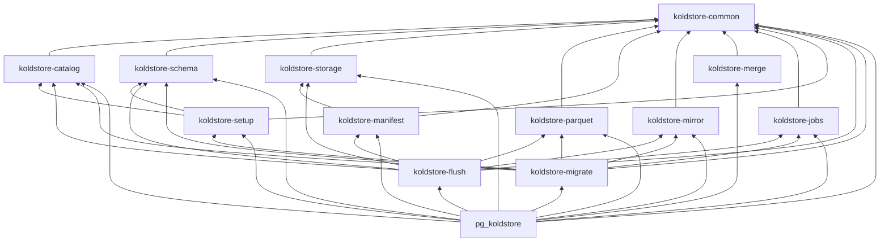

# Crate Architecture

pg-kalam is organized as layered Rust crates. Library crates hold PostgreSQL-free
domain logic; [`crates/pg_koldstore`](../../crates/pg_koldstore) is the thin
integration shell (`pgrx`, SPI, hooks, custom scan FFI).

## Extension Domains

| Domain | Library crate(s) | Extension adapter |
|--------|------------------|-------------------|
| Setup | `koldstore-setup` | `pg_koldstore` bootstrap SQL + SPI |
| Migrate | `koldstore-migrate` | `pg_koldstore::sql::ddl`, `migrate::*` |
| Merge scan | `koldstore-merge` | `pg_koldstore::merge_scan` |
| DML | `koldstore-mirror` | `pg_koldstore::sql::dml`, `hooks::*` |
| Flush / jobs | `koldstore-flush`, `koldstore-jobs` | `pg_koldstore::sql::ops` |
| Storage | `koldstore-storage` | storage registration wrappers |
| Schema | `koldstore-schema` | schema registry SQL execution |

## Setup vs Schema vs Catalog

- **setup** (`koldstore-setup`): DDL plans for internal objects in
  `koldstore--0.1.0.sql` — `storage`, `schemas`, `manifest`, `jobs`,
  `cold_segments`, `cold_pk_hints`, sequences, types, indexes, grants.
- **schema** (`koldstore-schema`): `koldstore.schemas` registry — column sets,
  versions, type matrix, initialization state for migrated tables.
- **catalog** (`koldstore-catalog`): cold bookkeeping — segments, PK hints,
  managed table meta, flush policy config, manifest rows, query/decode/cache.

## Dependency Graph

**Rules:**

1. Arrows point only into lower layers — no crate depends on `pg_koldstore`.
2. `pgrx` belongs only in `pg_koldstore`.
3. New domain logic defaults to the lowest layer that does not need PostgreSQL.

## Where New Code Goes

| Change | Crate |
|--------|-------|
| Shared identifier, seq, row model | `koldstore-common` |
| Internal metadata table model | `koldstore-catalog` or `koldstore-schema` |
| Internal table DDL plan | `koldstore-setup` |
| Migrated-table schema/version | `koldstore-schema` |
| Object-store access | `koldstore-storage` |
| Parquet read/write | `koldstore-parquet` |
| Manifest lifecycle | `koldstore-manifest` |
| Mirror SQL / DML statements | `koldstore-mirror` |
| Hot+cold merge logic | `koldstore-merge` |
| Job lease/phase framework | `koldstore-jobs` |
| Flush workflow | `koldstore-flush` |
| Migration workflow | `koldstore-migrate` |
| SPI, hooks, custom scan, `#[pg_extern]` | `pg_koldstore` |

## Cleanup Policy

When moving code between crates:

- Remove dead functions, types, and imports with no remaining callers.
- Consolidate duplicate types to a single owner.
- Do not carry unused helpers "just in case".
- Narrow `pub` to `pub(crate)` unless another crate needs the item.
- Only delete provably unreferenced code; flag ambiguous cases in PR notes.

## Documentation Standard

- Crate `lib.rs`: `//!` header — ownership, forbidden deps, where new code goes.
- Module files: `//!` header — what logic the module implements.
- Logic-bearing functions: `///` with purpose, invariants, and `# Errors`.
- Extension SQL entrypoints: document user contract and delegating crate.

See [ADR-001](../decisions/001-layered-crate-architecture.md) for rationale.

## Runtime workflow docs

End-to-end behavior (manage, flush, scan, DML) is documented separately from
crate layout:

- [manage-table.md](manage-table.md)
- [flushing-table.md](flushing-table.md)
- [scanning-table.md](scanning-table.md)
- [dml-table.md](dml-table.md)
