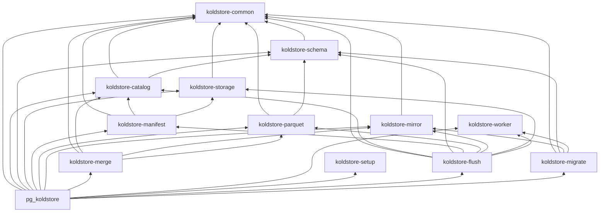

# Crate Architecture

pg-kalam is organized as layered Rust crates. Library crates hold PostgreSQL-free
domain logic; [`crates/pg_koldstore`](../../crates/pg_koldstore) is the thin
integration shell (`pgrx`, SPI, hooks, custom scan FFI).

## Extension Domains

| Domain | Library crate(s) | Extension adapter |
|--------|------------------|-------------------|
| Setup | `koldstore-setup` | `pg_koldstore` bootstrap SQL + SPI |
| Migrate | `koldstore-migrate` | `pg_koldstore::sql::ddl`, `migrate::*` |
| Merge scan | `koldstore-merge` | `pg_koldstore::merge_scan` — see [scanning-table.md](scanning-table.md) (shared preload required) |
| DML | `koldstore-mirror` | `pg_koldstore::sql::dml`, `hooks::*` |
| Flush | `koldstore-flush`, `koldstore-manifest` | `pg_koldstore::sql::flush` |
| DB worker + shared jobs | `koldstore-worker` | `pg_koldstore::database_worker` |
| Storage | `koldstore-storage` | storage registration wrappers |
| Schema | `koldstore-schema` | schema registry SQL execution |

## Setup vs Schema vs Catalog

- **setup** (`koldstore-setup`): DDL plans for internal objects in
  `koldstore--0.1.0.sql` — `storage`, `schemas`, `manifest`, `jobs`,
  `cold_segments`, `cold_segment_stats`, sequences, types, indexes, grants.
  Dependency-free leaf (parses/classifies SQL only).
- **schema** (`koldstore-schema`): `koldstore.schemas` registry — column sets,
  versions, type matrix, initialization state for migrated tables.
- **catalog** (`koldstore-catalog`): cold bookkeeping — segment visibility,
  sync-state FSM, managed-table snapshots, flush policy config, catalog
  query/decode/cache (capped OID maps). Must stay free of `koldstore-storage`.

**Do not merge schema and catalog.** Schema stays a leaf used by migrate and
parquet; catalog depends on schema one-way for typed init state. Combining them
would force migrate/parquet to pull cold-segment SQL and decode helpers.

**Do not merge mirror and catalog.** Mirror owns `__cl` DML/DDL SQL (common-only
leaf for migrate/merge). Catalog owns cold bookkeeping and may *look up*
`mirror_relation` from `koldstore.schemas`, but does not build mirror upserts.

**Do not merge manifest and catalog.** Catalog is PostgreSQL cold-metadata
authority; `koldstore-manifest` owns the derived object-store `manifest.json`
(model, assembly, paths, I/O) and depends on catalog + storage.

## Dependency Graph

`koldstore-setup` is a dependency-free SQL classifier (no `koldstore-*` edges).
`koldstore-worker` is a leaf crate with no internal `koldstore-*` dependencies
(shared job lease/status plus DB worker ensure/task/policy). Pure scheduling
policy, including the bounded immediate-pending retry budget, stays here;
`pg_koldstore::database_worker` owns latch, signal, SPI-transaction, and GUC
integration.
**Rules:**

1. Arrows point only into lower layers — no crate depends on `pg_koldstore`.
2. `pgrx` belongs only in `pg_koldstore`.
3. New domain logic defaults to the lowest layer that does not need PostgreSQL.

## Where New Code Goes

| Change | Crate |
|--------|-------|
| Shared identifier, seq, row model | `koldstore-common` |
| Internal metadata table model | `koldstore-catalog` or `koldstore-schema` |
| Internal table DDL plan | `koldstore-setup` |
| Migrated-table schema/version | `koldstore-schema` |
| Object-store access | `koldstore-storage` |
| Parquet read/write | `koldstore-parquet` |
| Manifest model / assembly / JSON I/O / paths | `koldstore-manifest` |
| Manifest sync-state FSM (`koldstore.manifest.sync_state`) | `koldstore-catalog` |
| Mirror SQL / DML statements / pgoutput decoder / strict capture planners | `koldstore-mirror` (`shared` / `strict` / `async`) |
| Hot+cold merge logic | `koldstore-merge` |
| Database worker ensure / task / poll policy / pending retry fairness / flush-check cadence | `koldstore-worker` |
| Flush workflow (selection, encode, segment write, catalog SQL plans, cleanup) | `koldstore-flush` |
| Migration workflow | `koldstore-migrate` |
| Shared privilege / LSN helpers | `koldstore-common` |
| SPI, hooks, custom scan, `#[pg_extern]` | `pg_koldstore` |

## Cleanup Policy

When moving code between crates:

- Remove dead functions, types, and imports with no remaining callers.
- Consolidate duplicate types to a single owner.
- Do not carry unused helpers "just in case".
- Narrow `pub` to `pub(crate)` unless another crate needs the item.
- Only delete provably unreferenced code; flag ambiguous cases in PR notes.

## Memory longevity

Backend-local OID caches (`ManagedTableSnapshotCache`, migration catalog cache,
segment-stats lookups) are **entry-capped** (default 64) and invalidated on
unmanage/flush. Async apply and flush SPI paths page at fixed batch sizes.

Remaining billion-row follow-ups (not solved by cache caps alone): segment
cardinality until compaction, streaming merge-scan emit, incremental
`manifest.json` publish without full reload.

## Documentation Standard

- Crate `lib.rs`: `//!` header — ownership, forbidden deps, where new code goes.
- Module files: `//!` header — what logic the module implements.
- Logic-bearing functions: `///` with purpose, invariants, and `# Errors`.
- Extension SQL entrypoints: document user contract and delegating crate.

See [ADR-001](../decisions/001-layered-crate-architecture.md) for rationale.

## Runtime workflow docs

End-to-end behavior (manage, flush, scan, DML) is documented separately from
crate layout:

- [manage-table.md](manage-table.md)
- [flushing-table.md](flushing-table.md)
- [scanning-table.md](scanning-table.md)
- [dml-table.md](dml-table.md)
