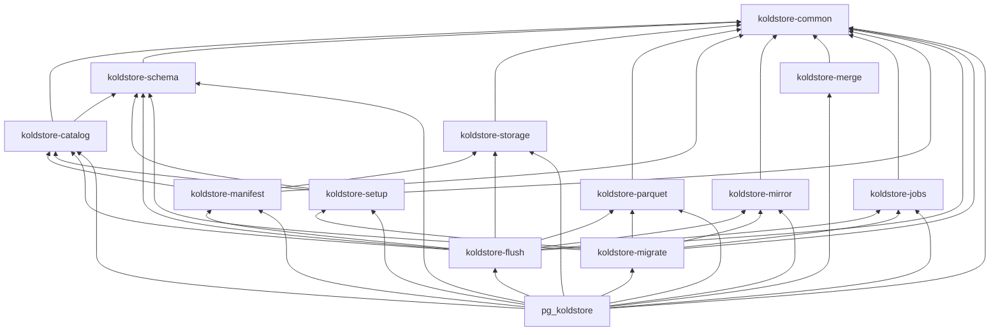

# Crate Architecture

pg-kalam is organized as layered Rust crates. Library crates hold PostgreSQL-free
domain logic; [`crates/pg_koldstore`](../../crates/pg_koldstore) is the thin
integration shell (`pgrx`, SPI, hooks, custom scan FFI).

## Extension Domains

| Domain | Library crate(s) | Extension adapter |
|--------|------------------|-------------------|
| Setup | `koldstore-setup` | `pg_koldstore` bootstrap SQL + SPI |
| Migrate | `koldstore-migrate` | `pg_koldstore::sql::ddl`, `migrate::*` |
| Merge scan | `koldstore-merge` | `pg_koldstore::merge_scan` |
| DML | `koldstore-mirror` | `pg_koldstore::sql::dml`, `hooks::*` |
| Flush / jobs | `koldstore-flush`, `koldstore-jobs`, `koldstore-manifest` | `pg_koldstore::sql::flush` |
| Storage | `koldstore-storage` | storage registration wrappers |
| Schema | `koldstore-schema` | pure type matrix / evolution policy (leaf) |
| Catalog | `koldstore-catalog` | versioned schema access + cold segment bookkeeping |

## Setup vs Schema vs Catalog

- **setup** (`koldstore-setup`): DDL plans for internal objects in
  `koldstore--0.1.0.sql` — `storage`, `schemas`, `manifest`, `jobs`,
  `segments`, `segment_stats`, sequences, types, indexes, grants.
- **schema** (`koldstore-schema`): PostgreSQL-free **type/evolution leaf** —
  `PgType`, type matrix, and pure schema-evolution policy helpers. Does **not**
  own the caller-facing versioned schema registry API.
- **catalog** (`koldstore-catalog`): **owns versioned schema access** (active /
  historical schema versions, columns with stable `column_id`,
  `next_column_id`) **and** cold bookkeeping (segments, lifecycle, PK hints,
  managed table meta, query/decode/cache). Callers (migrate, flush, extension)
  use catalog for schema versions and segments; there must not be a second
  registry API in `koldstore-schema`.

**Do not fully merge schema and catalog crates.** Keep `koldstore-schema` as a
thin type/evolution leaf so parquet/migrate type checks do not pull cold-segment
SQL. **Do** concentrate versioned schema **access** in catalog so there is one
obvious home for versions + segments (see feature `003-column-id-lifecycle`).

**Do not merge mirror and catalog.** Mirror owns `__cl` DML/DDL SQL (common-only
leaf for migrate/merge). Catalog owns cold bookkeeping and may *look up*
`mirror_relation` from managed schema metadata, but does not build mirror upserts.

## Dependency Graph

**Rules:**

1. Arrows point only into lower layers — no crate depends on `pg_koldstore`.
2. `pgrx` belongs only in `pg_koldstore`.
3. New domain logic defaults to the lowest layer that does not need PostgreSQL.

## Where New Code Goes

| Change | Crate |
|--------|-------|
| Shared identifier, seq, row model, `ColumnId`, scope counter key | `koldstore-common` |
| Versioned schema access + cold segment / lifecycle models | `koldstore-catalog` |
| Internal table DDL plan | `koldstore-setup` |
| PgType / type matrix / pure evolution policy | `koldstore-schema` |
| Object-store access | `koldstore-storage` |
| Parquet read/write / footer stats | `koldstore-parquet` |
| Manifest lifecycle (model, assembly, JSON I/O, paths, sync state, publish plan) | `koldstore-manifest` |
| Mirror SQL / DML statements | `koldstore-mirror` |
| Hot+cold merge logic | `koldstore-merge` |
| Job lease/phase framework | `koldstore-jobs` |
| Flush workflow (counters, pre-flush, selection, encode, segment write, catalog SQL plans, cleanup) | `koldstore-flush` |
| Migration workflow (calls catalog schema APIs) | `koldstore-migrate` |
| SPI, hooks, custom scan, `#[pg_extern]` | `pg_koldstore` |

## Cleanup Policy

When moving code between crates:

- Remove dead functions, types, and imports with no remaining callers.
- Consolidate duplicate types to a single owner.
- Do not carry unused helpers "just in case".
- Narrow `pub` to `pub(crate)` unless another crate needs the item.
- Only delete provably unreferenced code; flag ambiguous cases in PR notes.

## Documentation Standard

- Crate `lib.rs`: `//!` header — ownership, forbidden deps, where new code goes.
- Module files: `//!` header — what logic the module implements.
- Logic-bearing functions: `///` with purpose, invariants, and `# Errors`.
- Extension SQL entrypoints: document user contract and delegating crate.

See [ADR-001](../decisions/001-layered-crate-architecture.md) for rationale.

## Runtime workflow docs

End-to-end behavior (manage, flush, scan, DML) is documented separately from
crate layout:

- [manage-table.md](manage-table.md)
- [flushing-table.md](flushing-table.md)
- [scanning-table.md](scanning-table.md)
- [dml-table.md](dml-table.md)
