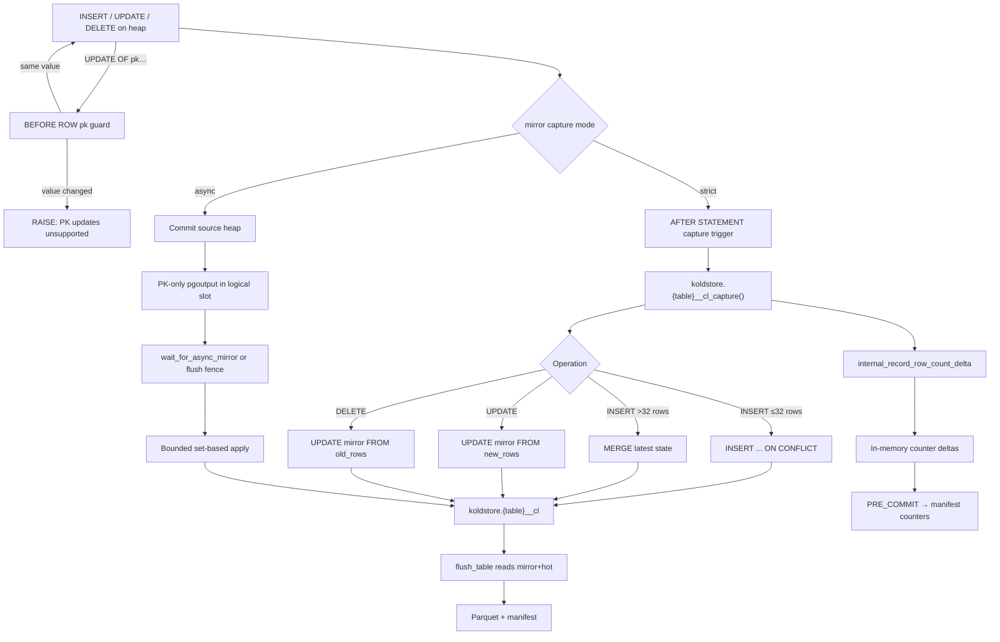
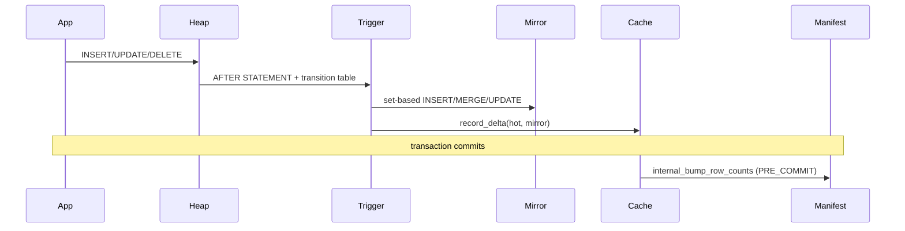
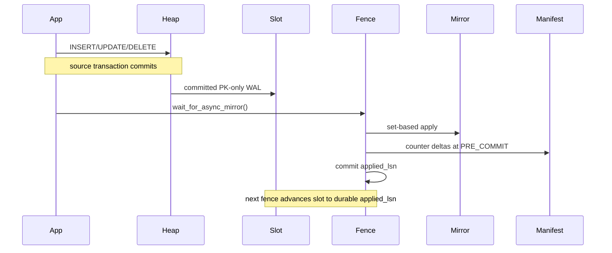

# DML Table Workflow

This document describes what happens when application SQL mutates a managed heap
table: `INSERT`, `UPDATE`, and `DELETE`. It covers mirror capture, row counter
accounting, scope enforcement, and how DML state flows into flush and scan.

**Capture mechanisms:** strict statement triggers or opt-in asynchronous
logical-WAL apply (plus a separate PK-mutation guard in both modes)

**Mirror contract:** `crates/koldstore-mirror/` (`shared` / `strict` / `async`)  
**Strict trigger planning:** `crates/koldstore-mirror/src/strict/` (re-exported via migrate)  
**Async apply / workers:** `crates/pg_koldstore/src/async_mirror/`  
**Counter cache:** `crates/pg_koldstore/src/row_counter_cache.rs`

---

## Clean-schema model

User tables keep application columns only. Each managed table has a latest-state
change-log mirror at `koldstore.{table}__cl`:

| Column | Type | Meaning |
|--------|------|---------|
| `<pk columns>` | same as heap | Primary key |
| `seq` | `bigint` | Snowflake-style effect id (ordering, flush cutoffs) |
| `op` | `smallint` | `1 = INSERT`, `2 = UPDATE`, `3 = DELETE` |
| `commit_lsn` | `pg_lsn` | WAL position sampled at capture (diagnostics only) |

The mirror holds **at most one row per PK** — the latest hot-side state for that
key. It is not a full event log. Tombstones (`op = 3`) stay until flush prunes
them.

---

## Overview



DML does **not** read Parquet or object storage. The hot path stays heap-native.

Strict capture keeps the mirror current before the source transaction commits.
Async capture returns from the foreground commit first and makes the mirror
current at the next fence. See
[mirror-capture-modes.md](mirror-capture-modes.md) for selection,
[mirror-capture-strict.md](mirror-capture-strict.md) and
[mirror-capture-async.md](mirror-capture-async.md) for mode details, setup,
consistency, crash safety, and slot operations.

Primary-key mutation is rejected by a separate
`BEFORE UPDATE OF <pk...> FOR EACH ROW` guard so ordinary updates never pay for
an `OLD TABLE` transition relation. Same-value assignments (`SET id = id`)
succeed because the guard raises only on `IS DISTINCT FROM`.

---

## Phase 1 — Table setup (prerequisite)

Installed by `koldstore.manage_table` (see [manage-table.md](manage-table.md)):

1. `CREATE TABLE koldstore.{name}__cl` with PK + metadata columns
2. B-tree on `seq`, plus partial tombstone index `(seq) WHERE op = 3`
3. Capture function `koldstore.{name}__cl_capture()`
4. PK-guard function `koldstore.{name}__cl_pk_guard()`
5. Three `AFTER … FOR EACH STATEMENT` capture triggers (transition tables)
6. One `BEFORE UPDATE OF <pk...> FOR EACH ROW` guard trigger
7. Counter refresh so manifest hot/mirror counts match live heaps before capture
   takes over
8. In async mode only: add the source's PK columns to the shared publication and
   drop the three DML capture triggers; keep the PK guard, install the
   worker-kick statement trigger, and start/reuse the database applier

For user-scoped tables, RLS policy `koldstore_user_scope_fail_closed` is also
installed.

Existing-table manage backfills one mirror row per live heap PK before
activation. Empty-table manage relies on INSERT capture from the first write.
That invariant is what lets UPDATE/DELETE modify the mirror directly.

---

## Phase 2 — Strict capture trigger function

Generated by `capture_function_sql` (`koldstore-mirror/src/strict/capture.rs`).
All three statement-level triggers call the same function. Capture sets

```sql
capture_wal_lsn pg_lsn := pg_current_wal_lsn();
```

once per statement for diagnostics; that value is **not** the final commit LSN.

Sequence ids use `public.snowflake_id()` (restricted `search_path` on the
capture function).

Threshold constant: `SMALL_INSERT_UPSERT_ROWS = 32` in `koldstore-mirror/src/strict/capture.rs`.

### INSERT

```sql
-- Transition: REFERENCING NEW TABLE AS new_rows

-- Pre-count overlapping PKs so reinserts over tombstones do not inflate
-- mirror_row_count (MERGE has no RETURNING on supported majors).
SELECT count(*) INTO existing_mirror_rows
FROM new_rows AS src
JOIN koldstore.{table}__cl AS mirror ON <pk equality>;

IF EXISTS (SELECT 1 FROM new_rows OFFSET 32 LIMIT 1) THEN
  -- bulk: MERGE (matched → update seq/op/lsn; not matched → insert)
  MERGE INTO koldstore.{table}__cl AS mirror ...;
ELSE
  -- small: ON CONFLICT keeps insert-or-update concurrency guarantees
  INSERT INTO koldstore.{table}__cl (...)
  SELECT ... FROM new_rows
  ON CONFLICT (pk...) DO UPDATE SET seq=..., op=1, commit_lsn=...;
END IF;

GET DIAGNOSTICS affected = ROW_COUNT;
PERFORM koldstore.internal_record_row_count_delta(
  TG_RELID, affected, affected - existing_mirror_rows);
```

### UPDATE

```sql
-- Transition: REFERENCING NEW TABLE AS new_rows only (no OLD TABLE).
UPDATE koldstore.{table}__cl AS mirror
SET seq = public.snowflake_id(), op = 2, commit_lsn = capture_wal_lsn
FROM new_rows AS src
WHERE <pk equality>;

-- Fail closed if transition rows exist but no mirror rows were updated.
-- No row counter delta (row still exists in hot and mirror).
```

PK mutation is rejected by `koldstore.{name}__cl_pk_guard()` on
`BEFORE UPDATE OF <pk...>`.

### DELETE

```sql
-- Transition: REFERENCING OLD TABLE AS old_rows.
UPDATE koldstore.{table}__cl AS mirror
SET seq = public.snowflake_id(), op = 3, commit_lsn = capture_wal_lsn
FROM old_rows AS src
WHERE <pk equality>;

GET DIAGNOSTICS affected = ROW_COUNT;
PERFORM koldstore.internal_record_row_count_delta(TG_RELID, -affected, 0);
-- hot -affected only; mirror tombstone remains until flush prunes it.
```

### Encoding at mirror boundary

| Field | Source | Type |
|-------|--------|------|
| PK values | transition `src."col"` | Native PG column types |
| `seq` | `public.snowflake_id()` | `i64` snowflake id |
| `op` | `MirrorOperation::code()` | `smallint` 1/2/3 |
| `commit_lsn` | statement `capture_wal_lsn` | `pg_lsn` |

No JSON or Arrow encoding at capture time. Values are written directly into the
mirror table via SQL.

Strict capture runs in the **same user transaction** as the DML. Mirror changes
roll back with the user statement on abort. PostgreSQL does not parallelize the
heap and mirror writes within that transaction.

---

## Phase 3 — Async committed-WAL capture

Async mode removes the three strict DML triggers after initialization. The
source table publishes only its primary-key columns through pgoutput v1. A
logical slot filters out aborted transactions; therefore rollback correctness
does not require speculative mirror writes or compensating deletes.

The database worker normally peeks committed changes every 100 ms and applies
them in bounded batches of 8,192. `koldstore.wait_for_async_mirror()` uses the
same path when the caller needs an explicit consistency boundary:

| Source operation | Mirror apply |
| --- | --- |
| INSERT | Set-based `INSERT ... ON CONFLICT DO UPDATE` |
| UPDATE | Set-based `UPDATE ... FROM` of the existing key |
| DELETE | Set-based `UPDATE ... FROM`, setting `op = 3` |

Primary keys cross the pgoutput boundary as protocol text, are grouped in Rust,
serialized once per batch, and are converted back to native PostgreSQL types
with `jsonb_to_recordset`. Non-key source columns are not published or allocated.
The mirror remains a metadata index; flush reads the current row image from the
hot heap.

The mirror batch, row-counter delta, and durable applied LSN commit together.
The next fence advances the slot to that checkpoint before peeking more WAL.
`flush_table` invokes this phase automatically. Flush's internal source-row
cleanup uses PostgreSQL's `DoNotReplicateId`, so maintenance deletes do not
produce new mirror tombstones.

Async capture is eventual within the worker polling interval. It is not a
transparent read-your-writes mode; strong reads still use the fence. Full
operational semantics are in
[mirror-capture-modes.md](mirror-capture-modes.md).

---

## Phase 4 — Row counter cache

### Delta recording

Strict `internal_record_row_count_delta`
(`pg_koldstore/src/sql/flush/counters.rs`) calls
`row_counter_cache::record_delta` once per capture statement. Async capture
calls the same cache once per applied set-based batch, not once per heap row:

```rust
// thread-local HashMap<table_oid, (hot_delta, mirror_delta)>
record_delta(table_oid, hot_delta, mirror_delta)
```

No manifest I/O per row.

### Commit path

`row_counter_xact_callback` on `XACT_EVENT_PRE_COMMIT`:

1. Drain pending deltas from the thread-local map
2. SPI `plan_bump_table_row_counts` → `koldstore.internal_bump_row_counts`
3. Update `koldstore.manifest` counters for each touched table

On `XACT_EVENT_ABORT`: `clear_pending_deltas` (discard in-memory state).

**Contract:** one manifest bump per touched table per strict source transaction
or async apply transaction, not per row.

### Counter semantics

| Operation | hot_row_count | mirror_row_count |
|-----------|---------------|------------------|
| INSERT (new PK) | +N | +N |
| INSERT (reinsert over tombstone) | +N | +0 for overlapping keys |
| UPDATE | 0 | 0 |
| DELETE | -N | 0 (tombstone stays until flush) |

Flush applies decrements via `internal_apply_flush_row_counts` after seq-range
cleanup (see [flushing-table.md](flushing-table.md)).

### Reading counters

`read_table_row_counters` reads O(1) from manifest:

```json
{"hot_row_count": N, "mirror_row_count": M, "cold_row_count": C, "cold_segment_count": S}
```

Used by flush stats resolution and operator diagnostics. Mid-transaction reads
of `manifest.mirror_row_count` do not include pending backend deltas until
pre-commit flush (pg_tests that assert counters call `flush_pending_deltas`
explicitly). Flush selection folds `row_counter_cache::pending_deltas` into the
O(1) mirror pending count so an in-transaction async fence cannot miss rows.

---

## Phase 5 — Hot heap behavior

| Operation | Heap | Mirror after capture/fence | Visible via merge scan |
|-----------|------|---------------------|------------------------|
| INSERT | New live row | `op = 1` latest state | Yes (hot wins) |
| UPDATE | In-place update | `op = 2` latest state | Yes (hot wins) |
| DELETE | Physical row removed | `op = 3` tombstone | Depends on cold state* |

\*If the PK existed in cold before delete, merge scan may still show the old
cold live row until async capture has been fenced (when applicable) and the
tombstone is flushed to Parquet with `deleted = true`. See
[scanning-table.md](scanning-table.md).

**No Parquet reads on DML path** — verified by design and
`crates/pg_koldstore-shell-tests/tests/hot_dml_no_cold_reads.rs`.

---

## Phase 6 — Scope enforcement (user tables)

Live DML/read isolation for user-scoped tables is enforced by **fail-closed
RLS** installed at manage time (`plan_user_scope_policy` in
`koldstore-migrate/src/security/scope.rs`):

```sql
USING (scope_column = current_setting('koldstore.user_id', true))
WITH CHECK (same)
```

Session scope is set with:

```sql
SET koldstore.user_id = '<tenant_id>';
```

`koldstore.user_id` is a GUC. Applications must set it before scoped DML and
reads.

`hooks/executor.rs::enforce_dml_scope` is a pure helper used by unit/shell
tests and planning code. It is **not** registered as a live executor hook;
runtime row filtering for scoped tables is RLS.

---

## Phase 7 — Downstream: flush reads mirror + hot

When `flush_table` runs, row selection joins mirror to hot heap
(`plan_mirror_flush_selection_batch` in `koldstore-flush`):

```sql
SELECT hot.col AS col, ..., mirror."seq", mirror."op"
FROM mirror
LEFT JOIN ONLY hot ON mirror.pk = hot.pk
WHERE mirror."seq" <= $max_seq
ORDER BY mirror."seq"
```

SPI decode → `FlushMirrorRow` → Arrow → Parquet.

Delete markers (`op = 3`): only PK columns + cold metadata written to Parquet;
`row_image` is null; `deleted = true` in the segment.

After Parquet write, **seq-range cleanup** removes mirror rows with
`seq <= max_seq` and matching hot rows for `op IN (1,2)`.

---

## Serde boundaries (DML → flush → cold)

```
User SQL row (native PG types on heap)
  → strict: statement transition relation → set-based mirror write
  → async: PK-only pgoutput → bounded JSON batch → set-based mirror write
  → Mirror table storage (typed PK + seq + op + pg_lsn; no JSON)

At flush:
  Mirror + hot JOIN
  → SPI heap tuples
  → FlushColumnValue (typed decode)
  → Arrow builders
  → Parquet binary

Row counter deltas:
  → in-memory (i64, i64) per table_oid
  → SPI bump of manifest at PRE_COMMIT
```

---

## Planned but not exposed in PG today

Pure planning exists in `koldstore-merge/src/sql/dml.rs` for:

- `koldstore.hydrate_pk`
- `koldstore.update_row` (`lookup_cold` flag)
- `koldstore.delete_row` (`allow_may_contain`)

SQL types exist in bootstrap DDL (`koldstore.dml_result`) but there are no
`#[pg_extern]` implementations in `pg_koldstore` yet.

Standard SQL `UPDATE`/`DELETE` on cold-only rows (not in the hot heap) is a
no-op on the heap; durable cold masking requires a mirror tombstone + flush.

### What hooks are actually registered

`_PG_init` installs:

- custom-scan hooks for `KoldMergeScan` (`set_rel_pathlist` / related scan hooks)
- `XactCallback` for row-counter flush/clear
- `RelcacheCallback` for catalog cache invalidation

Capture uses statement triggers in strict mode and logical decoding in async
mode. There is no live `ExecutorStart` / `ProcessUtility` DML-rewrite hook that
writes the mirror. Async tables have a lightweight statement trigger that only
ensures one database-scoped background applier is running.

---

## Transaction workflow summary

Strict mode:



Async mode:



---

## Crate map

| Concern | Location |
|---------|----------|
| Shared `__cl` DDL / read / write SQL | `koldstore-mirror/src/shared/` |
| Strict capture trigger SQL | `koldstore-mirror/src/strict/` |
| Async decoder / batch policy | `koldstore-mirror/src/async/` |
| Async lifecycle / apply / workers | `pg_koldstore/src/async_mirror/` |
| Migrate orchestration (uses mirror crate) | `koldstore-migrate/src/sql/mirror.rs` |
| Row counter cache | `pg_koldstore/src/row_counter_cache.rs` |
| Counter SPI | `pg_koldstore/src/sql/flush/counters.rs` |
| Counter SQL functions | `pg_koldstore/sql/koldstore--0.1.0.sql` |
| Scope / RLS | `koldstore-migrate/src/security/scope.rs` |
| Flush selection | `koldstore-flush/src/ops.rs` |
| DML effect planning (future) | `koldstore-merge/src/sql/dml.rs` |

Related docs: [manage-table.md](manage-table.md),
[mirror-capture-modes.md](mirror-capture-modes.md),
[flushing-table.md](flushing-table.md), and
[scanning-table.md](scanning-table.md).
