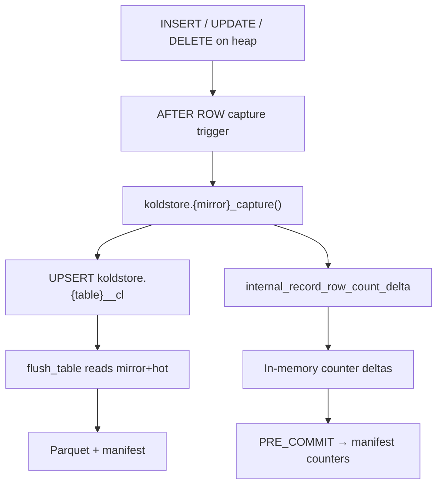
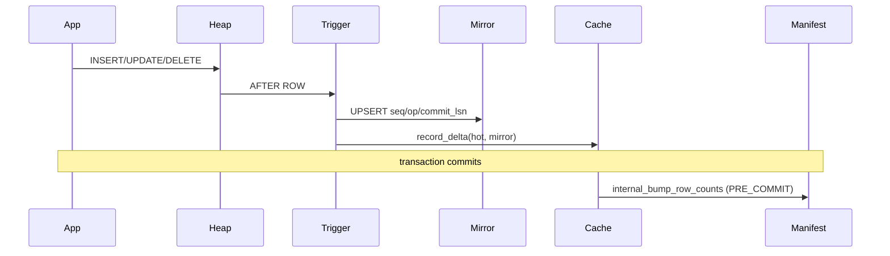

# DML Table Workflow

This document describes what happens when application SQL mutates a managed heap
table: `INSERT`, `UPDATE`, and `DELETE`. It covers mirror capture, row counter
accounting, scope enforcement, and how DML state flows into flush and scan.

**Capture mechanism:** AFTER ROW triggers on the user heap (not executor hooks)  
**Mirror contract:** `crates/koldstore-mirror/`  
**Trigger generation:** `crates/koldstore-migrate/src/sql/capture.rs`  
**Counter cache:** `crates/pg_koldstore/src/row_counter_cache.rs`

---

## Clean-schema model

User tables keep application columns only. Each managed table has a latest-state
change-log mirror at `koldstore.{table}__cl`:

| Column | Type | Meaning |
|--------|------|---------|
| `<pk columns>` | same as heap | Primary key |
| `seq` | `bigint` | Snowflake-style effect id (ordering, flush cutoffs) |
| `op` | `smallint` | `1 = INSERT`, `2 = UPDATE`, `3 = DELETE` |
| `commit_lsn` | `pg_lsn` | WAL position at capture (diagnostics) |

The mirror holds **at most one row per PK** — the latest committed hot state for
that key. It is not a full event log.

---

## Overview



DML does **not** read Parquet or object storage. Hot path stays heap-native.

---

## Phase 1 — Table setup (prerequisite)

Installed by `koldstore.manage_table` (see [manage-table.md](manage-table.md)):

1. `CREATE TABLE koldstore.{name}__cl` with PK + metadata columns
2. Indexes on `seq` and partial tombstone index (`op = 3`)
3. Capture function `koldstore.{mirror}_capture()`
4. Three AFTER ROW triggers on the user heap

For user-scoped tables, RLS policy `koldstore_user_scope_fail_closed` is also
installed.

---

## Phase 2 — Capture trigger function

Generated by `capture_function_sql` (`koldstore-migrate/src/sql/capture.rs`).
All three triggers call the same function.

### INSERT

```sql
-- plan_upsert_mirror_row: INSERT ... ON CONFLICT DO UPDATE
INSERT INTO koldstore.{table}__cl (pk..., seq, op, commit_lsn)
VALUES (NEW.pk..., SNOWFLAKE_ID(), 1, pg_current_wal_lsn())
ON CONFLICT (pk...) DO UPDATE SET seq=..., op=..., commit_lsn=...;

PERFORM koldstore.internal_record_row_count_delta(TG_RELID, 1, 1);
-- hot +1, mirror +1
RETURN NEW;
```

### UPDATE

```sql
-- RAISE if any PK column changed (primary_key_update_guard)
-- plan_upsert_mirror_row with op = 2
INSERT ... ON CONFLICT ... op = 2, new seq, pg_current_wal_lsn();

-- No row counter delta (row still exists in hot and mirror)
RETURN NEW;
```

### DELETE

```sql
-- plan_upsert_mirror_row with OLD.pk..., op = 3
INSERT ... ON CONFLICT ... op = 3, new seq, pg_current_wal_lsn();

PERFORM koldstore.internal_record_row_count_delta(TG_RELID, -1, 0);
-- hot -1 only; mirror tombstone remains until flush prunes it
RETURN OLD;
```

Mirror upsert SQL is built by `koldstore-mirror/src/write.rs::plan_upsert_mirror_row`.

### Encoding at mirror boundary

| Field | Source | Type |
|-------|--------|------|
| PK values | `NEW."col"` / `OLD."col"` | Native PG column types |
| `seq` | `SNOWFLAKE_ID()` | `i64` snowflake id |
| `op` | `MirrorOperation::code()` | `smallint` 1/2/3 |
| `commit_lsn` | `pg_current_wal_lsn()` | `pg_lsn` |

No JSON or Arrow encoding at capture time. Values are written directly into the
mirror table via SQL.

Capture runs in the **same user transaction** as the DML. Mirror changes roll
back with the user statement on abort.

---

## Phase 3 — Row counter cache

### Per-row hot path

`internal_record_row_count_delta` (`flush/counters.rs`) calls
`row_counter_cache::record_delta`:

```rust
// thread-local HashMap<table_oid, (hot_delta, mirror_delta)>
record_delta(table_oid, hot_delta, mirror_delta)
```

No manifest I/O per row.

### Commit path

`row_counter_xact_callback` on `XACT_EVENT_PRE_COMMIT`:

1. Drain pending deltas from thread-local map
2. SPI `plan_bump_table_row_counts` → `koldstore.internal_bump_row_counts`
3. Updates `koldstore.manifest` counters for each touched table

On `XACT_EVENT_ABORT`: `clear_pending_deltas` (discard in-memory state).

**Contract:** one manifest `UPDATE` per touched table per transaction, not per row.

### Counter semantics

| Operation | hot_row_count | mirror_row_count |
|-----------|---------------|------------------|
| INSERT | +1 | +1 |
| UPDATE | 0 | 0 |
| DELETE | -1 | 0 (tombstone stays until flush) |

Flush applies decrements via `internal_apply_flush_row_counts` after seq-range
cleanup (see [flushing-table.md](flushing-table.md)).

### Reading counters

`read_table_row_counters` (`flush/counters.rs`) reads O(1) from manifest:

```json
{"hot_row_count": N, "mirror_row_count": M, "cold_row_count": C, "cold_segment_count": S}
```

Used by flush stats resolution and example diagnostics.

---

## Phase 4 — Hot heap behavior

| Operation | Heap | Mirror after capture | Visible via merge scan |
|-----------|------|---------------------|------------------------|
| INSERT | New live row | `op = 1` latest state | Yes (hot wins) |
| UPDATE | In-place update | `op = 2` latest state | Yes (hot wins) |
| DELETE | Physical row removed | `op = 3` tombstone | Depends on cold state* |

\*If the PK existed in cold before delete, merge scan may still show the old
cold live row until the tombstone is flushed to Parquet with `deleted = true`.
See [scanning-table.md](scanning-table.md).

**No Parquet reads on DML path** — verified by design and
`tests/pg_koldstore/tests/hot_dml_no_cold_reads.rs`.

---

## Phase 5 — Scope enforcement (user tables)

| Check | Where |
|-------|-------|
| Session scope required | `koldstore-common/scope.rs::active_scope_for_table` |
| Row scope must match session | `hooks/executor.rs::enforce_dml_scope` |
| Fail-closed RLS on heap | `plan_user_scope_policy` at manage time |

RLS policy SQL:

```sql
USING (scope_column = current_setting('koldstore.user_id', true))
WITH CHECK (same)
```

Session scope is set with:

```sql
SET koldstore.user_id = '<tenant_id>';
```

`koldstore.user_id` is exposed as a GUC. Applications must set it before scoped
DML and reads.

---

## Phase 6 — Downstream: flush reads mirror + hot

When `flush_table` runs, row selection joins mirror to hot heap
(`plan_mirror_flush_selection_batch`):

```sql
SELECT hot.col AS col, ..., mirror."seq", mirror."op"
FROM mirror
LEFT JOIN ONLY hot ON mirror.pk = hot.pk
WHERE mirror."seq" <= $max_seq
ORDER BY mirror."seq"
```

SPI decode → `FlushMirrorRow` → Arrow → Parquet.

Delete markers (`op = 3`): only PK columns + cold metadata written to Parquet;
`row_image` is null; `deleted = true` in segment.

After Parquet write, **seq-range cleanup** removes mirror rows with
`seq <= max_seq` and matching hot rows for `op IN (1,2)`.

---

## Serde boundaries (DML → flush → cold)

```
User SQL row (native PG types on heap)
  → Trigger NEW/OLD references
  → Mirror UPSERT SQL (typed PK + SNOWFLAKE_ID + op + pg_lsn)
  → Mirror table storage (no JSON)

At flush:
  Mirror + hot JOIN
  → SPI heap tuples
  → FlushColumnValue (typed decode, mirror_fetch.rs)
  → Arrow builders (batch_builder.rs)
  → Parquet binary (writer.rs)

Row counter deltas:
  → in-memory (i64, i64) per table_oid
  → SPI UPDATE manifest at PRE_COMMIT
```

---

## Planned but not exposed in PG today

Pure planning exists in `koldstore-merge/src/sql/dml.rs` for:

- `koldstore.hydrate_pk`
- `koldstore.update_row` (`lookup_cold` flag)
- `koldstore.delete_row` (`allow_may_contain`)

SQL types exist in bootstrap DDL (`koldstore.dml_result`) but there are no
`#[pg_extern]` implementations in `pg_koldstore` yet.

Standard SQL `UPDATE`/`DELETE` on cold-only rows (not in hot heap) is a no-op on
the heap; durable cold masking requires mirror tombstone + flush.

`hooks/mod.rs` lists `ExecutorStart`, `ProcessUtility`, `XactCallback` for DML
rewrite — only custom scan + row-counter callbacks are actually registered.
Capture is entirely trigger-based.

---

## Transaction workflow summary



---

## Crate map

| Concern | Location |
|---------|----------|
| Capture trigger SQL | `koldstore-migrate/src/sql/capture.rs` |
| Mirror upsert SQL | `koldstore-mirror/src/write.rs` |
| Mirror DDL / columns | `koldstore-mirror/src/schema.rs`, `columns.rs` |
| Row counter cache | `pg_koldstore/src/row_counter_cache.rs` |
| Counter SPI | `pg_koldstore/src/sql/flush/counters.rs` |
| Counter SQL functions | `pg_koldstore/sql/koldstore--0.1.0.sql` |
| Scope / RLS | `koldstore-migrate/src/security/scope.rs` |
| DML effect planning (future) | `koldstore-merge/src/sql/dml.rs`, `managed_hook.rs` |

For mirror semantics and transaction boundaries, see also
[change-log-mirror-and-transactions.md](change-log-mirror-and-transactions.md).
