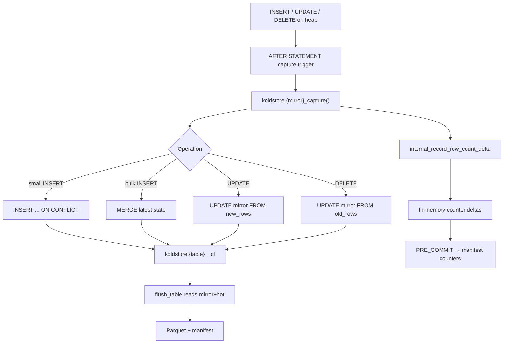
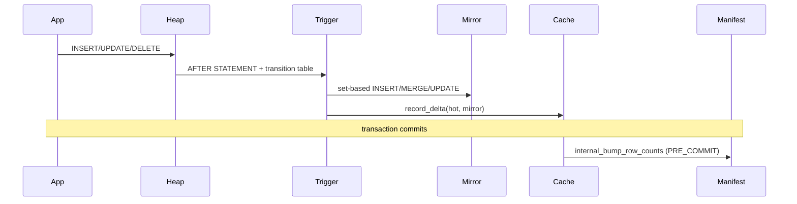

# DML Table Workflow

This document describes what happens when application SQL mutates a managed heap
table: `INSERT`, `UPDATE`, and `DELETE`. It covers mirror capture, row counter
accounting, scope enforcement, and how DML state flows into flush and scan.

**Capture mechanism:** `AFTER … FOR EACH STATEMENT` triggers with transition
tables (plus a separate PK-mutation guard)  
**Mirror contract:** `crates/koldstore-mirror/`  
**Trigger generation:** `crates/koldstore-migrate/src/sql/capture.rs`  
**Counter cache:** `crates/pg_koldstore/src/row_counter_cache.rs`

---

## Clean-schema model

User tables keep application columns only. Each managed table has a latest-state
change-log mirror at `koldstore.{table}__cl`:

| Column | Type | Meaning |
|--------|------|---------|
| `<pk columns>` | same as heap | Primary key |
| `seq` | `bigint` | Snowflake-style effect id (ordering, flush cutoffs) |
| `op` | `smallint` | `1 = INSERT`, `2 = UPDATE`, `3 = DELETE` |
| `commit_lsn` | `pg_lsn` | WAL position at capture (diagnostics) |

The mirror holds **at most one row per PK** — the latest committed hot state for
that key. It is not a full event log.

---

## Overview



DML does **not** read Parquet or object storage. Hot path stays heap-native.

Primary-key mutation is rejected by a separate
`BEFORE UPDATE OF <pk...> FOR EACH ROW` guard so ordinary updates never pay for
an `OLD TABLE` transition relation.

---

## Phase 1 — Table setup (prerequisite)

Installed by `koldstore.manage_table` (see [manage-table.md](manage-table.md)):

1. `CREATE TABLE koldstore.{name}__cl` with PK + metadata columns
2. Indexes on `seq` and partial tombstone index (`op = 3`)
3. Capture function `koldstore.{mirror}_capture()`
4. PK-guard function `koldstore.{mirror}_pk_guard()`
5. Three `AFTER … FOR EACH STATEMENT` capture triggers (transition tables)
6. One `BEFORE UPDATE OF <pk...> FOR EACH ROW` guard trigger

For user-scoped tables, RLS policy `koldstore_user_scope_fail_closed` is also
installed.

---

## Phase 2 — Capture trigger function

Generated by `capture_function_sql` (`koldstore-migrate/src/sql/capture.rs`).
All three statement-level triggers call the same function. Capture uses one
`capture_wal_lsn := pg_current_wal_lsn()` per statement for diagnostics; that
value is **not** the final commit LSN.

Every mutable hot row already has a mirror row before activation (empty-table
INSERT capture or existing-table backfill). That invariant lets UPDATE/DELETE
modify the mirror directly instead of upserting.

### INSERT

Small statements (≤32 transition rows) keep `ON CONFLICT` for insert-or-update
concurrency. Larger statements use `MERGE` because conflict-resolution overhead
dominates when most keys are new.

```sql
-- Pre-count overlapping PKs so reinserts over tombstones do not inflate
-- mirror_row_count (MERGE has no RETURNING on supported majors).
SELECT count(*) INTO existing_mirror_rows
FROM new_rows AS src
JOIN koldstore.{table}__cl AS mirror ON mirror.pk = src.pk;

-- bulk path when EXISTS (SELECT 1 FROM new_rows OFFSET 32 LIMIT 1)
MERGE INTO koldstore.{table}__cl AS mirror ...;
-- else:
INSERT INTO koldstore.{table}__cl (...)
SELECT ... FROM new_rows
ON CONFLICT (pk...) DO UPDATE SET seq=..., op=1, commit_lsn=...;

PERFORM koldstore.internal_record_row_count_delta(
  TG_RELID, affected, affected - existing_mirror_rows);
```

### UPDATE

```sql
-- Transition: REFERENCING NEW TABLE AS new_rows only.
UPDATE koldstore.{table}__cl AS mirror
SET seq = snowflake_id(), op = 2, commit_lsn = capture_wal_lsn
FROM new_rows AS src
WHERE mirror.pk = src.pk;
-- Fail closed if transition rows exist but no mirror rows were updated.
-- No row counter delta (row still exists in hot and mirror).
```

PK mutation is rejected by `koldstore.{mirror}_pk_guard()` on
`BEFORE UPDATE OF <pk...>`. Same-value assignments (`SET id = id`) succeed.

### DELETE

```sql
-- Transition: REFERENCING OLD TABLE AS old_rows.
UPDATE koldstore.{table}__cl AS mirror
SET seq = snowflake_id(), op = 3, commit_lsn = capture_wal_lsn
FROM old_rows AS src
WHERE mirror.pk = src.pk;

PERFORM koldstore.internal_record_row_count_delta(TG_RELID, -affected, 0);
-- hot -affected only; mirror tombstone remains until flush prunes it.
```

### Encoding at mirror boundary

| Field | Source | Type |
|-------|--------|------|
| PK values | transition `src."col"` | Native PG column types |
| `seq` | `snowflake_id()` | `i64` snowflake id |
| `op` | `MirrorOperation::code()` | `smallint` 1/2/3 |
| `commit_lsn` | statement `capture_wal_lsn` | `pg_lsn` |

No JSON or Arrow encoding at capture time. Values are written directly into the
mirror table via SQL.

Capture runs in the **same user transaction** as the DML. Mirror changes roll
back with the user statement on abort. A separate background transaction cannot
preserve that atomicity or read-your-writes contract; PostgreSQL also does not
parallelize data-modifying plans, so “parallel mirror write” is not available
as a transparent speed switch.

---

## Phase 3 — Row counter cache

### Per-statement hot path

`internal_record_row_count_delta` (`flush/counters.rs`) calls
`row_counter_cache::record_delta` once per capture statement (with the statement
row count), not once per heap row:

```rust
// thread-local HashMap<table_oid, (hot_delta, mirror_delta)>
record_delta(table_oid, hot_delta, mirror_delta)
```

No manifest I/O per row.

### Commit path

`row_counter_xact_callback` on `XACT_EVENT_PRE_COMMIT`:

1. Drain pending deltas from thread-local map
2. SPI `plan_bump_table_row_counts` → `koldstore.internal_bump_row_counts`
3. Updates `koldstore.manifest` counters for each touched table

On `XACT_EVENT_ABORT`: `clear_pending_deltas` (discard in-memory state).

**Contract:** one manifest `UPDATE` per touched table per transaction, not per row.

### Counter semantics

| Operation | hot_row_count | mirror_row_count |
|-----------|---------------|------------------|
| INSERT (new PK) | +N | +N |
| INSERT (reinsert over tombstone) | +N | +0 for overlapping keys |
| UPDATE | 0 | 0 |
| DELETE | -N | 0 (tombstone stays until flush) |

Flush applies decrements via `internal_apply_flush_row_counts` after seq-range
cleanup (see [flushing-table.md](flushing-table.md)).

### Reading counters

`read_table_row_counters` (`flush/counters.rs`) reads O(1) from manifest:

```json
{"hot_row_count": N, "mirror_row_count": M, "cold_row_count": C, "cold_segment_count": S}
```

Used by flush stats resolution and example diagnostics.

---

## Phase 4 — Hot heap behavior

| Operation | Heap | Mirror after capture | Visible via merge scan |
|-----------|------|---------------------|------------------------|
| INSERT | New live row | `op = 1` latest state | Yes (hot wins) |
| UPDATE | In-place update | `op = 2` latest state | Yes (hot wins) |
| DELETE | Physical row removed | `op = 3` tombstone | Depends on cold state* |

\*If the PK existed in cold before delete, merge scan may still show the old
cold live row until the tombstone is flushed to Parquet with `deleted = true`.
See [scanning-table.md](scanning-table.md).

**No Parquet reads on DML path** — verified by design and
`tests/pg_koldstore/tests/hot_dml_no_cold_reads.rs`.

---

## Phase 5 — Scope enforcement (user tables)

| Check | Where |
|-------|-------|
| Session scope required | `koldstore-common/scope.rs::active_scope_for_table` |
| Row scope must match session | `hooks/executor.rs::enforce_dml_scope` |
| Fail-closed RLS on heap | `plan_user_scope_policy` at manage time |

RLS policy SQL:

```sql
USING (scope_column = current_setting('koldstore.user_id', true))
WITH CHECK (same)
```

Session scope is set with:

```sql
SET koldstore.user_id = '<tenant_id>';
```

`koldstore.user_id` is exposed as a GUC. Applications must set it before scoped
DML and reads.

---

## Phase 6 — Downstream: flush reads mirror + hot

When `flush_table` runs, row selection joins mirror to hot heap
(`plan_mirror_flush_selection_batch`):

```sql
SELECT hot.col AS col, ..., mirror."seq", mirror."op"
FROM mirror
LEFT JOIN ONLY hot ON mirror.pk = hot.pk
WHERE mirror."seq" <= $max_seq
ORDER BY mirror."seq"
```

SPI decode → `FlushMirrorRow` → Arrow → Parquet.

Delete markers (`op = 3`): only PK columns + cold metadata written to Parquet;
`row_image` is null; `deleted = true` in segment.

After Parquet write, **seq-range cleanup** removes mirror rows with
`seq <= max_seq` and matching hot rows for `op IN (1,2)`.

---

## Serde boundaries (DML → flush → cold)

```
User SQL row (native PG types on heap)
  → Trigger NEW/OLD references
  → Mirror UPSERT SQL (typed PK + SNOWFLAKE_ID + op + pg_lsn)
  → Mirror table storage (no JSON)

At flush:
  Mirror + hot JOIN
  → SPI heap tuples
  → FlushColumnValue (typed decode, mirror_fetch.rs)
  → Arrow builders (batch_builder.rs)
  → Parquet binary (writer.rs)

Row counter deltas:
  → in-memory (i64, i64) per table_oid
  → SPI UPDATE manifest at PRE_COMMIT
```

---

## Planned but not exposed in PG today

Pure planning exists in `koldstore-merge/src/sql/dml.rs` for:

- `koldstore.hydrate_pk`
- `koldstore.update_row` (`lookup_cold` flag)
- `koldstore.delete_row` (`allow_may_contain`)

SQL types exist in bootstrap DDL (`koldstore.dml_result`) but there are no
`#[pg_extern]` implementations in `pg_koldstore` yet.

Standard SQL `UPDATE`/`DELETE` on cold-only rows (not in hot heap) is a no-op on
the heap; durable cold masking requires mirror tombstone + flush.

`hooks/mod.rs` lists `ExecutorStart`, `ProcessUtility`, `XactCallback` for DML
rewrite — only custom scan + row-counter callbacks are actually registered.
Capture is entirely trigger-based.

---

## Transaction workflow summary



---

## Crate map

| Concern | Location |
|---------|----------|
| Capture trigger SQL | `koldstore-migrate/src/sql/capture.rs` |
| Mirror DDL / columns | `koldstore-mirror/src/schema.rs`, `columns.rs` |
| Row counter cache | `pg_koldstore/src/row_counter_cache.rs` |
| Counter SPI | `pg_koldstore/src/sql/flush/counters.rs` |
| Counter SQL functions | `pg_koldstore/sql/koldstore--0.1.0.sql` |
| Scope / RLS | `koldstore-migrate/src/security/scope.rs` |
| DML effect planning (future) | `koldstore-merge/src/sql/dml.rs`, `managed_hook.rs` |

For mirror semantics and transaction boundaries, see also
[change-log-mirror-and-transactions.md](change-log-mirror-and-transactions.md).
