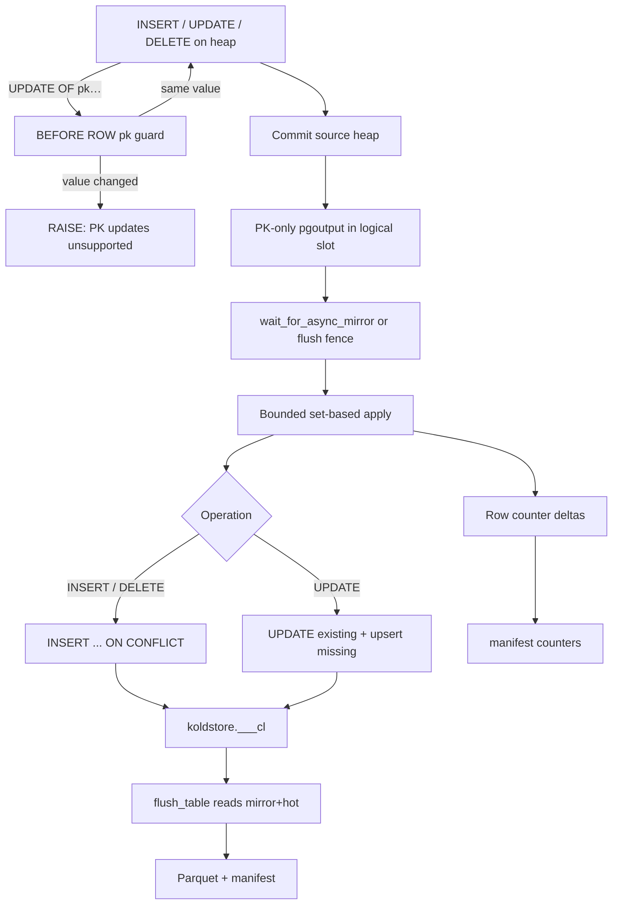
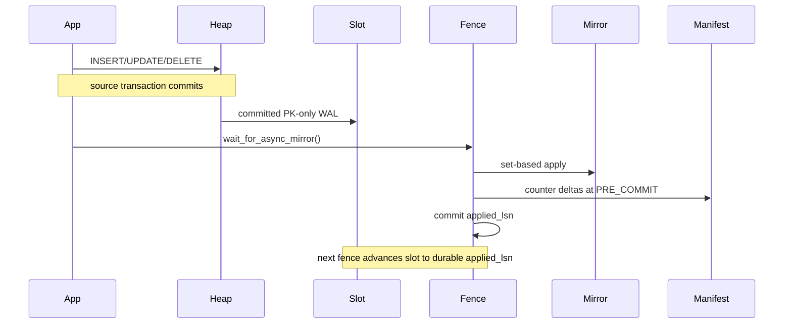

# DML Table Workflow

This document describes what happens when application SQL mutates a managed heap
table: `INSERT`, `UPDATE`, and `DELETE`. It covers mirror capture, row counter
accounting, scope enforcement, and how DML state flows into flush and scan.

**Application path:** native PostgreSQL heap DML + PK-mutation guard
**Capture path:** committed-WAL logical decoding + database apply worker

**Mirror contract:** `crates/koldstore-wal-mirror/src/mirror/`
**Capture/apply:** `crates/pg_koldstore/src/mirror/`
**Counter cache:** `crates/pg_koldstore/src/row_counter_cache.rs`

---

## Clean-schema model

User tables keep application columns only. Each managed table has a latest-state
change-log mirror at `koldstore.<schema>_<table>__cl`:

| Column | Type | Meaning |
|--------|------|---------|
| `<pk columns>` | same as heap | Primary key |
| `seq` | `bigint` | Snowflake-style effect id (ordering, flush cutoffs) |
| `op` | `smallint` | `1 = INSERT`, `2 = UPDATE`, `3 = DELETE` |

The mirror holds **at most one row per PK** — the latest hot-side state for that
key. It is not a full event log. Tombstones (`op = 3`) stay until flush prunes
them.

---

## Overview


```mermaid
flowchart TD
  DML["INSERT / UPDATE / DELETE on heap"] --> COMMIT["Commit source heap"]
  DML -->|"UPDATE OF pk…"| PKG["BEFORE ROW pk guard"]
  PKG -->|"value changed"| ERR["RAISE: PK updates unsupported"]
  PKG -->|"same value"| DML
  COMMIT --> WAL["PK-only pgoutput in logical slot"]
  WAL --> FENCE["wait_for_async_mirror or flush fence"]
  FENCE --> APPLY["Bounded set-based apply"]
  APPLY --> AKIND{"Operation"}
  AKIND -->|"INSERT / DELETE"| AUPSERT["INSERT ... ON CONFLICT"]
  AKIND -->|"UPDATE"| AUPDATE["UPDATE existing + upsert missing"]
  AUPSERT --> MIR["koldstore.<schema>_<table>__cl"]
  AUPDATE --> MIR
  APPLY --> RC["Row counter deltas"]
  RC --> MAN["manifest counters"]
  MIR --> FLUSH["flush_table reads mirror+hot"]
  FLUSH --> PQ["Parquet + manifest"]
```

DML is broader than capture: application statements synchronously mutate the
hot PostgreSQL heap, the PK guard synchronously protects the mirror identity,
and flush later performs its own internal cleanup DML. Only propagation from a
committed heap change into the mirror is deferred. The foreground commit returns
after the heap write; the mirror becomes current at the next fence
(`wait_for_async_mirror` or an internal flush fence). See
[mirror-capture.md](mirror-capture.md).

Primary-key mutation is rejected by a separate
`BEFORE UPDATE OF <pk...> FOR EACH ROW` guard so ordinary updates never pay for
an `OLD TABLE` transition relation. Same-value assignments (`SET id = id`)
succeed because the guard raises only on `IS DISTINCT FROM`.

---

## Phase 1 — Table setup (prerequisite)

Installed by `koldstore.manage_table` (see [manage-table.md](manage-table.md)):

1. `CREATE TABLE koldstore.<schema>_<table>__cl` with PK + metadata columns
2. B-tree on `seq`, plus partial tombstone index `(seq) WHERE op = 3`
3. PK-guard function with a bounded, mirror-derived name in `koldstore`
4. One `BEFORE UPDATE OF <pk...> FOR EACH ROW` guard trigger
5. Counter refresh so manifest hot/mirror counts match live heaps before capture
   takes over
6. Add the source's PK columns to the shared publication and start/reuse the
   always-on database applier

There are **no** INSERT/UPDATE/DELETE capture triggers on the source heap.
For user-scoped tables, RLS policy `koldstore_user_scope_fail_closed` is also
installed.

Existing-table manage backfills one mirror row per live heap PK before
activation. Empty-table manage relies on INSERT capture from the first write.
That invariant is what lets UPDATE/DELETE modify the mirror directly.

---

## Phase 2 — Committed-WAL capture

There is no statement-trigger capture path.

The source table publishes only its primary-key columns through pgoutput v1. A
logical slot filters out aborted transactions; therefore rollback correctness
does not require speculative mirror writes or compensating deletes.

Managed commits wake the persistent WAL applier through a coalescing shared
generation and latch. The applier applies committed changes in bounded batches
of 8,192; a low-frequency watchdog recovers missed notifications. Asynchronous
commits that are not yet decodeable retry for at most one second (10–200 ms).
`koldstore.wait_for_async_mirror()` uses the same path when the caller needs an
explicit consistency boundary:

| Source operation | Mirror apply |
| --- | --- |
| INSERT | Set-based `INSERT ... ON CONFLICT DO UPDATE` |
| UPDATE | Set-based `UPDATE ... FROM` for existing keys, then conflict-safe insert of only keys missing from the mirror |
| DELETE | Set-based `INSERT ... ON CONFLICT DO UPDATE`, setting `op = 3`, so a missing mirror row still becomes a tombstone |

Primary keys cross the pgoutput boundary as protocol text. The applier decodes
each peeked message immediately (it does not retain a raw bytea batch). Segment
order text is peeked before PK cells are taken, because taking replaces those
tuple slots with NULL and `migration_order_by` is often the PK itself. Builtin
int/bool keys parse once into native values. `seq` is an integer and `order_key`
stays bytes. In-batch identity is typed:
a single `bigint`/`int`/`smallint`/`bool` key is an inline HashSet key (no
String, no NUL join). Text and composite keys still own their cells. Compatible
batches contain at most 8,192 unique keys; a duplicate key, relation change,
operation change, or capacity boundary flushes the current batch. Non-key source
columns are not published or allocated. The mirror remains a metadata index;
flush reads the current row image from the hot heap.

The applier caches separate upsert and UPDATE plans for each relation.
Pgoutput relation metadata changes invalidate cached SQL plans, PK type names,
and PK column indexes/OIDs before another batch executes. UPDATE's direct write and insert-missing
fallback are one data-modifying CTE, preserving atomicity while avoiding
conflict arbitration for the normal existing-row path.

The mirror batch, row-counter delta, and durable applied LSN commit together.
The next fence advances the slot to that checkpoint before peeking more WAL.
`flush_table` invokes this phase automatically. Flush's internal source-row
cleanup uses PostgreSQL's `DoNotReplicateId`, so maintenance deletes do not
produce new mirror tombstones.

When a configured row/time budget ends with WAL still pending, the database
worker runs up to four more ticks immediately. The fifth pending result yields
through the latch before a new burst, balancing catch-up latency with CPU and
flush-scheduler fairness. Capture does not provide transparent read-your-writes.
The fence covers changes that committed before its WAL boundary; it cannot
decode the caller's uncommitted writes. In `REPEATABLE READ` or `SERIALIZABLE`,
a snapshot acquired before the fence also cannot see later-applied mirror state.
Call the fence before opening the transaction/snapshot that requires those
commits. Full operational semantics are in
[mirror-capture.md](mirror-capture.md).

### Encoding at mirror boundary

| Field | Source | Type |
|-------|--------|------|
| PK values | pgoutput text → parse-once native arrays | Native PG column types |
| `seq` | WAL applier snowflake allocation | `i64` above durable watermark |
| `order_key` | pgoutput text → sort-key bytes | `bytea` when configured |
| `op` | `MirrorOperation::code()` | `smallint` 1/2/3 |

---

## Phase 3 — Row counter cache

### Delta recording

The WAL applier records counter deltas through
`row_counter_cache::record_delta` once per applied set-based batch, not once
per heap row (`pg_koldstore/src/sql/flush/counters.rs` /
`pg_koldstore/src/row_counter_cache.rs`):

```rust
// thread-local HashMap<table_oid, (hot_delta, mirror_delta)>
record_delta(table_oid, hot_delta, mirror_delta)
```

No manifest I/O per row.

### Commit path

`row_counter_xact_callback` on `XACT_EVENT_PRE_COMMIT`:

1. Drain pending deltas from the thread-local map
2. SPI `plan_bump_table_row_counts` → `koldstore.internal_bump_row_counts`
3. Update `koldstore.manifest` counters for each touched table

On `XACT_EVENT_ABORT`: `clear_pending_deltas` (discard in-memory state).

**Contract:** one manifest bump per touched table per apply transaction, not
per row.

### Counter semantics

| Operation | hot_row_count | mirror_row_count |
|-----------|---------------|------------------|
| INSERT (new PK) | +N | +N |
| INSERT (reinsert over tombstone) | +N | +0 for overlapping keys |
| UPDATE | 0 | 0 |
| DELETE | -N | 0 (tombstone stays until flush) |

Flush applies decrements via `internal_apply_flush_row_counts` after seq-range
cleanup (see [flushing-table.md](flushing-table.md)).

### Reading counters

`read_table_row_counters` reads O(1) from manifest:

```json
{"hot_row_count": N, "mirror_row_count": M, "cold_row_count": C, "cold_segment_count": S}
```

Used by flush stats resolution and operator diagnostics. Mid-transaction reads
of `manifest.mirror_row_count` do not include pending backend deltas until
pre-commit flush (pg_tests that assert counters call `flush_pending_deltas`
explicitly). Flush selection folds `row_counter_cache::pending_deltas` into the
O(1) mirror pending count. This counter accounting does not make uncommitted
source changes visible to logical decoding or to `KoldMergeScan`.

---

## Phase 4 — Hot heap behavior

| Operation | Heap | Mirror after capture/fence | Visible via merge scan |
|-----------|------|---------------------|------------------------|
| INSERT | New live row | `op = 1` latest state | Yes (hot wins) |
| UPDATE | In-place update | `op = 2` latest state | Yes (hot wins) |
| DELETE | Physical row removed | `op = 3` tombstone | Depends on cold state* |

\*If the PK existed in cold before delete, merge scan may still show the old
cold live row until mirror capture has been fenced and the
tombstone is flushed to Parquet with `deleted = true`. See
[scanning-table.md](scanning-table.md).

**No Parquet reads on DML path** — verified by design and
`crates/pg_koldstore-shell-tests/tests/hot_dml_no_cold_reads.rs`.

---

## Phase 5 — Scope enforcement (user tables)

Live DML/read isolation for user-scoped tables is enforced by **fail-closed
RLS** installed at manage time (`plan_user_scope_policy` in
`koldstore-migrate/src/security/scope.rs`):

```sql
USING (
  current_setting('koldstore.user_id', true) IS NOT NULL
  AND current_setting('koldstore.user_id', true) <> ''
  AND scope_column = current_setting('koldstore.user_id', true)
)
WITH CHECK (same)
```

Session scope is set with:

```sql
SET koldstore.user_id = '<tenant_id>';
```

`koldstore.user_id` is a user-settable GUC. Applications must set it before
scoped DML and reads, but it is not proof of identity. A trusted connection
layer must bind it to an authenticated principal. The generated policy is
permissive; PostgreSQL OR-combines it with any other permissive policy on the
table, so additional policies can broaden access.

`hooks/executor.rs::enforce_dml_scope` is a pure helper used by unit/shell
tests and planning code. It is **not** registered as a live executor hook;
runtime row filtering for scoped tables is RLS. Native hot scans apply it in
PostgreSQL's child plan; streaming cold and hot+cold scans apply the compiled
security quals through PostgreSQL `ExecScan` after winner resolution.

---

## Phase 6 — Downstream: flush reads mirror + hot

When `flush_table` runs, row selection joins mirror to hot heap
(`plan_mirror_flush_selection_batch` in `koldstore-flush`):

```sql
SELECT hot.col AS col, ..., mirror."seq", mirror."op"
FROM mirror
LEFT JOIN ONLY hot ON mirror.pk = hot.pk
WHERE mirror."seq" <= $max_seq
ORDER BY mirror."seq"
```

SPI decode → `FlushMirrorRow` → Arrow → Parquet.

Delete markers (`op = 3`): only PK columns + cold metadata written to Parquet;
`row_image` is null; `deleted = true` in the segment.

After Parquet write, **seq-range cleanup** removes mirror rows with
`seq <= max_seq` and matching hot rows for `op IN (1,2)`.

---

## Serde boundaries (DML → flush → cold)

```
User SQL row (native PG types on heap)
  → PK-only pgoutput → bounded apply batch → set-based mirror write
  → Mirror table storage (typed PK + seq + op + pg_lsn; no JSON)

At flush:
  Mirror + hot JOIN
  → SPI heap tuples
  → FlushColumnValue (typed decode)
  → Arrow builders
  → Parquet binary

Row counter deltas:
  → in-memory (i64, i64) per table_oid during apply
  → SPI bump of manifest in the apply transaction
```

---

## Planned but not exposed in PG today

Pure planning exists in `koldstore-merge/src/sql/dml.rs` for:

- `koldstore.hydrate_pk`
- `koldstore.update_row` (`lookup_cold` flag)
- `koldstore.delete_row` (`allow_may_contain`)

There are no `#[pg_extern]` implementations in `pg_koldstore` yet; cold DML
remains library planning only.

Standard SQL `UPDATE`/`DELETE` on cold-only rows (not in the hot heap) is a
no-op on the heap; durable cold masking requires a mirror tombstone + flush.

### What hooks are actually registered

`_PG_init` installs:

- custom-scan hooks for `KoldMergeScan` (`set_rel_pathlist` / related scan hooks)
- `XactCallback` for row-counter flush/clear
- `RelcacheCallback` for catalog cache invalidation

Capture uses logical decoding only. There is no live `ExecutorStart` /
`ProcessUtility` DML-rewrite hook that writes the mirror. Managed tables keep
only the PK mutation guard; the always-on WAL applier is started during
activation and restored by the cluster supervisor or explicit ensure/fence
paths, not by application DML triggers.

---

## Transaction workflow summary


```mermaid
sequenceDiagram
  participant App
  participant Heap
  participant Slot
  participant Fence
  participant Mirror
  participant Manifest

  App->>Heap: INSERT/UPDATE/DELETE
  Note over App,Heap: source transaction commits
  Heap->>Slot: committed PK-only WAL
  App->>Fence: wait_for_async_mirror()
  Fence->>Mirror: set-based apply
  Fence->>Manifest: counter deltas at PRE_COMMIT
  Fence->>Fence: commit applied_lsn
  Note over Fence,Slot: next fence advances slot to durable applied_lsn
```

---

## Crate map

| Concern | Location |
|---------|----------|
| Shared `__cl` DDL / read / write SQL | `koldstore-wal-mirror/src/mirror/shared/` |
| PK / order mutation guard | `koldstore-wal-mirror/src/mirror/guard.rs` |
| Decoder / batch policy | `koldstore-wal-mirror/src/mirror/async/` |
| Lifecycle / apply / workers | `pg_koldstore/src/mirror/` |
| Migrate orchestration (uses mirror crate) | `koldstore-migrate/src/sql/mirror.rs` |
| Row counter cache | `pg_koldstore/src/row_counter_cache.rs` |
| Counter SPI | `pg_koldstore/src/sql/flush/counters.rs` |
| Counter SQL functions | `pg_koldstore/sql/koldstore--0.1.0.sql` |
| Scope / RLS | `koldstore-migrate/src/security/scope.rs` |
| Flush selection | `koldstore-flush/src/ops.rs` |
| DML effect planning (future) | `koldstore-merge/src/sql/dml.rs` |

Related docs: [manage-table.md](manage-table.md),
[mirror-capture.md](mirror-capture.md),
[flushing-table.md](flushing-table.md),
[jobs-and-scheduler.md](jobs-and-scheduler.md), and
[scanning-table.md](scanning-table.md). See
[ADR-005](../decisions/005-async-apply-progress-and-health.md) for apply
progress and retained-WAL health decisions.
