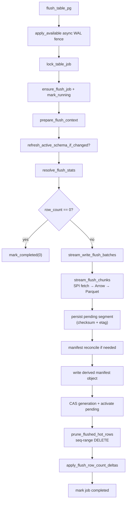

# Flush Table Workflow

This document describes the synchronous `koldstore.flush_table` path: how mirror
rows become Parquet segments, how the catalog and manifest are updated, and how
hot/mirror rows are pruned after a successful write.

**SQL entrypoint:** `koldstore.flush_table(table_name regclass) → uuid`
**Orchestrator:** `crates/pg_koldstore/src/sql/flush/execute.rs` (SPI + locks only)
**PG-free logic:** `crates/koldstore-flush/` (selection, encode, segment write, catalog plans),
`crates/koldstore-manifest/` (manifest assembly + JSON I/O), `crates/koldstore-parquet/`

Related: `koldstore.enqueue_flush_job(force => true)` sets the force flag on a
pending job; `flush_table` then runs it inline.

All flushes are **table-wide** (`scope_key = ''` in catalog).

---

## Overview



Internal mirror/hot SQL runs under `with_custom_scan_disabled` so the flush path
does not recurse into `KoldMergeScan`.

---

## Phase 0 — Async mirror fence

`flush_table` first calls `async_mirror::apply::apply_bounded` (via
`apply_available`) and retains the last applied source commit end-LSN (`L0`).
If the current database has no async logical slot, this is a cheap no-op.
Otherwise it applies all committed async source changes available before the
flush takes its table lock or resolves mirror statistics.

This makes flush selection a strong consistency boundary for both capture modes:
strict changes already exist in the mirror, and async changes are caught up
before selection. See [mirror-capture-modes.md](mirror-capture-modes.md).

## Phase 6 — Async prune fence (after manifest publish)

For tables with `mirror_capture_mode = async`, after manifest publish and before
`prune_flushed_hot_rows`:

1. `LOCK TABLE ONLY … IN SHARE ROW EXCLUSIVE MODE` (local `lock_timeout`)
2. Capture durable WAL upper bound `F1`
3. Bounded apply with `upto_lsn = F1`, skip through `L0`, no durable checkpoint
   acknowledgement, and target-table sequences strictly above `max_seq`
4. Existing atomic mirror+hot prune

Parquet upload stays concurrent with DML; only this short finalize window blocks
writers. Strict tables skip the fence. Design notes:
[async-flush-prune-race](../cases/async-flush-prune-race.md).

---

## Phase 1 — Job lock and context

### 1.1 Advisory lock

Same transaction lock as manage: `lock_table_job(table_oid)`.

### 1.2 Inline flush job

`jobs.rs` manages one inline job per flush call:

| Step | Planner (`koldstore-flush/table_jobs.rs`) | Effect |
|------|------------------------------------------|--------|
| Lookup | `plan_lookup_active_inline_flush_job` | Reuse pending/running job |
| Insert | `plan_insert_inline_flush_job` | New UUID, `force: false` in payload |
| Running | `plan_mark_inline_flush_job_running` | |
| Completed / failed | `plan_mark_*` | Always returns job UUID to caller |

**Job lookup serde:** SQL returns `jsonb_build_object('id', …, 'force', …)::text`
→ `PendingFlushJobWire { id, force }` via `serde_json`.

The `force` flag comes from an existing job payload (e.g. prior
`enqueue_flush_job(force=true)`). `flush_table` itself has no `force` parameter.

### 1.3 Prepared context

`prepare_flush_context` resolves:

| Field | Source |
|-------|--------|
| `RelationContext` | namespace, table name |
| `FlushStorageContext` | `storage_type`, `base_path`, credentials/config, compression, schema version |
| `ManagedTableSnapshot` | mirror relation, PK columns |
| Catalog columns | `migration_catalog` |
| `indexed_columns` | PK ∪ catalog indexed columns (deduped) |
| `max_rows_per_file` | active flush policy + GUC floor |

### 1.4 Schema evolution gate

`refresh_active_schema_if_changed(table_oid)` — if the active schema version
changed, context is rebuilt. On error the job is marked failed and the UUID is
still returned.

---

## Phase 2 — Stats resolution (what to flush)

`resolve_flush_stats` (`spi.rs`) gathers SPI inputs, then delegates pure selection to
`koldstore-flush::stats::{resolve_policy_flush_selection, resolve_force_flush_selection}`.
It returns `ResolvedFlushSelection { stats: FlushStats, mirror_ops: Option<Vec<i16>> }`.

### Path A — Force flush (`force = true`)

1. `mirror_flush_stats` — full mirror `COUNT(*)` + seq bounds
2. If delete-only rows ≤ 4096 (`FORCE_TOMBSTONE_ONLY_CAP`):
   - `mirror_op_stats(op=3)` + `mirror_ops: Some([3])` (tombstone-only fetch/cleanup)
3. Else flush entire mirror

### Path B — Policy flush (normal)

1. **`mirror_pending_row_count`** — O(1) read from `koldstore.manifest.mirror_row_count`
   plus any same-backend pending apply/DML deltas (falls back to
   `mirror_flush_stats` if manifest missing)

2. Load **`FlushPolicy`** from `koldstore.schemas.options`:
   - SPI → `pgrx::JsonB` → `FlushPolicy::from_value`

3. **`policy_flush_row_count(pending, policy)`** — pure math:
   - If `pending ≤ hot_row_limit` → 0
   - Else flush `excess` in `min_flush_rows` chunks (with half-chunk partial rule)

4. **`mirror_oldest_rows_cutoff(table_oid, flush_count)`**:
   - `ORDER BY seq ASC LIMIT 1 OFFSET (N-1)` → `max_seq` cutoff
   - Returns `(selected_count, max_seq)`
   - Fallback if counters overshoot: live `mirror_flush_stats` + capped cutoff

Policy-path `FlushStats` uses `min_seq = 0`; `commit_seq` equals mirror `seq`.

### Mirror stats serde (fallback / force paths)

```sql
SELECT jsonb_build_object(
  'row_count', count(*),
  'min_seq', COALESCE(min("seq"), 0),
  'max_seq', COALESCE(max("seq"), 0),
  ...
)::text
```

Rust: `serde_json::from_str` → `MirrorSeqStats` → `FlushStats`.

---

## Phase 3 — Early exit

If `selection.stats.row_count == 0`:

- `mark_flush_job_completed(0, 0, 0)`
- No Parquet, no cleanup, no manifest file write

---

## Phase 4 — Streaming encode and segment write

`stream_write_flush_batches` (`execute.rs`).

### 4.1 Setup

- Manifest paths: `{base_path}/{namespace}/{table}/manifest.json`
- Open the configured filesystem/S3 client and load the existing manifest object, or create a new shared manifest
- `next_flush_batch_number` from `koldstore.cold_segments`
- Build `StreamEncodeInput` (columns, Parquet schema, `max_seq`, optional `mirror_ops`)

### 4.2 Mirror fetch (SPI → typed rows)

**SQL planner:** `plan_mirror_flush_selection_batch` (`koldstore-flush/ops.rs`)

```sql
SELECT <app cols from hot/mirror join>,
       mirror."seq", mirror."op", (mirror."op" = 3) AS deleted
FROM koldstore.{table}__cl AS mirror
LEFT JOIN ONLY {schema}.{table} AS hot ON <pk join>
WHERE mirror."seq" <= $1          -- max_seq cutoff
  AND mirror."seq" > $2           -- keyset lower bound
  [AND mirror."op" = 3]           -- optional force tombstone filter
ORDER BY mirror."seq" ASC
LIMIT $3                          -- 8192 rows per SPI round trip
```

**Fetcher:** `mirror_fetch.rs::fetch_mirror_batch`

**SPI decode → `FlushMirrorRow`** (ordinal access, no per-column name lookup):

| PG type | `FlushColumnValue` |
|---------|-------------------|
| bool | `Bool` |
| int2/4/8 | `Int16` / `Int32` / `Int64` |
| float4/8 | `Float32` / `Float64` |
| text, numeric, bytea, text[] | `Utf8(String)` |
| uuid | `Utf8(uuid string)` |
| jsonb | `Utf8` (string or `serde_json::to_string`) |
| timestamptz | `TimestamptzMicros` (PG epoch µs + Unix offset; no string parse) |

Column layout: ordinals `1..N` = catalog columns, `N+1` = `seq`, `N+2` = `op`.

Non-PK column values for live rows come from the hot heap join. Delete mirror
rows (`op = 3`) carry PK values from mirror only.

### 4.3 Arrow encode

`stream_flush_chunks` (`koldstore-flush/encode.rs`):

1. Fetch page of up to 8192 rows (`FLUSH_MIRROR_FETCH_BATCH_SIZE`)
2. `CleanColdRecordBatchBuilder::push_typed_row` per row
   - App columns + metadata: `seq`, `op`, `deleted`, `schema_version`
   - Tracks `indexed_bounds` as `serde_json::Value` min/max per indexed column
     (manual pass; Parquet writer also records chunk stats on the same
     columns — see planned change below)
3. When chunk reaches `max_rows_per_file` → `FlushWriteChunk`
4. Callback writes Parquet segment

**No per-row cleanup JSON** is built in the encode loop. `cleanup_row_json` in
`batch_builder.rs` exists for tests/legacy only.

**Planned (ADR-002):** derive catalog `column_stats` from Parquet footer
statistics after encode and drop `indexed_bounds` tracking so flush does not
compute min/max twice. Catalog/manifest remains the segment-prune authority;
in-file row-group prune already uses the footer. Details:
[ADR-002: Footer-Derived Catalog Segment Stats](../decisions/002-footer-derived-catalog-stats.md).

### 4.4 Parquet write

`write_flush_segment_file` (`segment_write.rs`):

1. Path: `{namespace}/{table}/batch-{n}-{segment_id}.parquet`
   (`segment_id` makes each write attempt unique so a retry after abort cannot
   collide with an orphaned final object at the same `batch_number`)
2. Encode in memory via `encode_parquet_segment_bytes` (Arrow `RecordBatch` →
   native Parquet), then `validate_parquet_bytes` (magic + footer open)
3. Durable publish through `koldstore-storage`:
   - temp key under `{prefix}/.tmp/{writer_id}/…`
   - `PutMode::Create` / `copy_if_not_exists` to the final key
   - size validation; never truncate a final key in place
   - filesystem backends use `LocalFileSystem::with_fsync(true)`
4. Writer properties:
   - Column statistics on `seq` + PK + indexed columns
   - Bloom filters on PK columns (`max_ndv` = row-group size)
   - Compression from storage context (default `zstd`)
5. `column_stats` JSON for catalog (today from merged `indexed_bounds` +
   `FlushStats.seq`; later from footer extraction per ADR-002):
   ```json
   { "seq": {"min": N, "max": M}, "created_at": {"min": "...", "max": "..."} }
   ```
6. `byte_size` from published object metadata (not recomputed by scanning rows)
7. Assemble `ManifestSegment`s from `catalog_row`s once, then `manifest.append_segment_batch(...)`
8. Collect `WrittenFlushSegment` (new `segment_id = Uuid::new_v4()`)

Manifest finalize uses `write_manifest_with_client` and the same atomic put path
(`publish_mutable_object`) so `manifest.json` is never truncate-written in place.

### 4.5 Validation

`validate_flush_row_selection(stats.row_count, rows_written)` — counts must match.

---

## Phase 5 — Catalog insert as `pending` (per segment)

During streaming, each Parquet file is cataloged immediately via
`persist_flush_segment` with **`status = 'pending'`** (not query-visible):

1. One SPI insert for `koldstore.cold_segments` + `cold_segment_stats`
   (native arrays / `unnest`), including `checksum` (sha256 hex) and
   `object_etag` from the single publish pass
2. No per-PK catalog rows — prune with `cold_segment_stats` / Parquet
   row-group stats and bloom filters so catalog size stays O(segments ×
   indexed columns)

`column_stats` crosses SPI as `pgrx::JsonB` per segment (already
`serde_json::Value` in Rust). Failpoints: `after_checksum_metadata` then
`after_pending_segment` after the pending insert.

---

## Phase 6 — Seq-range cleanup (after activate)

`prune_flushed_hot_rows` (`spi.rs`) — **production path uses seq-range DELETE,
not JSON cleanup**. Runs only after pending segments are activated.

`plan_seq_range_cleanup` (`cleanup.rs`):

```sql
WITH removed_mirror AS (
  DELETE FROM koldstore.{table}__cl AS mirror
  WHERE mirror."seq" <= $1 [AND mirror."op" = …]
  RETURNING <pk cols>, seq, op
),
deleted_hot AS (
  DELETE FROM ONLY {schema}.{table} AS hot
  USING removed_mirror
  WHERE removed_mirror."op" IN (1, 2)
    AND <pk join>
  RETURNING 1
)
SELECT count(removed_mirror), count(deleted_hot)
```

- Bind parameter: single `bigint max_seq`
- Runs under `SET LOCAL session_replication_role = replica` so strict-mode
  source triggers do not capture KoldStore's own pruning
- The hot DELETE runs with PostgreSQL's internal replication origin temporarily
  set to `DoNotReplicateId`; the prior origin is restored even if SPI returns an
  error
- Mirror rows removed first; hot rows removed only for `op IN (1,2)` (insert/update)
- Delete tombstones (`op = 3`) stay in cold after flush; mirror copy is removed

`DoNotReplicateId` matters in async mode: pruning hot source rows is KoldStore
maintenance, not application DML, and must not be decoded later into fresh
tombstones. Replication-origin marking uses the backend C API boundary directly
instead of SQL `pg_replication_origin_session_setup/reset`; the trigger-control
setting above remains transaction-local SQL state.

`plan_clean_schema_cleanup` (JSON `jsonb_to_recordset`) remains for tests only.

---

## Phase 7 — Manifest counter deltas (after cleanup)

`apply_flush_row_count_deltas` → `koldstore.internal_apply_flush_row_counts`:

```sql
UPDATE koldstore.manifest SET
  mirror_row_count = GREATEST(0, mirror_row_count - mirror_pruned),
  hot_row_count    = GREATEST(0, hot_row_count - hot_pruned),
  cold_row_count   = GREATEST(0, cold_row_count + cold_rows_added)
WHERE table_oid = $1 AND scope_key = ''
```

Four native `bigint` SPI parameters — no JSON.

---

## Phase 8 — Manifest reconciliation

If in-memory `manifest.segments.len() != publishable_cold_segment_count`
(`pending` + `active`):

- Rebuild from catalog: `plan_publishable_cold_segments_for_manifest_json`
- SQL → `jsonb_agg` text → `Vec<CatalogManifestSegmentRow>` → `Manifest`

Guards against drift between streamed manifest and catalog truth before activate.

---

## Phase 9 — Finalize (derived manifest + CAS activate)

| Step | Serde |
|------|-------|
| Write `manifest.json` | `serde_json::to_vec(&Manifest)` to object-store path (derived export) |
| CAS activate | `plan_activate_flush_segments`: bump `manifest.generation` bigint where expected matches; set pending → `active` for this flush’s segment ids |
| Complete job | native SPI bigints |
| Invalidate cache | `catalog::cache::invalidate_table` |

The durable ordering is: publish final segments → insert **pending** catalog rows
→ write derived manifest object → **CAS generation + activate** → prune
mirror/hot rows → apply row count deltas → mark the job complete. Cleanup never
runs before activate succeeds, so a CAS/manifest failure leaves hot data
authoritative and retryable. Pending segments are invisible to merge scan
(`status = 'active'` only).

See [ADR-004](../decisions/004-segment-publication-protocol.md).

### `manifest.json` shape (`koldstore-manifest`)

`Manifest` and `ManifestSegment` are `Serialize`/`Deserialize`:

- `segments[]`: `path`, seq/commit ranges, `row_count`, `byte_size`, `schema_version`
- `column_stats`: `BTreeMap<String, {min, max: serde_json::Value}>`
- Watermarks: `max_seq`, `max_commit_seq`

After finalize, `sync_state` becomes `in_sync` and `generation` is monotonic.

---

## Serde boundary summary

| Boundary | Format |
|----------|--------|
| Job lookup | JSON text `{id, force}` |
| Flush policy | `JsonB` → `FlushPolicy` |
| Manifest counters | JSON text `{hot_row_count, mirror_row_count, …}` |
| Mirror stats (fallback) | JSON text → `MirrorSeqStats` |
| Mirror row fetch | SPI heap tuples → `FlushMirrorRow` (typed, no JSON) |
| Arrow / Parquet | `FlushColumnValue` → Arrow builders → binary Parquet |
| Segment catalog insert | native PG arrays + `jsonb[]` stats |
| Cleanup | single `bigint max_seq` |
| Counter deltas | 4× `bigint` |
| Manifest file | `serde_json` bytes |

---

## Key constants

| Constant | Value | Location |
|----------|-------|----------|
| Mirror fetch batch | 8192 | `FLUSH_MIRROR_FETCH_BATCH_SIZE` |
| Force tombstone cap | 4096 | `FORCE_TOMBSTONE_ONLY_CAP` |
| Scope | `scope_key = ''` | all flush SQL |

---

## Crate map

| Concern | Location |
|---------|----------|
| Orchestration | `pg_koldstore/src/sql/flush/execute.rs` |
| Stats, cleanup, catalog SPI | `pg_koldstore/src/sql/flush/spi.rs` |
| Mirror fetch/decode | `pg_koldstore/src/sql/flush/mirror_fetch.rs` |
| Encode loop | `koldstore-flush/src/encode.rs` |
| Mirror selection SQL | `koldstore-flush/src/ops.rs` |
| Seq-range cleanup | `koldstore-flush/src/cleanup.rs` |
| Parquet write | `koldstore-parquet/src/writer.rs`, `batch_builder.rs` |
| Manifest model | `koldstore-manifest/src/model/` |
