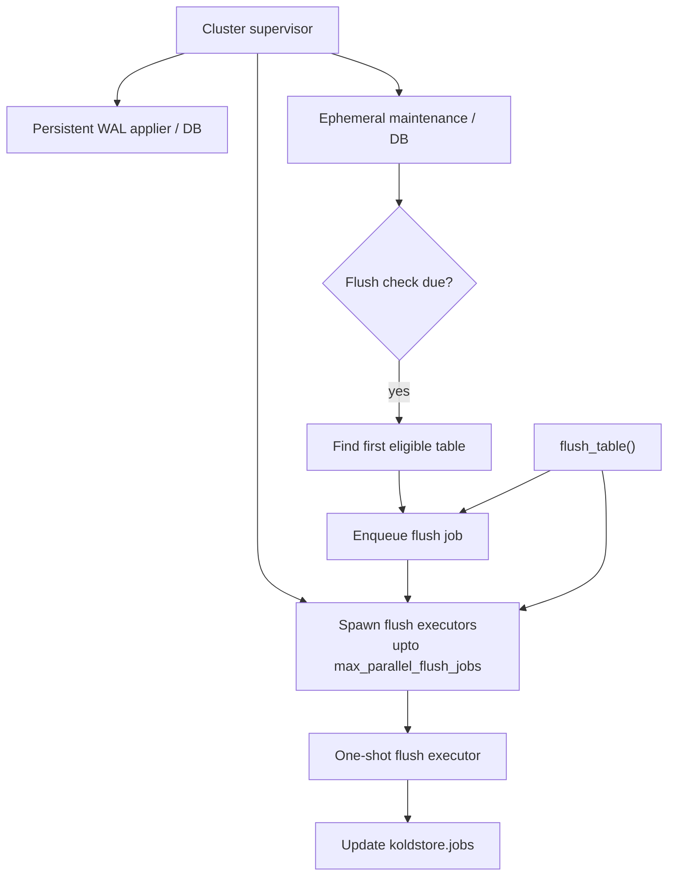

# Jobs and Scheduler

KoldStore uses durable rows in `koldstore.jobs` as a PostgreSQL-native flush
queue. Scheduling and recovery run in an ephemeral per-database maintenance
worker; Parquet work runs in bounded one-shot flush executors. Persistent WAL
application is a separate latch-driven service and is not part of the flush
scheduler loop. Jobs are both the work request and the operator-visible
progress record.

Production default is `koldstore.flush_execution = queue`.
`koldstore.flush_execution = inline` exists only so `#[pg_test]` SPI
transactions can run flush in the calling backend.

## Runtime topology

The static cluster supervisor discovers KoldStore-active databases and keeps
required services alive. One persistent WAL applier runs per active database
(see [mirror-capture.md](mirror-capture.md)). Maintenance workers are
ephemeral: they reconcile recovery, evaluate automatic flush eligibility,
reconcile the flush queue, recover orphan jobs, wait a short 200 ms
burst-coalescing grace, then exit when caught up.

`manage_table`, explicit consistency fences, and the supervisor also ensure
lifecycle when necessary. WAL appliers use `BGW_NEVER_RESTART` so intentional
slot drop leaves them stopped until the supervisor re-registers a still-required
service. A registration backoff applies when `max_worker_processes` is
exhausted.

## `koldstore.jobs`

Each job has an ID, table OID, table-wide empty `scope_key`, type, status,
phase, payload, progress fields, timestamps, and optional cancellation/error
metadata. Current job types are `migrate_backfill` and `flush`. Flush jobs move
through `pending` → `running` → a terminal `completed`, `error`, or `cancelled`
state. The flush path records `rows_processed`, `rows_flushed`, batches,
checkpoint sequence, duration, and phase as it progresses.

The extension permits one active (`pending` or `running`) flush job per table.
In queue mode, `flush_table` enqueues (or reuses) that job and returns its UUID
immediately; a one-shot executor claims the **table** job lock and runs the
work. The database **apply/slot** lock is not held for the whole flush: Parquet
upload runs alongside background mirror apply; finalize try-locks the slot only
for the short catch-up + prune fence. See [flushing-table.md](flushing-table.md)
and [mirror-capture.md](mirror-capture.md).

Useful SQL entry points:

| Entry point | Purpose |
| --- | --- |
| `koldstore.flush_table(table)` | Enqueue or reuse the active flush job, spawn an executor when needed, return a jsonb status object (`job_id`, `status`, `error`, …). |
| `koldstore.enqueue_flush_job(table)` | Same durable enqueue/lookup without spawning executors. |
| `koldstore.list_jobs(statuses, job_types, table)` | Read job status and progress as JSON. |
| `koldstore.cancel_job(id)` | Request cooperative cancellation of one active job. |
| `koldstore.cancel_table_jobs(table)` | Cancel pending work and request cancellation of running work for a table. |

Cancellation is cooperative: the running flush polls the durable request at
safe boundaries. Drop and unmanage hard-cancel pending jobs and signal running
ones. Startup/scheduler recovery reclaims a durable `running` flush only after
it can acquire that table's job lock, which proves no live owner holds it.

## Maintenance and WAL loops

Managed commits advance a shared WAL generation and set the persistent WAL
applier latch (with the cluster supervisor as lifecycle fallback). Concurrent
commits coalesce into one bounded WAL drain. Soft SPI/apply errors stay in the
WAL process with bounded exponential backoff rather than permanently ending the
applier; hard process death is recovered by the supervisor even when the mirror
is already caught up. A 30-second watchdog recovers missed in-memory hints
without opening an idle apply transaction.

Flush scheduling is independent of the apply wake. Ephemeral maintenance runs
only when recovery or schedule work is due, evaluates at most one table, and
enqueues at most one auto-flush job per check. It may then ask the supervisor to
spawn multiple executors for already pending work up to
`koldstore.max_parallel_flush_jobs`.

Auto-flush eligibility is **not** driven by PostgreSQL autovacuum. It uses
KoldStore mirror / hot-row policy on that check cadence. See
[operations/scheduling.md](../operations/scheduling.md).

## Automatic flush selection

A table is eligible only when it is active, has an enabled flush policy, and
has not opted out with `auto_flush = false`. Candidate selection excludes a
table with a running flush and delays a table for 60 seconds after a failed
flush. Candidates are ordered by newest managed table first; selection stops at
the first one whose policy is due.

- `row_limit` policies use the manifest mirror-row counter plus pending local
  counter deltas and flush only the policy-selected excess.
- `older_than` policies resolve eligible mirror rows through the flush stats
  path.
- A busy table is skipped without waiting; a later check can choose it again.
- Manual `flush_table` / `enqueue_flush_job` ignore the automatic-flush
  opt-out, so operators can flush an opted-out table deliberately.

The internal `koldstore.internal_run_flush_scheduler_tick()` exists for tests
and diagnostics. Production scheduling comes from ephemeral maintenance workers
started by the cluster supervisor.

## Operational knobs

| Setting | Effect |
| --- | --- |
| `koldstore.async_apply_watchdog_interval_ms` | Safety recovery cadence for a missed commit wakeup. |
| `koldstore.async_apply_max_rows_per_tick` / `...max_ms_per_tick` | Bound one apply transaction. |
| `koldstore.flush_check_interval_seconds` | Automatic-flush evaluation cadence. |
| `koldstore.max_parallel_flush_jobs` | Cap on concurrent one-shot flush executors per database. |
| `koldstore.flush_execution` | `queue` (default) or `inline` (SPI tests only). |
| `koldstore.job_retention_days` | Days to retain terminal jobs before purge (`0` disables). |
| `auto_flush` table option | Enables or opts a table out of background flushes. |
| Flush policy | Defines row-limit or age-based eligibility and the amount selected. |

See [mirror capture](mirror-capture.md) for apply correctness and
[flushing](flushing-table.md) for the flush lifecycle after a job is claimed.
