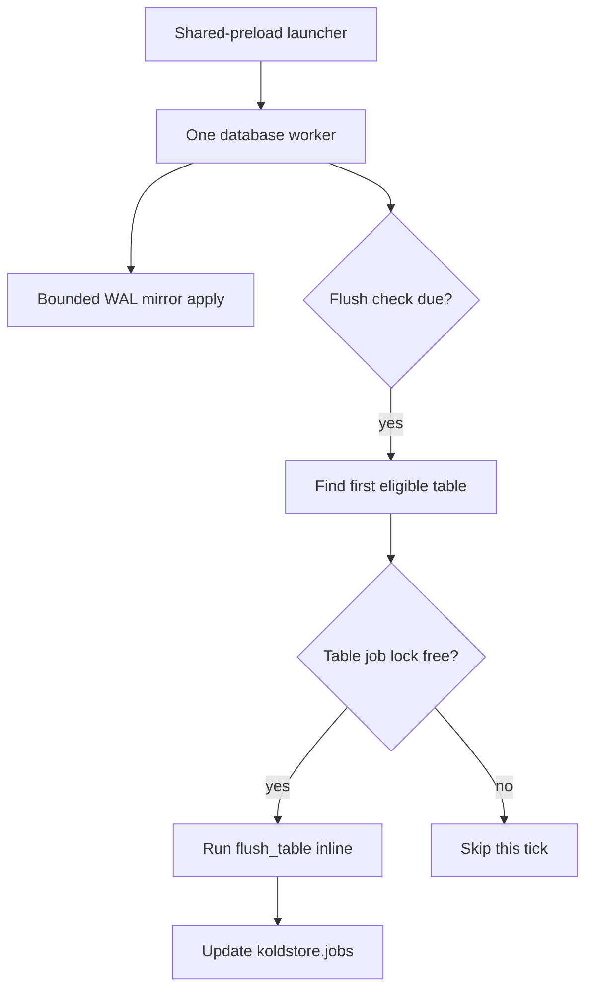

# Jobs and Scheduler

KoldStore uses durable rows in `koldstore.jobs` to expose migration and flush
work to operators. A database-scoped background worker applies committed WAL
and, on a separate cadence, evaluates automatic flush eligibility. Jobs are
durable state and progress records; they are not a separate queue consumer that
performs flushes later.

## Runtime topology

The launcher discovers KoldStore logical slots after postmaster start and
ensures one worker per database. `manage_table`, explicit consistency fences,
and the worker itself also ensure the worker when necessary. A worker stays
alive while the database has either a mirror slot or an automatic-flush-eligible
managed table.

## `koldstore.jobs`

Each job has an ID, table OID, table-wide empty `scope_key`, type, status,
phase, payload, progress fields, timestamps, and optional cancellation/error
metadata. Current job types are `migrate_backfill` and `flush`. Flush jobs move
through `pending` → `running` → a terminal `completed`, `error`, or `cancelled`
state. The flush path records `rows_processed`, `rows_flushed`, batches,
checkpoint sequence, duration, and phase as it progresses.

The extension permits one active (`pending` or `running`) flush job per table.
`flush_table` try-locks the table advisory lock and the database apply lock,
then fails fast with a clear error when either is busy (including background
auto-flush right after server start). On success it marks an orphaned running
record as errored when no owner remains, reuses an existing pending job when
present, and performs the work in the calling backend. The same function is
used for manual calls and scheduler work.

Useful SQL entry points:

| Entry point | Purpose |
| --- | --- |
| `koldstore.enqueue_flush_job(table, force := false)` | Create a pending job if one is not already active; it does not itself flush. |
| `koldstore.flush_table(table, force := false)` | Claim or create the job and execute it inline; returns its UUID. |
| `koldstore.list_jobs(statuses, job_types, table)` | Read job status and progress as JSON. |
| `koldstore.cancel_job(id)` | Request cooperative cancellation of one active job. |
| `koldstore.cancel_table_jobs(table)` | Cancel pending work and request cancellation of running work for a table. |

Cancellation is cooperative: the running flush polls the durable request at
safe boundaries. Drop and unmanage hard-cancel pending jobs and signal running
ones. Startup/scheduler recovery reclaims a durable `running` flush only after
it can acquire that table's job lock, which proves no live owner holds it.

## Worker loop

Managed commits advance a shared database generation and set the worker latch.
Concurrent commits therefore coalesce into one bounded WAL drain. If an
asynchronous commit is not decodeable on the first wake, the worker retries with
a 10–200 ms exponential delay for at most one second. A row or time budget that
leaves work pending gets a bounded number of immediate retries before yielding
to the latch. Errors soft-fail with backoff rather than permanently ending the
applier; a 30-second watchdog recovers missed in-memory hints.

The flush check is independent of the apply wake and runs only when
`koldstore.flush_check_interval_seconds` is due. This avoids catalog scans on
every commit wake. The worker evaluates at most one table and runs at most one
flush per check.

## Automatic flush selection

A table is eligible only when it is active, has an enabled flush policy, and
has not opted out with `auto_flush = false`. Candidate selection excludes a
table with a running flush and delays a table for 60 seconds after a failed
flush. Candidates are ordered by newest managed table first; selection stops at
the first one whose policy is due.

- `row_limit` policies use the manifest mirror-row counter plus pending local
  counter deltas and flush only the policy-selected excess.
- `older_than` policies resolve eligible mirror rows through the flush stats
  path.
- A busy table is skipped without waiting; a later check can choose it again.
- Manual `enqueue_flush_job` and `flush_table` ignore the automatic-flush
  opt-out, so operators can flush an opted-out table deliberately.

The internal `koldstore.internal_run_flush_scheduler_tick()` exists for tests
and diagnostics. Production scheduling comes from the database worker.

## Operational knobs

| Setting | Effect |
| --- | --- |
| `koldstore.async_apply_watchdog_interval_ms` | Safety recovery cadence for a missed commit wakeup. |
| `koldstore.async_apply_max_rows_per_tick` / `...max_ms_per_tick` | Bound one apply transaction. |
| `koldstore.flush_check_interval_seconds` | Automatic-flush evaluation cadence. |
| `auto_flush` table option | Enables or opts a table out of background flushes. |
| Flush policy | Defines row-limit or age-based eligibility and the amount selected. |

See [mirror capture](mirror-capture.md) for apply correctness and
[flushing](flushing-table.md) for the inline flush lifecycle.
