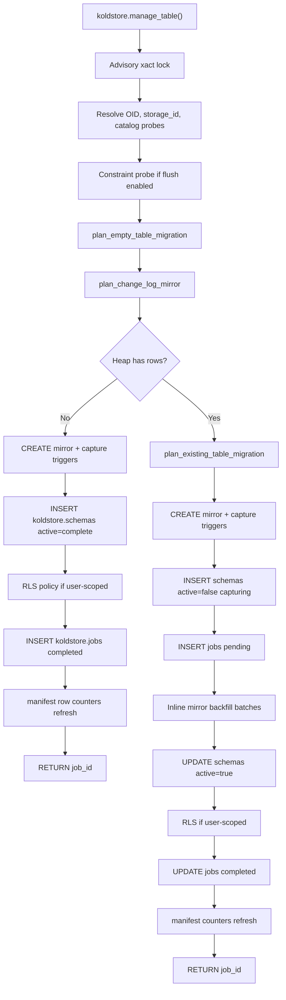

# Manage Table Workflow

This document describes what actually happens when you call
`koldstore.manage_table`. It is written against the current clean-schema
implementation: user heap tables keep application columns only; KoldStore state
lives in a change-log mirror (`koldstore.{table}__cl`), catalog tables, and
(once flushed) cold Parquet segments.

**SQL entrypoint:** `koldstore.manage_table(table_name regclass, storage text, …) → uuid`  
**Orchestrator:** `crates/pg_koldstore/src/sql/migrate_pg.rs`  
**Planning:** `crates/koldstore-migrate/`

Prerequisite: register object storage first with `koldstore.register_storage`.

---

## Overview



`manage_table` does **not** write Parquet files or object-store `manifest.json`.
Those happen on the first `koldstore.flush_table` call.

---

## Phase 0 — SQL arguments and options

`manage_table_pg` (`migrate_pg.rs`) parses:

| Argument | Default | Purpose |
|----------|---------|---------|
| `table_name` | required | Target heap `regclass` |
| `storage` | required | Name in `koldstore.storage` |
| `hot_row_limit` | null | When set, enables flush policy |
| `min_flush_rows` | 1000 | Minimum excess mirror rows before flush |
| `max_rows_per_file` | 1000 | Parquet segment size cap (GUC floor applies) |
| `table_type` | `shared` | `shared` or `user` |
| `scope_column` | null | Required for `user` tables |
| `migration_order_by` | null | Explicit ordering for existing-table backfill |
| `compression` | null | `snappy`, `zstd`, or `uncompressed` |
| `target_file_size_mb` | null | Optional target Parquet segment size in MiB |

When `hot_row_limit` is set, the triple `(hot_row_limit, min_flush_rows,
max_rows_per_file)` is validated and stored in `ManageTableOptions` as a
`FlushPolicy`. `max_rows_per_file` must be ≥ `koldstore.min_max_rows_per_file`.

**Serde boundary:** SQL args are native pgrx types. Options are assembled in Rust
as `ManageTableOptions` (`koldstore-common/src/config.rs`) before catalog
persistence.

---

## Phase 1 — Lock and catalog introspection

### 1.1 Advisory lock

`lock_table_job(table_oid)` (`job_lock_pg.rs`) takes a transaction-scoped
advisory lock so flush/migration cannot race on the same table.

### 1.2 Resolve identifiers

| Lookup | Source |
|--------|--------|
| Qualified table name | `catalog::resolve::qualified_relation_name` |
| `storage_id` UUID | `storage_id_by_name` → `koldstore.storage` |
| Column catalog | `migration_catalog` via SPI probes |
| Exact PK shape | `primary_key_shape_probe_plan` |

### 1.3 SPI catalog probes → Rust

Introspection returns **JSON text** over SPI, decoded in
`koldstore-migrate/src/introspection.rs`:

| Probe | Wire format | Rust type |
|-------|-------------|-----------|
| Primary key names | `["col1","col2"]` | `Vec<String>` |
| Columns | `[{name, type_name, is_primary_key, identity, default_expr?}]` | `ExistingTableCatalog` |
| Indexed columns | `["created_at", …]` | `Vec<String>` |
| PK shape | `[{column, ordinal, type_oid, type_name, typmod, collation?, domain_identity?, not_null}]` | `PrimaryKeyShape` |
| Constraints (if flush enabled) | `{unique_constraints, foreign_keys}` | `ManageTableConstraintsCatalog` |

When flush is enabled, non-PK `UNIQUE` constraints and foreign keys are
rejected unless `allow_fk_hot_only = true`.

---

## Phase 2 — Planning

### 2.1 Base migration plan

`plan_empty_table_migration` (`koldstore-migrate/workflow/plan.rs`):

- Validates `table_type` ∈ `{shared, user}`
- User tables require a safe `scope_column`
- Returns `EmptyTableMigrationPlan` (table OID, storage_id, effective scope)

### 2.2 Mirror plan

`plan_change_log_mirror` (`koldstore-migrate/src/sql/mirror.rs`):

| Artifact | Name pattern | Contents |
|----------|--------------|----------|
| Mirror table | `koldstore.{source_table}__cl` | PK cols + `seq bigint`, `op smallint`, `commit_lsn pg_lsn` |
| Seq index | `{mirror}_seq_idx` | `("seq")` |
| Tombstone index | `{mirror}_tombstone_seq_idx` | `("seq") WHERE op = 3` |
| Capture function | `koldstore.{mirror}_capture()` | PL/pgSQL trigger body |
| Capture triggers | on user heap | INSERT / UPDATE / DELETE AFTER ROW |

The user heap is **not** altered. No `_seq`, `_commit_seq`, or `_deleted`
columns are added (clean-schema contract).

### 2.3 Existing-table ordering (populated heap only)

`plan_existing_table_migration` chooses backfill order:

1. Explicit `migration_order_by` if orderable (integer, bigint, timestamp, timestamptz, date)
2. Else single-column PK with identity or `nextval()` default
3. Else error: *existing table migration requires an auto-increment primary key or explicit order column*

Batch size defaults to `10_000` (`DEFAULT_BACKFILL_BATCH_ROWS`).

---

## Phase 3 — Empty table path

When `EXISTS (SELECT 1 FROM ONLY table LIMIT 1)` is false:

1. **Create mirror objects** — `mirror_plan.create_statements()` via SPI:
   - `CREATE TABLE IF NOT EXISTS koldstore.{name}__cl`
   - Indexes
   - Capture function + three triggers

2. **Register schema** — `register_schema_version` inserts `koldstore.schemas` v1:
   - `active = true`
   - `initialization_state = complete`
   - `options.migration_status = active`
   - `mirror_relation`, `primary_key`, `primary_key_shape`, `columns`, `indexed_columns`, `type_matrix`, `storage_id`

3. **User scope** (if `table_type = user`) — `apply_user_scope_policy`:
   - `ENABLE ROW LEVEL SECURITY`
   - Policy `koldstore_user_scope_fail_closed` on `scope_column = current_setting('koldstore.user_id')`

4. **Job row** — `insert_completed_empty_migration_job`:
   - `job_type = migrate_backfill`, `status = completed`, `rows_processed = 0`

5. **Row counters** — `refresh_managed_table_row_counters` (see Phase 5)

6. **Return** job UUID

---

## Phase 4 — Populated table path

When the heap already has rows:

1. **Create mirror + triggers** (same as empty path)

2. **Register schema (inactive)**:
   - `active = false`
   - `initialization_state = capturing`
   - `options.migration_status = mirror_initializing`

3. **Enqueue job** — `enqueue_migration_job`:
   - `status = pending`, `phase = initialize_mirror`
   - `payload` = `MigrationBackfillPayload` (JSON, see serde section)

4. **Inline mirror backfill** — `run_existing_table_mirror_initialization_inline`:
   - Loops `plan_mirror_initialization_batch` until no candidates
   - Each batch: scan hot rows missing mirror rows, `INSERT … ON CONFLICT DO NOTHING`
   - `op = 1`, `seq = SNOWFLAKE_ID()`, `commit_lsn = pg_current_wal_lsn()`
   - `ORDER BY <migration_order_by> ASC, ctid ASC`, `FOR KEY SHARE SKIP LOCKED`
   - Capture triggers are already live; concurrent DML is captured separately

5. **Activate schema** — `plan_activate_managed_schema`:
   - `active = true`, `initialization_state = complete`
   - `options.migration_status = active`

6. **User scope policy** (if applicable)

7. **Complete job** — `status = completed`, `phase = finished`, `rows_processed = count`

8. **Row counters** + return job UUID

**Note:** Backfill runs inline in the caller session today. The `koldstore.jobs`
row is durable audit/progress; there is no separate worker claim loop in
`pg_koldstore` yet.

---

## Phase 5 — Manifest row counter initialization

`refresh_managed_table_row_counters` (`flush/counters.rs`):

1. Plans `plan_refresh_table_row_counters(table, mirror)`
2. SPI executes `COUNT(*)` on hot heap and mirror
3. Calls `koldstore.internal_refresh_row_counts(oid, hot_count, mirror_count)`

This creates or updates `koldstore.manifest` for `scope_key = ''`:

| Field | Value at manage time |
|-------|----------------------|
| `manifest_path` | `'pending'` |
| `sync_state` | `'pending_write'` |
| `hot_row_count` | live heap count |
| `mirror_row_count` | live mirror count |
| `cold_row_count` | 0 |
| `segment_count` | 0 |

After manage, DML triggers bump counters in memory; manifest is updated at
transaction pre-commit (see [dml-table.md](dml-table.md)).

---

## Serde and catalog persistence

### `koldstore.schemas.options` (jsonb)

Persisted via `RegistrationMetadata::prepare` (`koldstore-migrate/catalog/register.rs`):

```json
{
  "hot_row_limit": 10000,
  "min_flush_rows": 1000,
  "max_rows_per_file": 1000,
  "migration_order_by": "created_at",
  "target_file_size_mb": 256,
  "compression": "zstd",
  "backfill_batch_size": 10000,
  "allow_fk_hot_only": true,
  "migration_status": "active",
  "cold_metadata": {
    "stats_columns": ["seq", "created_at"],
    "bloom_filter_columns": ["id"],
    "bloom_candidate_columns": ["id"],
    "indexed_columns": [{ "column": "created_at", "source": "index", "ordinal": 1 }],
    "ordered_indexes": []
  }
}
```

`FlushPolicy` is read back with `FlushPolicy::from_value(&options)` — not a
separate column.

### `koldstore.jobs.payload` (migrate_backfill)

```json
{
  "phase": "initialize_mirror",
  "table_name": "public.messages",
  "table_type": "shared",
  "storage_id": "<uuid>",
  "scope_column": null,
  "order_column": "id",
  "order_source": "auto_increment_primary_key",
  "batch_size": 10000,
  "hot_row_limit": 10000,
  "processed_rows": 0
}
```

Serde: `#[serde(rename_all = "snake_case")]` on job phase enums.

### `koldstore.schemas` column payloads

| Column | Format |
|--------|--------|
| `columns` | `Vec<SchemaColumn>` JSON |
| `primary_key` | `["id"]` |
| `primary_key_shape` | `PrimaryKeyShape` JSON |
| `indexed_columns` | `["created_at"]` |
| `type_matrix` | `{version, columns:[{name, type_name, supported}]}` |
| `initialization_state` | string enum: `not_started` / `capturing` / `complete` / `failed` |

---

## What gets written where

| Store | Empty table | Populated table |
|-------|-------------|-----------------|
| `koldstore.schemas` | 1 row, `active=true` | 1 row, `active=false` → `true` |
| `koldstore.jobs` | completed migrate_backfill | pending → completed |
| `koldstore.manifest` | counters from live counts | same |
| Mirror table `__cl` | created | created + backfilled |
| Capture triggers | installed | installed |
| `koldstore.segments` | — | not touched |
| Object-store Parquet / `manifest.json` | — | not touched |

---

## Related entrypoints

| Function | Returns | Notes |
|----------|---------|-------|
| `koldstore.unmanage_table` | deactivated schema count | Drops mirror, triggers, RLS |
| `koldstore.register_storage` | storage UUID | Prerequisite |
| `koldstore.describe_table` | jsonb | Post-manage diagnostics |
| `koldstore.flush_table` | job UUID | First cold write (see [flushing-table.md](flushing-table.md)) |

---

## Crate map

| Layer | Crate | Role |
|-------|-------|------|
| SQL / SPI | `pg_koldstore::sql::migrate_pg` | Orchestration |
| Planning | `koldstore-migrate` | Mirror, backfill, registry, jobs, scope |
| Mirror DDL | `koldstore-mirror` | `__cl` table contract |
| Options / policy | `koldstore-common` | `ManageTableOptions`, `FlushPolicy` |
| Counters | `koldstore-flush::table_counters` | Manifest counter SQL plans |
| Cache | `koldstore-catalog` | `managed_table_snapshot` for later reads |
