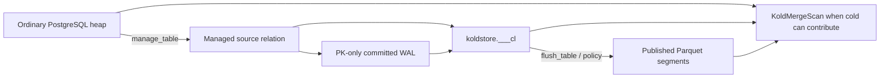

# Managed-Table Lifecycle and DDL

This document describes the user-visible lifecycle of a managed table: what
`koldstore.manage_table` installs, how hot/mirror/cold reads are merged, and
which PostgreSQL identity changes rehome generated artifacts.

For the detailed execution paths, see [manage-table](manage-table.md),
[mirror-capture](mirror-capture.md), [flushing-table](flushing-table.md), and
[scanning-table](scanning-table.md).

## Lifecycle at a glance

The heap remains the application table and PostgreSQL remains responsible for
transactions, locking, permissions, RLS, and native hot indexes. KoldStore adds
metadata and cold storage around that heap; it does not replace it with a new
table type.

## What `manage_table` does

For a source such as `db1.messages`, management creates or configures:

| Item | Result |
| --- | --- |
| Mirror | `koldstore.db1_messages__cl`, containing primary-key columns plus sequence and operation metadata |
| Mirror indexes | Sequence and tombstone-sequence indexes for flush and change reads |
| PK guard | A source-table trigger that rejects a real primary-key change, preserving the merge identity |
| Catalog state | `koldstore.schemas`, `koldstore.jobs`, and initial manifest counters |
| WAL capture | Source PK publication membership and the database-scoped logical WAL applier |
| Cold storage | Nothing immediately; Parquet segments are created only by a later flush |

For an empty source table, the mirror is immediately active. For a populated
source table, KoldStore publishes the relation, backfills the mirror, catches up
committed WAL, and only then marks the table active. This closes the gap between
the snapshot backfill and concurrent writes.

The generated name includes the **PostgreSQL schema**, not merely the relation
name. Thus `db1.messages` and `db2.messages` get independent mirrors. Very long
generated artifact names use a deterministic hash while retaining their semantic
suffixes, avoiding PostgreSQL's implicit identifier truncation as a source of
shared artifact identities.

## How reads merge hot and cold state

Before the first published segment, PostgreSQL reads the heap with its native
plan. Once cold storage can satisfy part of a query, `KoldMergeScan` combines
the hot heap, latest-state mirror, and cold Parquet segments by primary key.

1. The native hot child supplies current heap rows and preserves PostgreSQL
   access-path behavior.
2. The mirror identifies newer inserts, updates, and deletes. It masks an older
   cold row with the same primary key; a tombstone suppresses that cold row.
3. Unmasked cold rows are eligible to appear. The resolver emits exactly one
   winner per primary key.

The planner retains a native heap plan only when the cold side is proven empty
or unable to match. It must use the merge path whenever cold could contribute;
otherwise a query could omit valid cold rows.

## Source DDL and generated-artifact behavior

The source table's PostgreSQL OID is stable across the supported rename and
move operations. KoldStore keeps catalog references by OID, but mirror names
contain the source identity for clarity and uniqueness. After the following DDL
operations complete, it rehomes the mirror table, its generated indexes, and
the source PK-guard trigger/function:

| User operation | Source identity after DDL | Mirror effect |
| --- | --- | --- |
| `ALTER TABLE db1.messages RENAME TO events` | `db1.events` | `koldstore.db1_messages__cl` → `koldstore.db1_events__cl` |
| `ALTER TABLE db1.messages SET SCHEMA db2` | `db2.messages` | `koldstore.db1_messages__cl` → `koldstore.db2_messages__cl` |
| `ALTER SCHEMA db1 RENAME TO db2` | Every managed table moves from `db1.*` to `db2.*` | Each affected mirror is rehomed |
| `ALTER DATABASE old RENAME TO new` | Same relations in the same database OID | No mirror rename is needed |

The final row is intentionally different: KoldStore catalogs, the logical slot,
and generated mirrors are database-local. A PostgreSQL database rename keeps
the database OID and its contained schemas/relations, so no source identity used
by a mirror changes. In the issue terminology, names such as `db1.messages`
refer to schemas, not separate PostgreSQL databases.

Other supported `ALTER TABLE` changes run the active-schema refresh path so
catalogued columns, publication membership, and runtime artifacts stay aligned.
If a change cannot preserve the managed schema contract, KoldStore fails safely
during maintenance instead of treating an incomplete heap-only read as correct.

## Legacy shared mirrors

Older installations could create `koldstore.messages__cl` for multiple source
schemas. KoldStore now takes two protective measures:

1. `manage_table` refuses a proposed mirror that another active source already
   owns.
2. Unmanage, source-drop cleanup, and mirror rehoming refuse to remove or move
   a mirror still referenced by another active source.

KoldStore does not automatically split a legacy shared mirror: its rows cannot
be safely attributed to their original source after a collision. The failure is
intentional—repair the affected tables explicitly rather than risking data loss
or a dangling catalog reference.
