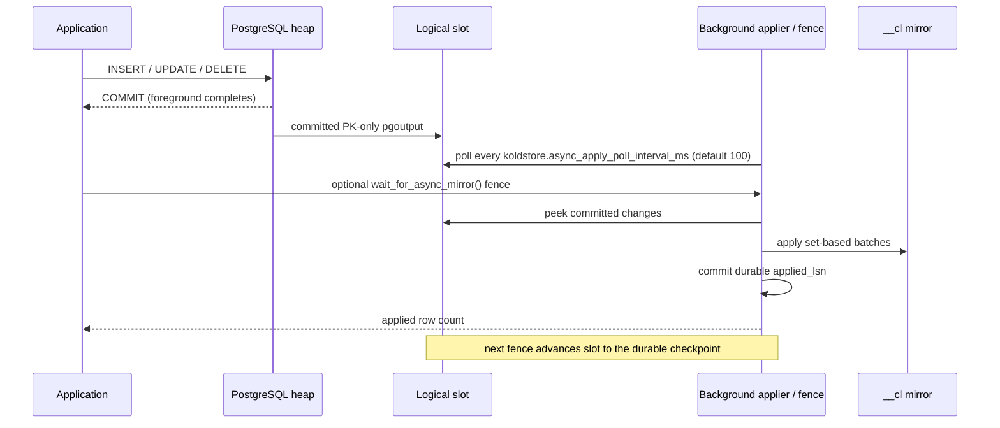

# Async Mirror Capture

Async mode is opt-in. PostgreSQL commits the source heap change first; a
database-scoped background worker later decodes committed WAL and applies
bounded, set-based mirror batches. Foreground DML does **not** write the mirror
and does **not** run a per-statement kick trigger.

See also the [mode comparison](mirror-capture-modes.md) and
[strict mode](mirror-capture-strict.md). The rationale for the specialized
UPDATE and progress policy is in
[ADR-005](../decisions/005-async-apply-progress-and-health.md).

## Enable

1. Turn on logical decoding and restart PostgreSQL:

   ```sql
   ALTER SYSTEM SET wal_level = logical;
   ```

2. Install the extension (`CREATE EXTENSION` creates the empty publication):

   ```sql
   CREATE EXTENSION IF NOT EXISTS koldstore;
   ```

3. Opt a table into async capture:

   ```sql
   SELECT koldstore.manage_table(
     table_name          => 'public.events',
     storage             => 'archive',
     hot_row_limit       => 100000,
     mirror_capture_mode => 'async'
   );
   ```

The slot name is `koldstore_async_<database_oid>`
(`koldstore.async_mirror_slot_name()`). If `wal_level` is not `logical`, the
first async `manage_table` fails before any table/catalog writes. That server
setting (and restart) is the only administrator step KoldStore cannot perform
from the extension.

## Activation without a capture gap

`manage_table` initially installs strict triggers in both modes. For a populated
table it also completes the initial mirror backfill. Only then, in the same
migration transaction, it:

1. adds the source table to publication `koldstore_async_mirror`;
2. publishes only the primary-key columns;
3. drops the INSERT / UPDATE / DELETE capture triggers;
4. retains the primary-key mutation guard;
5. starts the WAL applier (cluster launcher is shared-preload only).

Changes before the switch are covered by strict capture; committed changes after
it are covered by WAL. Publication and trigger changes are transactional, so
there is no unprotected interval.

### Why PK-only publication

The mirror stores key plus operation metadata; current non-key values stay
authoritative in the hot heap. Publishing only PKs avoids decoding wide payloads
per row. Development measurements on a wide-table insert phase reduced
logical-decoding temporary data from about 7.3 GiB (full-row) to at most
449 MiB (PK-only), with backend RSS around 281 MiB. These are diagnostic
observations, not portable guarantees.

## Worker lifecycle (always-on)

There is **no** per-DML kick trigger. Async tables keep only the PK-update guard
on the source relation.

| Event | Behavior |
| --- | --- |
| Async `manage_table` | Starts the database WAL applier (`wait_for_startup`; the worker finishes connecting after the manage transaction commits) |
| Steady state | Applier polls every 100 ms; **O(1) skip** when insert LSN is still at/behind the slot's `confirmed_flush`. Empty peeks advance `confirmed_flush` past non-publication WAL and apply exponential idle backoff (cap 5 s) so a lagged `restart_lsn` cannot pin a core |
| Bounded backlog remains | Up to four `ContinuePending` ticks run immediately; the fifth yields through the latch before another burst so catch-up progresses without an unbounded CPU loop |
| Apply error | The transaction rolls back, the immediate-retry budget resets, and polling backs off from 100 ms up to 30 s |
| Applier crash | Shared-preload launcher re-registers the applier (every 2 s); otherwise the next session `ensure` / `wait_for_async_mirror` after commit does |
| Postmaster restart | Shared-preload launcher (if `koldstore` is in `shared_preload_libraries`) and/or the next `wait_for_async_mirror` / `internal_ensure_async_mirror_worker` re-attaches appliers for databases that still have a slot |
| `disable_async_mirror` | Terminates the applier if needed, then drops the slot (avoids deadlock when peek waits on the caller's open XID) |

Hot and mirror row counters are updated by the WAL applier (idempotent under
peek/replay). Truncate, origin, type, and logical-message pgoutput records are
ignored so teardown noise cannot wedge the slot.

The one-shot slot provisioner uses PostgreSQL's native replication-slot C API
rather than SPI so the worker transaction stays XID-free until the consistent
point is established.

## Strong-consistency fence

```sql
SELECT koldstore.wait_for_async_mirror();
```

Returns the number of source row-change messages applied. `flush_table` calls
the same applier before selecting mirror rows so a flush cannot omit
already-committed async changes.

### Apply pipeline



Logical decoding, flush fences, and `disable_async_mirror` share a
transaction-scoped advisory apply lock (held for the flush SQL transaction,
including upload). Phase-5.5 drains accumulated WAL before the source relation
lock. Releasing the apply lock during upload needs a multi-transaction flush
redesign to avoid deadlocks with logical decoding waiting on the flush XID.
PostgreSQL's SQL slot APIs acquire with `nowait`; disable terminates a stuck
applier before taking that lock so a peek blocked on the caller's open XID
cannot deadlock teardown.

Each apply tick is **one** PostgreSQL transaction: peek, all mirror batch SPI
writes, and `koldstore.async_mirror_state.applied_lsn` commit or roll back
together. Mid-tick ERROR (including `error:async_mirror_apply_after_batch`)
leaves neither a durable checkpoint advance nor partial mirror effects.

The decoder reads pgoutput v1 in pages of 8,192 messages. The applier groups up
to 8,192 compatible, unique keys and binds typed `unnest` arrays containing the
PK columns plus Rust-allocated `seq` values. It caches separate SQL plans per
relation and invalidates them when pgoutput relation metadata changes:

| Source operation | Set-based mirror plan | Why |
| --- | --- | --- |
| INSERT | `INSERT ... ON CONFLICT DO UPDATE` | Reinserts and replay safely converge on the latest metadata row |
| UPDATE | `UPDATE ... FROM incoming RETURNING <pk>` followed by `INSERT ... LEFT JOIN updated ... ON CONFLICT DO UPDATE` for only missing keys | Existing hot rows avoid conflict arbitration; a mirror row pruned by flush is recreated safely |
| DELETE | `INSERT ... ON CONFLICT DO UPDATE` with `op = 3` | A tombstone must survive even if flush already removed the previous mirror row |

The UPDATE statement and its insert-missing fallback are one data-modifying CTE,
so they succeed or fail together. Duplicate keys force a batch boundary before
execution, avoiding ambiguous multi-update joins. Internal hot-row deletion
during flush is marked `DoNotReplicateId` so maintenance deletes do not re-enter
the async stream.

The mirror indexes remain part of this performance design: the primary-key
index serves UPDATE joins and conflict fallback, the `seq` index serves ordered
flush selection, and the partial tombstone `seq` index serves delete-only
flushes. Dropping them would trade foreground write cost for degraded catch-up
or flush scalability and requires separate measurement.

### Crash and retry safety

The applier peeks rather than consumes WAL. It commits mirror changes and
`koldstore.async_mirror_state.applied_lsn` together, then advances the slot to
that durable checkpoint on the next fence:

- failure before apply commit → mirror and checkpoint unchanged; WAL is retried;
- failure after apply commit but before slot advance → checkpoint is found and
  the slot advances without duplicating mirror effects;
- the checkpoint also covers WAL emitted by mirror apply itself.

## Consistency and operations

- Heap-only PostgreSQL reads see a committed source change immediately.
- A merge read before the fence can see a stale mirror/cold overlay (important
  for deletes that must win over cold rows — fence first).
- `flush_table` fences automatically before row selection. A second pre-prune
  fence for async DML during upload is proposed in
  [async-flush-prune-race](../cases/async-flush-prune-race.md).
- Primary-key updates remain unsupported.
- Application `TRUNCATE` on an async managed table is rejected at the SQL
  boundary; truncate records that still appear in the stream are ignored.

Monitor slot retention and catch-up:

```sql
SELECT koldstore.async_mirror_status();

SELECT slot_name,
       active,
       confirmed_flush_lsn,
       pg_wal_lsn_diff(pg_current_wal_lsn(), confirmed_flush_lsn) AS retained_bytes
FROM pg_replication_slots
WHERE slot_name = koldstore.async_mirror_slot_name();

SELECT database_oid, applied_lsn, updated_at
FROM koldstore.async_mirror_state;
```

If the worker cannot run or repeatedly soft-fails, the slot retains WAL and can
fill `pg_wal`. Alert on retained bytes, `async_mirror_status()->'healthy'`, and
the age of `updated_at`. `async_mirror_status()->'retention'` contains the
threshold, observed bytes, and `ok`; `admission` remains a compatibility alias.
By default
`koldstore.async_mirror_max_retained_bytes` is a **1 GiB health threshold**.
Crossing it marks async mirror status unhealthy and should alert operators, but
apply keeps draining because blocking the consumer would increase retained WAL.
Use PostgreSQL disk monitoring and slot-retention policy as independent hard
safeguards. `max_slot_wal_keep_size` can invalidate an over-retained logical
slot and require mirror rebuild, so it is a last-resort capacity bound rather
than normal flow control. Setting `0` disables only this KoldStore health
threshold.

### Explicit cleanup

After every async table in the database has been unmanaged:

```sql
SELECT koldstore.disable_async_mirror();
```

Idempotent; refuses while an active async table still depends on the
infrastructure. The next async `manage_table` recreates publication and slot.

## Test contract

| Area | E2E coverage |
| --- | --- |
| No kick triggers; PK guard only | `tests/e2e/dml/async_change_log_mirror.rs` |
| Worker startup, bounded lag, fence, rollback, cleanup | same + `change_log_mirror.rs` in `--mode async` |
| Kill applier → launcher / ensure restart, no duplicate PKs | `tests/e2e/dml/async_mirror_worker.rs` |
| Apply failpoint ERROR → recovery without duplicates | same |
| Mid-tick after-batch abort → no durable applied_lsn / mirror | same |
| UPDATE direct path + missing-row fallback after flush pruning | `tests/e2e/dml/async_change_log_mirror.rs`, `crates/koldstore-mirror/tests/storage_contract.rs` |
| Retained-WAL health threshold never blocks drain | `tests/e2e/dml/async_mirror_worker.rs` |
| GUC off blocks manage; cleanup stops applier | same |
| Truncate noise in slot does not kill worker | same |
| Flush / join fixtures fence before mirror-dependent asserts | `tests/e2e/join/fixtures.rs`, flush helpers |

Run:

```bash
scripts/run-pg-e2e.sh 16 --mode async
```

Not covered as a dedicated E2E today: full postmaster restart with only the
shared-preload launcher (no session `ensure`), and a pure launcher-only restart
assertion that forbids falling back to `internal_ensure_async_mirror_worker`.
