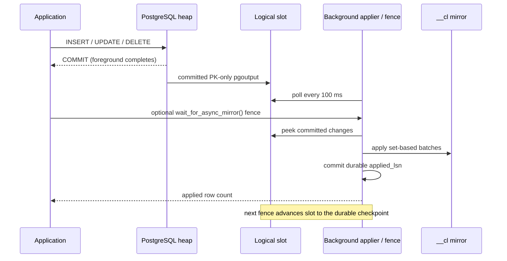

# Mirror Capture Modes

KoldStore supports two ways to keep a managed table's latest-state mirror in
sync with its PostgreSQL heap: `strict` and `async`. The mode is selected once,
when `koldstore.manage_table` is called. `strict` is the default because it has
no logical-decoding prerequisites and gives immediate read-your-writes
semantics. `async` is opt-in for workloads where foreground DML throughput is
more important than an immediately current mirror.

The two modes write the same mirror schema and produce the same Parquet format.
They differ only in when a committed heap change is copied to the mirror.

## Choosing a mode

| Property | `strict` (default) | `async` |
| --- | --- | --- |
| Capture path | Statement trigger in the user transaction | Committed WAL through a logical slot |
| Foreground commit | Waits for heap and mirror writes | Waits for the heap write only |
| Mirror visibility | Immediate, including read-your-writes | Normally within 100 ms; fence gives an exact boundary |
| Rollback | Heap and mirror roll back together | Aborted WAL is never decoded |
| Setup | No replication setup | `wal_level=logical`; KoldStore creates publication and slot |
| WAL retention risk | None beyond normal PostgreSQL | Slot retains WAL until it is acknowledged |
| Best fit | Strong consistency and simple operations | Insert-heavy workloads with a controlled catch-up point |

Use `strict` when application code may write and then immediately depend on the
mirror/cold overlay, or when logical-slot operations are undesirable. Use
`async` when a short mirror lag is acceptable. A database-scoped worker applies
committed WAL every 100 ms; applications still use the consistency fence before
operations that require a precise read boundary.

`async` does **not** make PostgreSQL execute two data-modifying plans in parallel
inside one transaction. PostgreSQL commits the source transaction first; a
later transaction decodes only committed WAL and applies it in bounded,
set-based batches. This removes mirror work from foreground latency while
keeping rollback behavior correct.

## Strict mode

Strict mode is selected by default or explicitly:

```sql
SELECT koldstore.manage_table(
  table_name          => 'public.events',
  storage             => 'archive',
  hot_row_limit       => 100000,
  mirror_capture_mode => 'strict'
);
```

`manage_table` installs three `AFTER ... FOR EACH STATEMENT` triggers using
transition tables. INSERT uses `ON CONFLICT` for small batches and `MERGE` for
large batches; UPDATE and DELETE update existing mirror rows directly. A
separate `BEFORE UPDATE OF <primary key>` trigger rejects primary-key changes.

The source heap mutation, mirror mutation, and row-counter delta share the
application transaction. An error aborts all three, and a successful statement
can immediately be read through `KoldMergeScan`.

## Async mode setup

Async capture has one publication and one deterministic logical slot per
database. Both are provisioned automatically and idempotently: existing
compatible objects are reused.

1. Enable logical decoding and restart PostgreSQL:

   ```sql
   ALTER SYSTEM SET wal_level = logical;
   ```

2. Install the extension. `CREATE EXTENSION` creates the empty publication;
   PostgreSQL supports an empty publication so tables can be added later:

   ```sql
   CREATE EXTENSION IF NOT EXISTS koldstore;
   ```

3. Opt the first table into async capture. Before changing table or KoldStore
   catalogs, `manage_table` creates the deterministic logical slot in a
   short-lived autonomous worker transaction:

   ```sql
   SELECT koldstore.manage_table(
     table_name          => 'public.events',
     storage             => 'archive',
     hot_row_limit       => 100000,
     mirror_capture_mode => 'async'
   );
   ```

The slot name is `koldstore_async_<database_oid>`, returned by
`koldstore.async_mirror_slot_name()`. If `wal_level` is not `logical`, the first
async `manage_table` returns one configuration error before any table/catalog
writes. This server setting and restart are the only administrator setup that
KoldStore cannot perform safely from the extension.

The one-shot provisioner uses PostgreSQL's native replication-slot C API rather
than SPI. Running `pg_create_logical_replication_slot` through SPI assigns a
top-level transaction ID in a connected worker; PostgreSQL then rejects slot
creation or waits for the parent `manage_table` transaction. Native creation
keeps the worker transaction XID-free until the consistent point is established.

## Async activation without a capture gap

`manage_table` initially creates the strict triggers in both modes. For a
populated table it also completes the initial mirror backfill. Only then, in the
same migration transaction, it:

1. adds the source table to `koldstore_async_mirror`;
2. publishes only the primary-key columns;
3. drops the INSERT, UPDATE, and DELETE capture triggers; and
4. retains the primary-key mutation guard;
5. installs a lightweight statement trigger that only ensures the worker is
   running; and
6. starts the database-scoped WAL applier.

Changes before the switch are covered by strict capture; committed changes
after it are covered by WAL. Publication and trigger changes are transactional,
so there is no unprotected interval.

Publishing only primary keys is intentional. The mirror stores key plus
operation metadata, while current non-key values remain authoritative in the
hot heap. It avoids decoding and allocating approximately 50 wide-table values
per row in the benchmark workload. In development measurements, this reduced
logical-decoding temporary data at the comparable insert phase from about
7.3 GiB for full-row publication to at most 449 MiB for primary-key-only
publication; backend RSS stayed around 281 MiB. These are diagnostic
observations, not portable benchmark guarantees.

## The strong-consistency fence

Call the fence when subsequent work must observe every source commit visible at
the start of the call:

```sql
SELECT koldstore.wait_for_async_mirror();
```

It returns the number of source row-change messages applied. `flush_table`
calls the same applier automatically before selecting mirror rows, so a flush
cannot omit already-committed async changes.

Normal catch-up is automatic. The database worker polls every 100 ms, skips
logical decoding when the WAL position has not moved, and applies all committed
changes available at that point. The statement trigger on each
async table re-establishes the worker after a PostgreSQL restart; it does not
write the mirror or decode WAL inside the source transaction. A second explicit
fence may be used by diagnostics to acknowledge the preceding durable
checkpoint and verify that no additional changes are waiting.

### Apply pipeline



The decoder reads pgoutput v1 in pages of 8,192 messages. The applier groups up
to 8,192 compatible keys, converts each batch with `jsonb_to_recordset`, and
executes one set-based mirror statement. Allocations therefore scale with a
batch, not with total retained WAL. INSERT upserts; UPDATE and DELETE modify an
existing mirror row. Internal hot-row deletion during flush is marked
`DoNotReplicateId`, preventing maintenance deletes from re-entering the async
capture stream.

### Crash and retry safety

The applier peeks rather than consumes WAL. It commits mirror changes and the
database's `koldstore.async_mirror_state.applied_lsn` together, then advances
the logical slot to that durable checkpoint on the next fence:

- failure before the apply transaction commits leaves both mirror and
  checkpoint unchanged, so WAL is retried;
- failure after apply commit but before slot advance finds the committed
  checkpoint first and advances without replaying the batch;
- the checkpoint also covers WAL emitted by the mirror apply itself, avoiding a
  scan through irrelevant mirror WAL on the next fence.

This ordering avoids acknowledging source WAL before its mirror effect is
durable.

## Consistency and operations

Async mode introduces an explicit consistency boundary:

- Heap-only PostgreSQL reads see a committed source change immediately.
- A merge read before the fence can see a stale mirror/cold overlay. This is
  especially important for a delete of a key that also exists in cold storage:
  wait for the tombstone before requiring the delete to win.
- `flush_table` fences automatically.
- Primary-key updates remain unsupported in both modes.
- `TRUNCATE` is not supported for async managed tables.

Monitor slot retention and catch-up:

```sql
SELECT slot_name,
       active,
       confirmed_flush_lsn,
       pg_wal_lsn_diff(pg_current_wal_lsn(), confirmed_flush_lsn) AS retained_bytes
FROM pg_replication_slots
WHERE slot_name = koldstore.async_mirror_slot_name();

SELECT database_oid, applied_lsn, updated_at
FROM koldstore.async_mirror_state;
```

If the worker cannot run or repeatedly fails, the slot retains WAL and can fill
`pg_wal`. Operational automation should alert on retained bytes and the age of
`updated_at`. Backups must continue to protect PostgreSQL and cold object
storage together; the logical slot is a capture mechanism, not a backup.

### Explicit cleanup

After every async table in the database has been unmanaged, remove the slot,
publication, and apply checkpoint with:

```sql
SELECT koldstore.disable_async_mirror();
```

The call is idempotent and refuses to run while an active async table still
depends on the infrastructure. It is intended for permanent async teardown or
before uninstalling KoldStore. If async mode is used again, the next
`manage_table` recreates both publication and slot automatically; cleanup does
not introduce a manual re-enable procedure.

## Stored configuration

The selected mode is stored in `koldstore.schemas.options` as
`mirror_capture_mode`. For backward compatibility, a missing property means
`strict`; explicit strict mode is omitted from serialized options. Async mode
is persisted as:

```json
{
  "mirror_capture_mode": "async"
}
```

Changing modes on an already-managed table is not currently a public operation.
Reconfiguration needs the same no-gap trigger/publication handoff used during
`manage_table` and should not be approximated by manually dropping triggers or
altering the publication.

## Test contract

The main change-log E2E suite executes the same behavior matrix once with
`strict` and once with `async`: insert, update, delete, reinsert, rollback,
no-op PK assignment, rejected PK mutation, bulk update/delete, latest-state
uniqueness, and row-counter accuracy. Async-specific coverage additionally
asserts automatic publication/slot provisioning, PK-only publication columns,
worker startup, bounded-lag visibility without a fence, explicit-fence
compatibility, cleanup refusal while active, and flush-origin suppression.
The async test uses a 5-second hard deadline. A fresh local PG16 verification
observed the worker after 30 ms and 10,000 committed inserts in the mirror after
363 ms; these timings are diagnostic, not a production latency guarantee.
