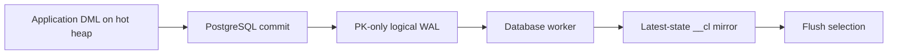

# Mirror Capture

KoldStore keeps a latest-state change-log mirror for every managed table. The
application continues to issue ordinary PostgreSQL `INSERT`, `UPDATE`, and
`DELETE` statements against the hot heap; committed WAL is then applied to the
mirror by the database worker. The mirror is not an event log and foreground
DML never writes it directly.

## Contract

| Property | Behavior |
| --- | --- |
| Capture source | Committed WAL from one database-scoped logical slot |
| Foreground transaction | Commits after the heap write; mirror application follows later |
| Exact mirror boundary | `SELECT koldstore.wait_for_async_mirror()` |
| Rollback | Aborted transactions never reach logical decoding |
| Publication payload | Primary-key columns only; non-key values remain in the hot heap |
| Ordering | `seq` is allocated on apply and is used for mirror/flush ordering, not as a commit-order cursor |

`wal_level=logical` is required. `manage_table` provisions the shared
publication and deterministic database slot when needed, and refuses to manage
a table when logical decoding is unavailable.

## Activation without a gap

For an existing table, `manage_table` creates the mirror and PK-update guard,
then holds the database apply lock while it adds the relation's PK columns to
the publication and records an activation LSN. It backfills the heap into the
mirror, catches up committed WAL above the backfill sequence floor, then marks
the schema active. Concurrent writes land in WAL during the backfill, so they
are included by catch-up. Empty tables activate through the same publication
and worker setup without a backfill.

The only source-table trigger is a `BEFORE UPDATE OF <pk>` guard. It rejects a
real primary-key mutation because the mirror key is the identity used by flush
and merge; `SET id = id` is allowed. There are no DML capture triggers.

## Apply and recovery

Managed-table commits mark the transaction dirty; only a successful top-level
commit advances a database-scoped generation and sets the worker latch.
Concurrent commits coalesce into one drain. A 30-second watchdog recovers
missed in-memory hints and two-phase commits that cannot carry the originating
backend's dirty bit.

The worker reads bounded pgoutput batches, groups them by relation and
operation, and applies typed PK arrays with set-based SQL. Inserts and deletes
are idempotent `ON CONFLICT` writes; updates use a keyed update plus an
insert-missing fallback. A batch, its row-counter delta, and its durable
`applied_lsn` checkpoint commit together. The slot advances to a checkpoint
only on a later pass, making replay after a crash safe.

Sequence allocation is always above the durable high watermark and any flush
prune floor. This prevents a post-restart or concurrent flush apply from
reusing a sequence range that was already published to cold storage.

`koldstore.async_mirror_status()` reports lag and retained WAL. The retained-WAL
threshold is an operational health signal; it does not stop application of WAL,
because applying is the recovery action. `koldstore.disable_async_mirror()` is
an explicit cleanup operation and refuses to remove infrastructure while an
active managed table still depends on it.

## Consistency boundaries

- A normal heap query sees its committed write immediately.
- A managed-table merge scan needs the mirror for an unflushed update or
  tombstone to mask an older cold row. Call `wait_for_async_mirror()` before a
  read that requires this boundary.
- `flush_table` applies available WAL before selecting work, then runs a second
  bounded fence while holding its short final table lock before pruning rows.

See [DML](dml-table.md), [jobs and scheduler](jobs-and-scheduler.md), and
[flushing](flushing-table.md) for the consumers of the mirror.
