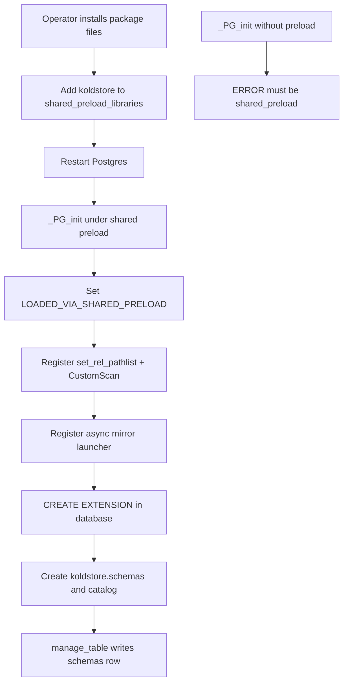
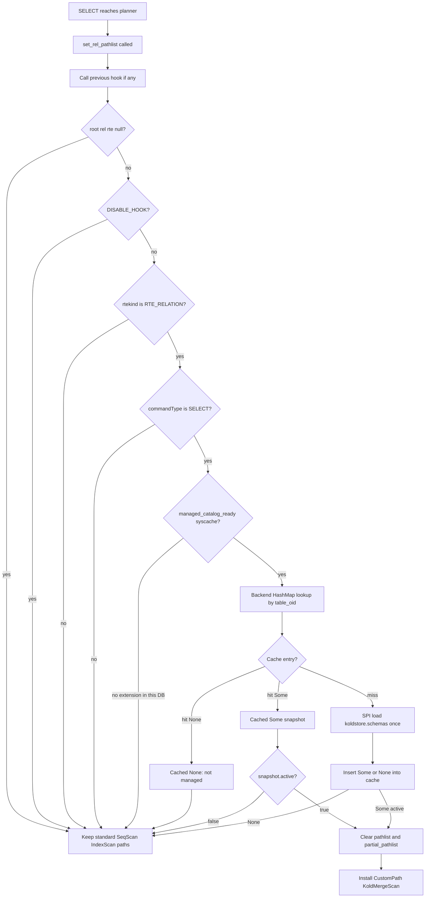
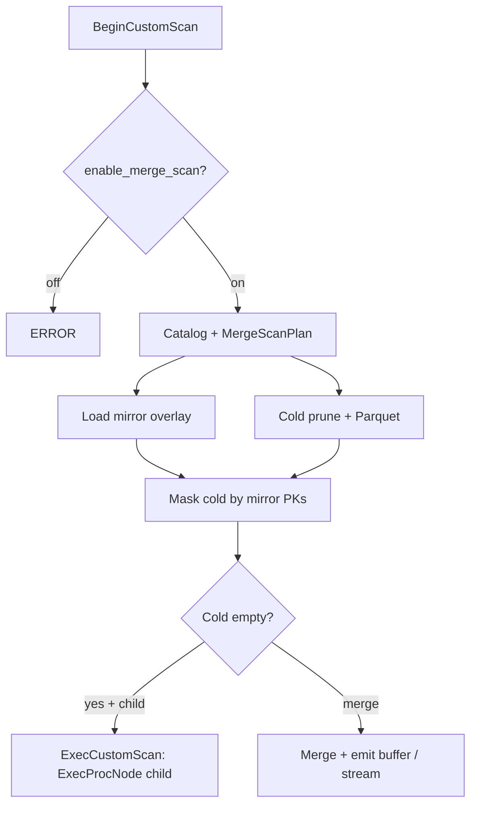

# Scanning Table Workflow (KoldMergeScan)

This document describes how `SELECT` queries against managed tables are planned
and executed through the `KoldMergeScan` custom scan node. It covers shared
preload, planner gates, catalog caching, cold Parquet reads, native hot child
plans, mirror overlay, winner resolution, and ownership boundaries.

**Planner hook:** `set_rel_pathlist` in `crates/pg_koldstore/src/merge_scan/pg.rs`  
**Rust merge:** `crates/koldstore-merge/src/core/resolver.rs`  
**Parquet read:** `crates/koldstore-parquet/src/reader.rs`  
**Preload gate:** `crates/pg_koldstore/src/preload.rs`

---

## Design principle

```text
Primary path: shared_preload → planner hook → KoldMergeScan
If hook/preload missing: ERROR at install/manage (fail closed)
Never: silent SeqScan that returns hot-only rows for managed tables
```

PostgreSQL remains the transaction, locking, index, and hot-row authority.
KoldStore adds a custom scan that is a **merge coordinator**:

```text
KoldMergeScan
├── PostgreSQL native child plan   (IndexScan / BitmapScan / SeqScan)
├── KoldParquetScan                (segments → row groups → projected batches)
└── MirrorOverlay                  (unflushed inserts/updates/tombstones)
```

The user table stays a normal heap table. There is no custom table access method
and no unified view rewrite. JOINs are safe: the hook runs **per base RTE**, so
only managed relations become `KoldMergeScan`.

- Planner cost is `hot_child_cost + catalog + estimated cold + merge overlay`.
- Heap-only finals **and** parallel partials are replaced so managed SELECTs
  cannot silently omit cold rows (including under `ORDER BY` / Gather Merge).
- `koldstore.enable_merge_scan = off` still plans `KoldMergeScan` then **ERRORs**
  at begin — never silent heap-only.
- Unmanaged tables keep normal `Seq Scan` / `Index Scan` after a cheap in-memory
  OID cache lookup (absences are cached so SPI is not repeated).
- Shared preload is mandatory so every backend has the planner hook before any
  query. A silent heap `SeqScan` fallback for managed SELECTs is forbidden: it
  would return incomplete results after flush.

### Merge invariant

Active cold state is treated as at most one visible version per PK after
newest-first resolution. The mirror overlay masks any PK that still has an
unflushed mirror row (`op` 1/2/3). Visible cold rows can therefore be appended
alongside native hot rows without a global `DISTINCT ON` sort.

### Cursor semantics

- `seq` is a row-version / effect identity (Snowflake id allocated at statement
  time). It is **not** a commit-order cursor.
- Durable change-stream replay must use WAL LSN / logical decoding.

---

## A. Cluster boot and install



`CREATE EXTENSION` creates SQL objects only. Preload installs hooks into every
backend. Check with `SELECT koldstore.preload_status();`.

Removing preload after manage is **unsupported**: fresh backends never load the
`.so`, so no extension code can intercept heap reads.

---

## B. Per-SELECT planner gate (every base relation)

Three questions — do not collapse them:

| Check | Scope | Implementation |
|-------|--------|----------------|
| Library preloaded | Process | `_PG_init` + `LOADED_VIA_SHARED_PRELOAD` |
| Extension installed | This database | `managed_catalog_ready()` syscache for `koldstore.schemas` |
| Table managed | This OID | Backend `OptionalLookupCache` (present **and** absent) |



`manage_table` / `unmanage_table` call `invalidate_table_globally` so peer
backends drop stale negative (“not managed”) entries.

For a managed relation the planner then:

1. Picks the cheapest non-custom path as the hot child.
2. Clears `pathlist` and `partial_pathlist` (required so Gather Merge cannot
   prefer a hot-only ordered path after flush).
3. Installs one `CustomPath` whose `custom_paths` holds that child.

---

## C. Executor path



### BeginCustomScan

1. Error if `enable_merge_scan` is off.
2. Deserialize `MergeScanPlan` when present.
3. Load catalog snapshot + mirror overlay (all unflushed mirror PKs).
4. Prune cold segments from local catalog stats; open ObjectStore readers only
   for remaining candidates.
5. Filter cold rows whose PK appears in the mirror overlay.
6. Hot-only + native child → stream mode; otherwise merge and materialize.

### ExecCustomScan / End / Rescan

- Hot-child mode: `ExecProcNode` on the child.
- Buffer mode: emit the next materialized row.
- Drop scan state on end; `ExecReScan` the hot child when present.

---

## Failure modes

| Misconfiguration | Symptom | Protection |
|------------------|---------|------------|
| No shared_preload | CREATE EXTENSION / LOAD errors | `_PG_init` gate |
| Preload removed after manage | Hot-only SELECT, no error | Docs + upgrade checklist only |
| Extension not in this DB | Normal heap scans | `managed_catalog_ready` |
| Unmanaged table | Normal heap scans | Negative OID cache |
| `enable_merge_scan=off` | ERROR at BeginCustomScan | No silent heap-only |

---

## Mirror overlay rules

| Mirror op | Effect on cold | Effect on result |
|-----------|----------------|------------------|
| 1 / 2 | Skip cold for that PK | Native hot child / hot load returns the live row |
| 3 | Skip cold for that PK | Row is invisible (no hot row) |
| none | Cold may be visible | Cold winner after merge rules |

---

## GUCs

| GUC | Meaning |
|-----|---------|
| `koldstore.enable_merge_scan` | Required for managed SELECT. `off` → ERROR at scan begin. |
| `koldstore.cold_reads=auto` | Cold eligible when catalog/cost says so. |
| `koldstore.cold_reads=on` | Cold eligible; does not force unnecessary object reads. |
| `koldstore.cold_reads=off` | Hot-only; ERROR when correctness would require opening cold. |
| `koldstore.max_open_parquet_readers` | Per-backend open Parquet reader cap. |

---

## Row-level security

Native hot-child scans remain PostgreSQL-owned and apply permissions and RLS
normally. Buffered cold and hot+cold winners are materialized in the base
relation's scan-slot layout, then returned through PostgreSQL `ExecScan`.

Fixed reads of extension-owned catalogs and mirror tombstones run under the
extension owner. Buffered merge scans read the complete hot source under a
tightly scoped relation-owner context so RLS cannot hide a newer winner;
PostgreSQL then evaluates the invoking role's compiled quals on resolved tuples.

---

## EXPLAIN

KoldMergeScan uses PostgreSQL's native `ExplainProperty*` and
`ExplainOpenGroup` APIs. Standard syntax works unchanged, including
`ANALYZE`, `TIMING`, and `FORMAT TEXT | JSON | YAML | XML`:

```sql
EXPLAIN (ANALYZE, BUFFERS, FORMAT JSON)
SELECT body FROM app.messages WHERE id IN (1, 4);
```

Plain `EXPLAIN` reports planned source state and never claims that a segment
was opened or a row was scanned. `EXPLAIN ANALYZE` adds:

- the selected emit path (`hot_child`, `hot_native`, `cold_native`, or
  `merge_buffer`);
- a nested `Scan Sources` flow with hot, cold Parquet, and mirror-overlay
  access methods and rows scanned;
- segment, row-group, bloom, range-request, byte, projection, and cache
  diagnostics for the cold source;
- a `Merge` stage with input/output rows and rows removed by overlay or
  primary-key winner resolution;
- PostgreSQL's normal `Filter` / `Rows Removed by Filter` properties after
  winner resolution;
- a nested `Timing` stage for initialization, metadata, hot scan, cold read,
  mirror scan, overlay, merge, and tuple materialization.

Custom phase timings follow PostgreSQL's `TIMING` option. They are present for
`EXPLAIN (ANALYZE)` and omitted for `EXPLAIN (ANALYZE, TIMING OFF)`.
`Initialization Time` is reported explicitly because source loading and merge
setup run in `BeginCustomScan`, outside PostgreSQL's per-tuple Custom Scan node
timer.

Ordinary execution does not allocate an EXPLAIN profile, read custom phase
clocks, or maintain EXPLAIN-only row counters. Collection is enabled only when
PostgreSQL attaches native executor instrumentation to the plan node. For the
streaming hot-child path, row totals are read from PostgreSQL's child-plan
instrumentation after execution instead of adding work to each emitted row.

Example shape (ANALYZE, TEXT):

```text
Custom Scan (KoldMergeScan)
  Emit Path: merge_buffer
  Scan Sources:
    Hot Scan:
      Planned Access: Bitmap Heap Scan
      Access Method: SPI JSON projection
      Rows Scanned: 1
    Cold Scan:
      Status: executed
      Rows Scanned: 3
      Candidate Segments: 12
      Segments Pruned by Min/Max: 10
      Parquet Segments Opened: 2
      Bytes Fetched: 16384 bytes
    Mirror Scan:
      Status: executed
      Rows Scanned: 1
      Rows Removed by Overlay: 1
  Merge:
    Strategy: Primary Key Winner Resolution
    Input Rows: 3
    Output Rows: 2
    Rows Removed by Merge: 1
  Timing:
    Initialization Time: 4.812 ms
    Hot Scan Time: 0.142 ms
    Cold Read Time: 3.906 ms
    Merge Time: 0.011 ms
```

---

## Implementation notes / remaining polish

1. Overlap merge path still uses SPI JSON hot load for winner resolution when a
   full PK equality probe is not available; PK point lookups use hot-native /
   cold-native emit.
2. User-scoped cold segment loading beyond `scope_key = ''` continues to land
   with catalog scope work.
3. No DSM / parallel CustomScan workers yet.
4. Backend Parquet footer metadata is cached across scans and cleared on flush /
   managed-table invalidation.
