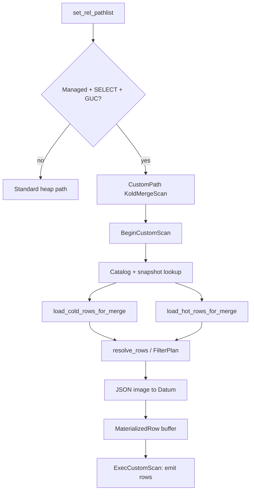

# Scanning Table Workflow (KoldMergeScan)

This document describes how `SELECT` queries against managed tables are planned
and executed through the `KoldMergeScan` custom scan node. It covers manifest
checks, cold Parquet reads, hot heap union, winner resolution, and ownership
boundaries at each step.

**Planner hook:** `set_rel_pathlist` in `crates/pg_koldstore/src/merge_scan/pg.rs`  
**Rust merge:** `crates/koldstore-merge/src/core/resolver.rs`  
**Parquet read:** `crates/koldstore-parquet/src/reader.rs`

---

## Design principle

PostgreSQL remains the transaction, locking, and hot-row authority. KoldStore
adds a custom scan path that **materializes the merged hot+cold view once** at
`BeginCustomScan`, then serves rows from an in-memory buffer in
`ExecCustomScan`.

Cold rows stay in Rust (`ColdRow`) through merge. Hot rows are loaded once via
SPI as JSON images, merged with `resolve_rows`, then projected to Datums owned
by a scan-local memory context.

---

## Overview



---

## Phase 1 — Extension bootstrap

On `_PG_init` (`pg_koldstore/src/lib.rs`):

1. Register custom scan callbacks (`merge_scan/pg.rs::register_custom_scan_hooks`)
2. Register row-counter transaction callback (`row_counter_cache.rs`)

`set_rel_pathlist_hook` chains to the previous hook after KoldStore runs.

---

## Phase 2 — Planner: when KoldMergeScan is chosen

`set_rel_pathlist` (`merge_scan/pg.rs`) adds a `CustomPath` when **all** gates pass:

| Gate | Check |
|------|-------|
| Not internal | `with_custom_scan_disabled` is false |
| GUC | `koldstore.enable_merge_scan` is on |
| Relation RTE | `RTE_RELATION` |
| Command | `CMD_SELECT` |
| Managed | `managed_table_snapshot(oid)?.active == true` |

The custom path is given `startup_cost = 0`, `total_cost = 0` so it wins over
the heap path.

Cold involvement is decided entirely at execution time in `BeginCustomScan`.

---

## Phase 3 — BeginCustomScan

### Step 1 — Catalog resolution

Under `with_hook_disabled`:

```
qualified_relation_name(table_oid)
migration_catalog(table_oid)           → columns, PK, indexed_columns
managed_table_snapshot(table_oid)      → mirror_relation, PK, scope_column
```

### Step 2 — Cold row load

`load_cold_rows_for_merge` (`merge_scan/pg/cold.rs`):

1. `cached_manifest_segment_stats(table_oid)` — one prepared SPI query for
   published manifest path, generation, base path, and active segment stats
   (`plan_in_sync_manifest_scan_context`). A published row is any manifest with
   a real path/generation (including `pending_write` after hot DML); the
   pre-flush placeholder (`manifest_path = 'pending'`) is excluded.
   Backend-local cache keyed by `table_oid`; invalidated on flush/migrate.
2. If no published manifest → empty cold set (hot-only).
3. Qual prune via `prune_segment_stats`.
4. For each surviving segment: per-backend reader permit (fail-fast), then
   `read_clean_cold_rows_from_object_store_with_size` (footer-first range GETs,
   PK min/max + bloom row-group prune, column projection). EXPLAIN surfaces
   manifest source (`catalog`), storage type/base, PK probe, per-segment
   footer/bloom/row-group/I/O counters, convert to `ColdRow`.

**Scope note:** PG scan path loads only `scope_key = ''` segments (table-wide).

### EXPLAIN cold-read properties

`ExplainCustomScan` prints diagnostics from the cold profile collected at
`BeginCustomScan` (or a planned stub when the scan has not executed yet):

| Property | Meaning |
|----------|---------|
| `Manifest` | Catalog path + `source=catalog` (+ timing when analyzed) |
| `Cold storage` | Backend `type` + `base` path |
| `Cold segments` | `considered` vs `opened` after catalog min/max prune |
| `PK probe` | Equality values pushed into Parquet row-group prune |
| `Cold projection` | Application columns decoded from Parquet |
| `Parquet segment` | Object key, byte size, rows, timing |
| `Parquet I/O` | `footer-first`, range GET count, bytes read, % of object |
| `Row groups` | total / selected / skipped / `stats_pruned` |
| `Bloom` | `not_requested` / `skipped_after_stats` / `applied` |

### Step 3 — Hot row load

`load_hot_rows_for_merge` (`merge_scan/pg/hot.rs`) runs:

```sql
SELECT to_jsonb(hot)::text, jsonb_build_object(...)::text
FROM ONLY schema.table AS hot
```

Hot rows use `seq = HOT_SEQ_SENTINEL` (`i64::MAX`) so they beat all cold rows.

### Step 4 — Rust merge + emit

1. Build `FilterPlan` from residual equality / `IN` quals.
2. `execute_merge_scan_with_filters(hot, cold, filters)`.
3. Project winner `row_image` columns to Datums inside a scan `AllocSet`
   (`ScanMemory`); store `Vec<MaterializedRow>` in thread-local `SCAN_STATES`.

---

## Phase 4 — ExecCustomScan / Rescan / EndCustomScan

| Callback | Behavior |
|----------|----------|
| `ExecCustomScan` | Index into pre-materialized rows; fill virtual slot |
| `RescanCustomScan` | Reset index to 0 (no re-read of Parquet) |
| `EndCustomScan` | Drop state (deletes scan memory context); keep cold profile for EXPLAIN |
| `ExplainCustomScan` | Manifest path, segment paths, read timings |

---

## Row merge semantics

Among hot + cold candidates for the same PK:

1. Highest `seq`
2. Then highest `commit_seq`
3. Then hot wins ties

Hot rows always carry `seq = i64::MAX`, so any live hot row beats any cold row.

---

## GUCs affecting scan

| GUC | Effect |
|-----|--------|
| `koldstore.enable_merge_scan` | Planner gate for KoldMergeScan |
| `koldstore.cold_reads` | `off` errors when cold segments would be read |
| `koldstore.max_open_parquet_readers` | Per-backend open Parquet reader cap (fail-fast) |
| `koldstore.user_id` | Session scope for user-scoped RLS |

---

## Implementation gaps (vs future contract)

1. Bulk materialize at `BeginCustomScan`, not streaming per `ExecCustomScan` row
2. Mirror not consulted during merge (tombstone visibility gap pre-flush)
3. User-scoped cold segment loading not wired (`scope_key = ''` only)
4. No DSM / parallel CustomScan workers
