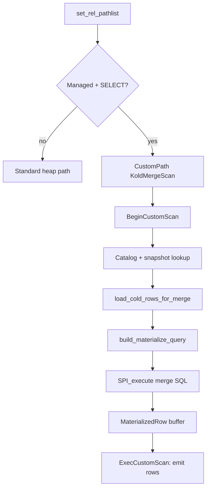

# Scanning Table Workflow (KoldMergeScan)

This document describes how `SELECT` queries against managed tables are planned
and executed through the `KoldMergeScan` custom scan node. It covers manifest
checks, cold Parquet reads, hot heap union, winner resolution, and the serde
boundaries at each step.

**Planner hook:** `set_rel_pathlist` in `crates/pg_koldstore/src/merge_scan/pg.rs`  
**Merge SQL template:** `crates/koldstore-merge/src/scan/materialize.rs`  
**Parquet read:** `crates/koldstore-parquet/src/reader.rs`

---

## Design principle

PostgreSQL remains the transaction, locking, and hot-row authority. KoldStore
adds a custom scan path that **materializes the merged hot+cold view once** at
`BeginCustomScan`, then serves rows from an in-memory buffer in
`ExecCustomScan`.

The user heap has **no** KoldStore system columns. Hot rows are native heap
tuples. Cold history lives in Parquet segments referenced from
`koldstore.cold_segments` and `koldstore.manifest`.

---

## Overview



---

## Phase 1 — Extension bootstrap

On `_PG_init` (`pg_koldstore/src/lib.rs`):

1. Register custom scan callbacks (`merge_scan/pg.rs::register_custom_scan_hooks`)
2. Register row-counter transaction callback (`row_counter_cache.rs`)

`set_rel_pathlist_hook` chains to the previous hook after KoldStore runs.

---

## Phase 2 — Planner: when KoldMergeScan is chosen

`set_rel_pathlist` (`merge_scan/pg.rs`) adds a `CustomPath` when **all** gates pass:

| Gate | Check |
|------|-------|
| Not internal | `with_custom_scan_disabled` is false |
| Relation RTE | `RTE_RELATION` |
| Command | `CMD_SELECT` |
| Managed | `managed_table_snapshot(oid)?.active == true` |

The custom path is given `startup_cost = 0`, `total_cost = 0` so it wins over
the heap path.

**Not wired today:**

- `koldstore.enable_merge_scan` GUC exists but is **not checked** in the hook
- `MergeScanPlan` is not serialized into `CustomScan.custom_private`
- No hot child plan inside `custom_plans`

Cold involvement is decided entirely at execution time in `BeginCustomScan`.

---

## Phase 3 — BeginCustomScan: first steps

`begin_custom_scan` is where all work happens. Order of operations:

### Step 1 — Catalog resolution

Under `with_hook_disabled`:

```
qualified_relation_name(table_oid)
migration_catalog(table_oid)           → columns, PK, indexed_columns
managed_table_snapshot(table_oid)      → mirror_relation, PK, scope_column
```

**Serde:** SPI returns JSON text → `serde_json::Value` → `ManagedTableSnapshot`
(`catalog/cache.rs::decode_managed_table_snapshot`).

### Step 2 — Cold row load

`load_cold_rows_for_merge(table_oid, snapshot, catalog, qual)`

#### 2a — Manifest check

`active_manifest_segment_stats(table_oid)`:

1. `optional_manifest_path` — `SELECT manifest_path FROM koldstore.manifest
   WHERE sync_state = 'in_sync' ORDER BY generation DESC LIMIT 1`
2. If **no in-sync manifest** → cold JSON = `"[]"`, scan is **hot-only**

When manifest exists:

- `active_flush_storage_context` → `base_path`
- `active_cold_segment_stats_from_catalog` → SPI JSON array:
  ```json
  [{"object_path": "ns/table/batch-1.parquet", "column_stats": {"seq": {"min": 1, "max": 1000}, ...}}, ...]
  ```
  from `koldstore.cold_segments WHERE scope_key = '' AND status = 'active'`

**Scope note:** PG scan path loads only `scope_key = ''` segments (table-wide).
User-scoped cold pruning exists in the pure `koldstore-merge` model but is not
wired in `pg.rs` today.

#### 2b — Qual predicate classification

From the query `qual` list:

| Predicate shape | Use |
|-----------------|-----|
| Column in PK or `indexed_columns` | Allowed filter column |
| `=`, `<`, `<=`, `>`, `>=` on indexed col | Segment prune (`SegmentPrunePredicate`) |
| `=` on indexed col (residual) | SQL `row_image ->> col` equality after merge |
| Other shapes | Ignored for cold prune |

`prune_segment_stats` (`koldstore-merge`) drops segments whose `column_stats`
min/max do not overlap the predicate range.

If pruned segment list is non-empty and `koldstore.cold_reads = off` → error.

#### 2c — Parquet read

For each surviving segment path:

1. `acquire_parquet_reader_permit` (advisory lock pool, GUC `max_open_parquet_readers`)
2. `read_clean_cold_rows_from_path(path, columns, pk_columns)`

**Parquet → domain encoding** (`parquet/reader.rs`):

```
Parquet file
  → Arrow RecordBatch (per row group)
  → per-cell: pg_type_codec::json_from_arrow_cell → serde_json::Value
  → CleanColdRow {
       pk_json: {"id": 42, ...},
       row_image: {"id": 42, "body": "..."} or null,
       seq, commit_seq (= seq today), deleted, schema_version
     }
```

All segment rows are concatenated, then:

```rust
serde_json::to_string(&Vec<CleanColdRow>)  // embedded in merge SQL
```

### Step 3 — Build merge SQL

`build_materialize_query` delegates to `koldstore-merge/scan/materialize.rs`:

```sql
WITH hot AS (
    SELECT
        to_jsonb(hot) AS row_image,
        jsonb_build_object('id', hot."id", ...) AS pk_json,
        9223372036854775807::bigint AS seq,       -- HOT_SEQ_SENTINEL (i64::MAX)
        9223372036854775807::bigint AS commit_seq,
        false AS deleted,
        true AS from_hot
    FROM ONLY schema.table AS hot
),
candidates AS (
    SELECT row_image, pk_json, seq, commit_seq, deleted, false AS from_hot
    FROM jsonb_to_recordset('<cold_json>'::jsonb) AS cold(
        pk_json jsonb, row_image jsonb,
        seq bigint, commit_seq bigint,
        deleted boolean, schema_version integer
    )
    UNION ALL
    SELECT row_image, pk_json, seq, commit_seq, deleted, from_hot
    FROM hot
),
winners AS (
    SELECT DISTINCT ON (pk_json::text)
        row_image, deleted
    FROM candidates
    ORDER BY pk_json::text, seq DESC, commit_seq DESC, from_hot DESC
)
SELECT (row_image ->> 'col')::type AS col, ...
FROM winners
WHERE NOT deleted [AND residual predicates]
```

Projection and residual `WHERE` are built from the planner `targetlist` and
`qual` in `merge_scan/pg.rs`.

### Step 4 — Execute merge SQL via SPI

`materialize_query` → `SPI_connect` / `SPI_execute` → copy datums into
`Vec<MaterializedRow>` (`merge_scan/tuple.rs`).

### Step 5 — Store execution state

Rows + `ColdReadProfile` (manifest path, segment timings) stored in thread-local
`SCAN_STATES` keyed by scan node pointer.

---

## Phase 4 — ExecCustomScan / Rescan / EndCustomScan

| Callback | Behavior |
|----------|----------|
| `ExecCustomScan` | Increment index into pre-materialized rows; fill virtual slot |
| `RescanCustomScan` | Reset index to 0 (no re-read of Parquet) |
| `EndCustomScan` | Drop state; keep cold profile for EXPLAIN if requested |
| `ExplainCustomScan` | Manifest path, segment paths, read timings |

There is **no** per-row hot/cold merge in `ExecCustomScan`. The pure
`koldstore-merge/src/scan/exec.rs::execute_merge_scan` resolver is used in unit
tests only; production merge semantics are implemented by the SQL above.

---

## Row merge semantics

### Winner selection (per primary key)

Among hot + cold candidates for the same `pk_json`:

1. Highest `seq`
2. Then highest `commit_seq`
3. Then `from_hot DESC` (hot wins ties)

Hot rows always carry `seq = i64::MAX` (`HOT_SEQ_SENTINEL`), so **any live hot
row beats any cold row** regardless of cold `seq`.

### Tombstones and visibility

| Source | Effect on winners CTE |
|--------|----------------------|
| Hot heap live row | `deleted = false`, always wins over cold |
| Cold Parquet `deleted = true` | `row_image = null`, filtered by `WHERE NOT deleted` |
| Mirror `op = 3` (pre-flush DELETE) | **Not read by merge scan** |

**Important:** After `DELETE` on a row that was previously flushed to cold, the
mirror records `op = 3` but merge scan does not consult the mirror. Until the
tombstone is flushed to Parquet (`deleted = true` in cold), the older cold live
row may still be visible. Durable hide requires flushing the tombstone (see
[flushing-table.md](flushing-table.md)).

### Scope filtering

| Layer | Mechanism |
|-------|-----------|
| User-scoped hot heap | RLS `koldstore_user_scope_fail_closed` on `scope_column` |
| Cold segments (PG) | Only `scope_key = ''` loaded today |
| Session scope | `SET koldstore.user_id = '<tenant>'` before queries |

---

## Which rows come from where

| PK state | Visible source |
|----------|----------------|
| Live row in hot heap | Hot (`to_jsonb(hot)`), beats cold |
| Flushed to cold, not deleted | Parquet `row_image` |
| Flushed tombstone (`deleted = true`) | Suppressed |
| Deleted in hot, tombstone only in mirror (pre-flush) | May still show old cold row |
| No in-sync manifest / no segments | Hot heap only |

---

## Serde / encoding boundaries (scan path)

```
Parquet binary
  → Arrow RecordBatch
  → CleanColdRow (serde::Serialize)
  → JSON string (serde_json::to_string)
  → SQL jsonb_to_recordset literal
  → SPI heap tuples (merge SQL result)
  → pg_sys::Datum copies (tuple.rs)
  → TupleTableSlot (virtual)
```

Catalog reads throughout use JSON text over SPI
(`catalog/cache.rs`, `active_cold_segment_stats_from_catalog`).

Hot row encoding uses PostgreSQL's native `to_jsonb(hot)` — no Rust serde on
the hot path.

---

## GUCs affecting scan

| GUC | Effect |
|-----|--------|
| `koldstore.cold_reads` | `off` errors when cold segments would be read; `auto`/`on` allow |
| `koldstore.max_open_parquet_readers` | Concurrent Parquet file cap |
| `koldstore.user_id` | Session scope for user-scoped RLS |

---

## Implementation gaps (vs future contract)

1. Bulk materialize at `BeginCustomScan`, not streaming per `ExecCustomScan` row
2. `enable_merge_scan` GUC not enforced in planner
3. Mirror not consulted during merge (tombstone visibility gap pre-flush)
4. User-scoped cold segment loading not wired (`scope_key = ''` only)
5. Pure `execute_merge_scan` resolver not used in PG executor

---

## Crate map

| Concern | Location |
|---------|----------|
| PG custom scan glue | `pg_koldstore/src/merge_scan/pg.rs` |
| Tuple materialization | `pg_koldstore/src/merge_scan/tuple.rs` |
| EXPLAIN profile | `pg_koldstore/src/merge_scan/profile.rs` |
| Merge SQL template | `koldstore-merge/src/scan/materialize.rs` |
| Segment pruning | `koldstore-merge/src/scan/prune.rs` |
| Pure resolver (tests) | `koldstore-merge/src/core/resolver.rs` |
| Parquet read | `koldstore-parquet/src/reader.rs` |
| Catalog queries | `koldstore-catalog/src/queries.rs` |
