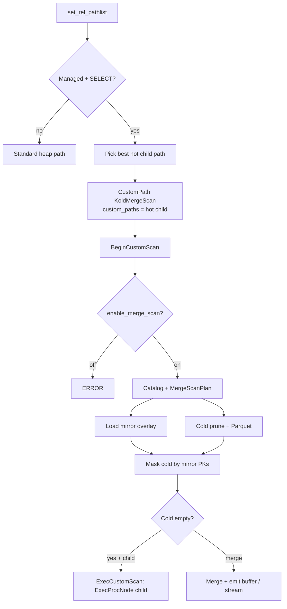

# Scanning Table Workflow (KoldMergeScan)

This document describes how `SELECT` queries against managed tables are planned
and executed through the `KoldMergeScan` custom scan node. It covers catalog
pruning, cold Parquet reads, native hot child plans, mirror overlay, winner
resolution, and ownership boundaries at each step.

**Planner hook:** `set_rel_pathlist` in `crates/pg_koldstore/src/merge_scan/pg.rs`  
**Rust merge:** `crates/koldstore-merge/src/core/resolver.rs`  
**Parquet read:** `crates/koldstore-parquet/src/reader.rs`

---

## Design principle

PostgreSQL remains the transaction, locking, index, and hot-row authority.
KoldStore adds a custom scan that is a **merge coordinator**:

```text
KoldMergeScan
├── PostgreSQL native child plan   (IndexScan / BitmapScan / SeqScan)
├── KoldParquetScan                (segments → row groups → projected batches)
└── MirrorOverlay                  (unflushed inserts/updates/tombstones)
```

The user table stays a normal heap table. There is no custom table access method.

- Planner cost is `hot_child_cost + catalog + estimated cold + merge overlay`.
- Heap-only finals **and** parallel partials are replaced so managed SELECTs
  cannot silently omit cold rows (including under `ORDER BY` / Gather Merge).
- Hot-only scans (no matching cold segments) stream from the native child via
  `ExecProcNode` when available.
- Merge paths apply the mirror overlay immediately so committed deletes cannot
  resurrect cold rows before flush.
- `EXPLAIN` without `ANALYZE` uses local catalog metadata only (no remote object
  opens).

### Merge invariant

Active cold state is treated as at most one visible version per PK after
newest-first resolution. The mirror overlay masks any PK that still has an
unflushed mirror row (`op` 1/2/3). Visible cold rows can therefore be appended
alongside native hot rows without a global `DISTINCT ON` sort. When multiple
cold versions exist in open segments, newest-first winner resolution plus a
bounded `seen_pk` set remains the correctness path (compaction is not required).

### Cursor semantics

- `seq` is a row-version / effect identity (Snowflake id allocated at statement
  time). It is **not** a commit-order cursor.
- Durable change-stream replay must use WAL LSN / logical decoding (or another
  true commit-order cursor). Do not treat `WHERE seq > cursor` as gap-free
  commit ordering.
- Until a commit-safe API ships, `changes_since` remains unreleased / documented
  as non-commit-ordered if exposed.

---

## Overview



---

## Phase 1 — Extension bootstrap

On `_PG_init` (`pg_koldstore/src/lib.rs`):

1. Register `KoldMergeScan` custom scan methods.
2. Install `set_rel_pathlist_hook`.

---

## Phase 2 — Planner

For each managed relation on `SELECT`:

1. Let PostgreSQL build normal heap paths (including parallel partials).
2. Choose the cheapest non-custom path as the hot child.
3. Clear both `pathlist` and `partial_pathlist`, then install one `CustomPath`
   whose `custom_paths` holds that child. Clearing partials is required:
   PostgreSQL builds Gather / Gather Merge *after* `set_rel_pathlist` from
   leftover heap IndexScan partials; leaving them lets `ORDER BY … LIMIT`
   prefer a hot-heap-only plan that omits cold rows after flush.
4. Cost = child cost + catalog lookup + per-segment cold estimate + overlay.
5. `PlanCustomPath` copies `custom_plans` from the planned child list and stores
   a serialized `MergeScanPlan` in `custom_private`.

`koldstore.enable_merge_scan = off` still plans `KoldMergeScan` for managed
tables; execution errors instead of allowing an incorrect heap-only read.

---

## Phase 3 — Executor

### BeginCustomScan

1. Error if `enable_merge_scan` is off.
2. Deserialize `MergeScanPlan` when present.
3. Load catalog snapshot + mirror overlay (all unflushed mirror PKs).
4. Prune cold segments from local catalog stats; open ObjectStore readers only
   for remaining candidates.
5. Filter cold rows whose PK appears in the mirror overlay.
6. Hot-only + native child → stream mode; otherwise merge hot (SPI/JSON today
   for overlap) with filtered cold and materialize winners into a scan-local
   memory context.

### ExecCustomScan

- Hot-child mode: `ExecProcNode` on the child, copy into the result slot.
- Buffer mode: emit the next materialized row.
- Checks interrupts between rows so cancel can stop work.

### End / Rescan

- Drop scan state and cold profile (keep profile briefly for `EXPLAIN ANALYZE`).
- `ExecReScan` the hot child when present; reset buffer index.

---

## Mirror overlay rules

| Mirror op | Effect on cold | Effect on result |
|-----------|----------------|------------------|
| 1 / 2 | Skip cold for that PK | Native hot child / hot load returns the live row |
| 3 | Skip cold for that PK | Row is invisible (no hot row) |
| none | Cold may be visible | Cold winner after merge rules |

A committed delete must never require a later flush to become invisible.

---

## GUCs

| GUC | Meaning |
|-----|---------|
| `koldstore.enable_merge_scan` | Required for managed SELECT. `off` → ERROR at scan begin (not silent heap-only). |
| `koldstore.cold_reads=auto` | Cold eligible when catalog/cost says so. |
| `koldstore.cold_reads=on` | Cold eligible; does not force unnecessary object reads. |
| `koldstore.cold_reads=off` | Hot-only; ERROR when correctness would require opening cold segments. |
| `koldstore.max_open_parquet_readers` | Per-backend open Parquet reader cap. |

---

## EXPLAIN

`EXPLAIN` / `EXPLAIN ANALYZE` should show at least:

- Hot Plan (Index Scan / Bitmap Heap Scan / Seq Scan)
- Emit path (`hot_child` / `hot_native` / `cold_native` / `merge_buffer`)
- Hot rows / Result rows (ANALYZE)
- Candidate segments
- Segments pruned by scope / min/max
- Parquet segments opened
- Row groups read / Bytes fetched (ANALYZE)
- Footer cache hits when footers were reused
- Mirror Tombstones / Mirror Overrides
- Manifest path + catalog source
- Per-segment Parquet I/O / row-group / bloom detail when ANALYZE ran

Example shape (ANALYZE):

```text
Custom Scan (KoldMergeScan)
  Hot Plan: Index Scan
  Emit path: cold_native
  Hot rows: 0
  Result rows: 1
  Candidate segments: 12
  Segments pruned by scope: 0
  Segments pruned by min/max: 10
  Parquet segments opened: 2
  Row groups read: 3
  Bytes fetched: 1.8 MB
```

---

## Implementation notes / remaining polish

1. Overlap merge path still uses SPI JSON hot load for winner resolution when a
   full PK equality probe is not available; PK point lookups use hot-native /
   cold-native emit. Further pushdown of residual quals through PostgreSQL
   `ExprState` and fully lazy cold segment iteration remain follow-ups.
2. User-scoped cold segment loading beyond `scope_key = ''` continues to land
   with catalog scope work (`Segments pruned by scope` stays 0 for shared-only).
3. No DSM / parallel CustomScan workers yet.
4. Backend Parquet footer metadata is cached across scans and cleared on flush /
   managed-table invalidation.
