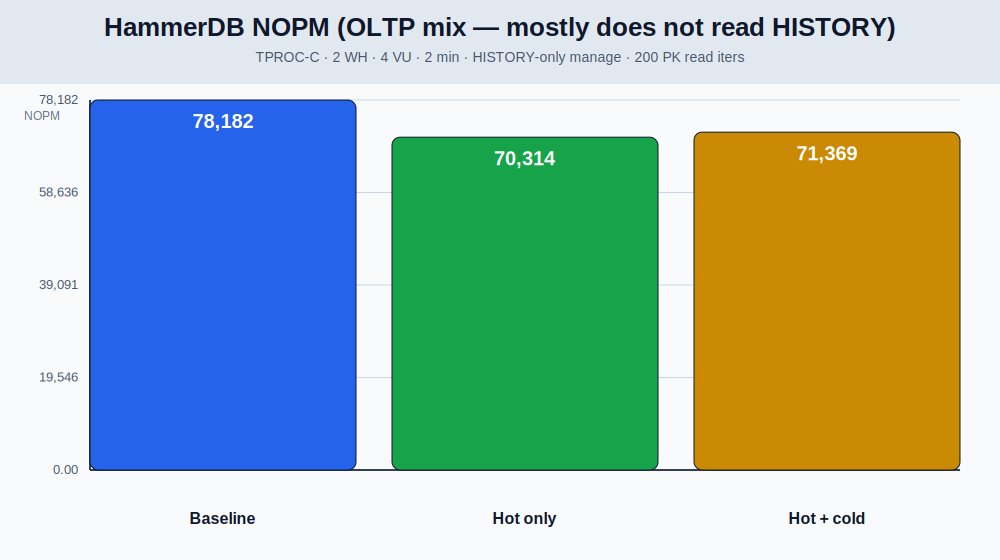
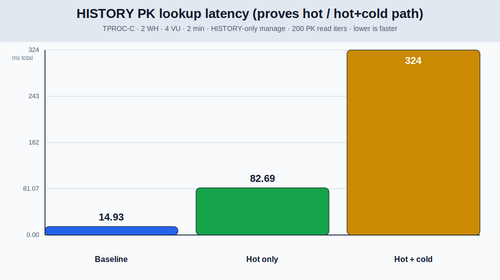
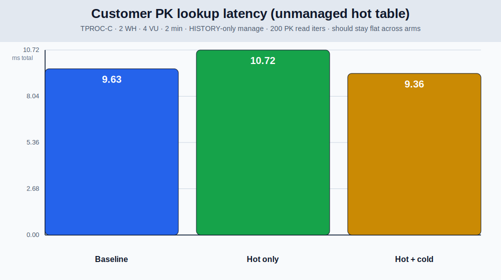

# HammerDB / TPROC-C with selective KoldStore manage

## Important: what HammerDB does (and does not) prove

TPROC-C **mostly inserts** into `HISTORY` during payment transactions. It does
**not** run `SELECT`s that merge hot+cold `HISTORY` rows. So NOPM alone cannot
prove cold-path correctness.

This harness therefore runs **three arms** and, after each arm, an explicit
**read microbench + `EXPLAIN` proof**:

| Arm | Meaning | Expected `HISTORY` PK plan |
| --- | --- | --- |
| **baseline** | unmanaged | `Index Scan` on heap PK |
| **hot_only** | managed, **not flushed** | `KoldMergeScan`, `opened=0` cold segments |
| **hot_cold** | managed + **flushed** | `KoldMergeScan`, `opened≥1` Parquet segment |

Unmanaged hot tables (`customer`, …) must keep ordinary index plans in every arm.

## Latest compare (this machine)

Config: PostgreSQL **16** · **2** warehouses · **4** VU · **2** minutes ·
**200** PK read iters · Docker HammerDB 4.12 · manage **HISTORY only**.

Re-run after caching successful **absent-manifest** lookups (and invalidating on
flush). Absolute NOPM varies run-to-run; relative deltas vs baseline are the
signal.

### HammerDB NOPM (OLTP mix)

| Arm | NOPM | TPM | vs baseline |
| --- | ---: | ---: | ---: |
| baseline | 78,182 | 178,940 | — |
| hot_only | 70,314 | 161,364 | **−10.1%** |
| hot_cold | 71,369 | 163,380 | **−8.7%** |

| Metric | Before absence-cache | After |
| --- | ---: | ---: |
| hot_only NOPM vs baseline | −16.5% | **−10.1%** |
| hot_cold NOPM vs baseline | −19.7% | **−8.7%** |

NOPM still drops mainly from **capture triggers on `HISTORY` inserts**, not from
cold reads (TPROC-C barely reads `HISTORY`). The narrower gap vs baseline
matches less per-statement SPI for “no cold manifest yet.”



### Read path (the real hot / hot+cold proof)

| Arm | HISTORY PK (200 iters) | Customer PK (200 iters) | Merge scan? | Cold opened |
| --- | ---: | ---: | --- | ---: |
| baseline | 14.9 ms | 9.6 ms | no (`Index Scan`) | 0 |
| hot_only | 82.7 ms | 10.7 ms | yes | **0** |
| hot_cold | 324.3 ms | 9.4 ms | yes | **1** (of 12 segs) |

| HISTORY PK (200) | Before | After |
| --- | ---: | ---: |
| hot_only | 99.8 ms | **82.7 ms** |
| hot_cold | 320.5 ms | 324.3 ms |

- **Customer (hot, unmanaged)** stays flat (~10 ms) across arms — selective
  manage does **not** tax hot OLTP tables.
- **hot_only HISTORY PK** improved after absence caching (still merge-scan
  overhead vs native index).
- **hot_cold HISTORY PK** is still dominated by opening Parquet (~20× baseline)
  — expected; absence caching does not change cold I/O.
- After flush: **12** cold segments · **59,000** cold rows · **~1.7 MiB** Parquet.





### EXPLAIN excerpts (from `target/hammerdb/compare/explain_*.txt`)

**baseline** — heap index only:

```text
Index Scan using history_pkey on history
  Index Cond: (ks_id = 1)
```

**hot_only** — merge scan, no cold files:

```text
Custom Scan (KoldMergeScan) on history
  Hot Plan: Index Scan
  Manifest: (none), source=catalog (planned)
  Cold segments: considered=0, ... opened=0
  Parquet segment: none
```

**hot_cold** — merge scan opens Parquet:

```text
Custom Scan (KoldMergeScan) on history
  Hot Plan: Index Scan
  Cold segments: considered=12, pruned_min_max=11, opened=1
  Parquet segment: public/history/batch-1.parquet, ... 1 rows
```

**customer** (all arms) — unchanged hot path:

```text
Index Scan using customer_i1 on customer
  Index Cond: ((c_w_id = 1) AND (c_d_id = 1) AND (c_id = 1))
```

Note: `SELECT count(*) FROM history` still chooses parallel seq scan on the
heap today (merge scan does not win that plan). Point lookups are the proof
that hot+cold merge works.

## Policy

| Table | Manage? | Why |
| --- | --- | --- |
| `customer`, `orders`, `stock`, … | **No** | Hot mutable OLTP |
| `history` | **Yes** | Append / archive candidate |

## Reproduce

```bash
KOLDSTORE_HAMMERDB_WAREHOUSES=2 \
KOLDSTORE_HAMMERDB_VU=4 \
KOLDSTORE_HAMMERDB_MINUTES=2 \
KOLDSTORE_HAMMERDB_READ_ITERS=200 \
  scripts/hammerdb/compare.sh 16
```

Artifacts:

- `target/hammerdb/compare/results.json`
- `target/hammerdb/compare/explain_{baseline,hot_only,hot_cold}.txt`
- `docs/benchmarks/assets/hammerdb-{nopm,history-reads,customer-reads}.svg`

On macOS, compare uses Docker `tpcorg/hammerdb:v4.12` against pgrx. Each compare
run uses a fresh cold-storage temp dir so leftover Parquet cannot fail flush
validation.

## Related

- Storage / query trade-offs: [README](README.md)
- pgbench suites: [`benchmarks/`](../../benchmarks/)
- Scripts: [`scripts/hammerdb/`](../../scripts/hammerdb/)
