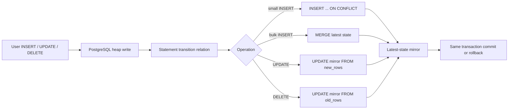

# Managed Mirror DML Performance Implementation Plan

> **For Claude:** REQUIRED SUB-SKILL: Use superpowers:executing-plans to implement this plan task-by-task.

**Goal:** Make managed-table `INSERT`, `UPDATE`, and `DELETE` materially faster and less memory-intensive while preserving atomic rollback, read-your-writes, mirror correctness, and PostgreSQL 15-18 support.

**Architecture:** Keep capture synchronous in the user's transaction, because the heap change and its mirror state are one atomic correctness unit. Retain statement-level transition tables for set-based capture, but make UPDATE use only `NEW TABLE`, move primary-key mutation rejection to a separate column-specific guard, replace guaranteed-existing UPDATE/DELETE upserts with direct updates, and use an empirically chosen adaptive INSERT path (`ON CONFLICT` for small statements, `MERGE` for bulk statements). Treat mirror index changes and a native executor-hook implementation as separately benchmarked gates, not assumptions.

**Tech Stack:** Rust, pgrx, PostgreSQL 15-18, PL/pgSQL generated by `koldstore-migrate`, local pgrx-managed PostgreSQL, `cargo nextest`, pgrx `#[pg_test]`, deterministic multi-session E2E, pgbench/storage-comparison benchmarks.

---

## Handoff instructions and non-negotiable constraints

Use `@test-driven-development`, `@cargo-pgrx`, `@performance-optimization`, `@rust-skills`, `@git-workflow-and-versioning`, and `@verification-before-completion` while executing this plan.

1. Work in a dedicated `codex/` worktree or branch created from the commit that contains the prior cold-query performance work. The source workspace may already contain unrelated uncommitted read-path changes. Do not reset, discard, reformat, or fold them into this work.
2. Keep the normal development loop local and pgrx-managed. Docker is not part of the correctness loop.
3. Run the red test before every behavioral implementation and preserve the failing output in the task notes.
4. Commit after each task. Do not combine the SQL rewrite, index experiment, and native-code spike in one commit; each must be independently revertible.
5. Do not publish new benchmark numbers from debug builds. Use the repository's `release-pg` install path and run at least three repetitions, reporting the median.
6. Every non-obvious comment must explain an invariant or trade-off. Do not comment syntax.
7. Preserve the crate boundary: PostgreSQL/SPI/hooks remain in `pg_koldstore`; SQL planning stays in `koldstore-migrate`; mirror storage SQL stays in `koldstore-mirror`.

## Why this design

The current implementation in `crates/koldstore-migrate/src/sql/capture.rs:177-341` already uses one `AFTER ... FOR EACH STATEMENT` trigger call with transition tables, so changing PL/pgSQL to literal C would only remove one function-dispatch boundary per statement. The expensive work is PostgreSQL heap/index maintenance and transition-relation handling.

Preliminary PostgreSQL 16.13 probes on the same machine found:

| Probe | Current | Candidate | Result |
|---|---:|---:|---:|
| 200k-row wide INSERT | `ON CONFLICT`: 5.44 s | `MERGE`: 1.97 s | about 2.8x faster end to end |
| 5k one-row INSERT statements | `ON CONFLICT`: 279 ms | `MERGE`: 290 ms | `ON CONFLICT` about 4% faster |
| 100k non-PK UPDATE | old/new PK guard | still running at 76 s, cancelled | current guard is effectively quadratic |
| 100k UPDATE after removing guard | upsert: 3.77 s | direct update, NEW only: 1.55 s | about 2.4x faster |
| 100k DELETE | upsert: 2.67 s | direct update: 0.93 s | about 2.9x faster |
| 200k Snowflake IDs | — | 28.6 ms total | not a priority for C rewrite |
| 200k wide INSERT temp writes | baseline: 342 blocks | transition capture: 7,226 blocks | about 53.8 MiB additional temp I/O |
| 100k wide UPDATE transition writes | OLD+NEW: 6,896 blocks | NEW only: 3,454 blocks | approximately half the temp I/O |

These are investigation results, not release claims. Reproduce them after Task 1 and record machine, PostgreSQL version, profile, settings, row width, and medians.

PostgreSQL facts that constrain the design:

- A transition relation is only available to an `AFTER` trigger, and an `UPDATE OF column...` trigger cannot also request transition relations. Therefore PK mutation rejection and NEW-only bulk capture must be separate triggers. See [PostgreSQL 16 CREATE TRIGGER](https://www.postgresql.org/docs/16/sql-createtrigger.html).
- `INSERT ... ON CONFLICT DO UPDATE` guarantees an insert-or-update outcome in Read Committed, while `MERGE` does not provide the same concurrency guarantee and has no `RETURNING` in PostgreSQL 16. See [transaction isolation](https://www.postgresql.org/docs/16/transaction-iso.html) and [MERGE](https://www.postgresql.org/docs/16/sql-merge.html). This is why small/concurrency-sensitive INSERTs retain `ON CONFLICT` and why deterministic isolation tests are mandatory.
- PostgreSQL does not generate parallel plans for a statement that writes data. A second data-modifying CTE shares a snapshot; it is not a parallel DML worker. See [When Can Parallel Query Be Used?](https://www.postgresql.org/docs/16/when-can-parallel-query-be-used.html) and [data-modifying CTEs](https://www.postgresql.org/docs/16/queries-with.html#QUERIES-WITH-MODIFYING).
- A separate background transaction would lose atomic rollback and immediate mirror visibility. An asynchronous mirror is a different consistency mode requiring logical decoding, an apply watermark, read/flush fencing, WAL-retention controls, and operational recovery. It is explicitly outside the first implementation.

## Target transaction flow



### Required code-comment policy

Add comments with this level of intent near the relevant generators:

```rust
// PK mutation is rejected by a separate column-specific row trigger. Keeping
// OLD TABLE here would materialize a second full-width transition relation for
// every ordinary UPDATE and would reintroduce the quadratic old/new PK check.
```

```rust
// Small statements retain ON CONFLICT's insert-or-update concurrency guarantee.
// Bulk statements use MERGE because PostgreSQL's conflict-resolution machinery
// dominates capture time when most incoming keys are new.
```

```rust
// Every mutable hot row has a mirror row: empty-table INSERT capture and
// existing-table backfill establish it before activation, and flush removes the
// corresponding hot row when it removes a live mirror entry. That invariant
// lets UPDATE and DELETE modify the mirror directly instead of upserting.
```

Do not add comments such as `// update the mirror` or `// get row count`; those only restate code.

---

### Task 1: Make the benchmark reproduce bulk and single-row DML separately

**Files:**
- Modify: `tests/storage/pg_vs_koldstore.rs:17-21, 77-166, 626-699`
- Modify: `scripts/run-storage-comparison.sh:6-65`
- Modify: `tests/storage/README.md`
- Modify: `docs/benchmarks/README.md` only after measurements; this file may already have unrelated user edits

**Step 1: Make DML sample size configurable**

Rename the constant and read an environment value next to `rows` and `hot_limit`:

```rust
const DEFAULT_DML_SAMPLE: i64 = 1_000;

let dml_sample = env_i64("KOLDSTORE_STORAGE_DML_SAMPLE", DEFAULT_DML_SAMPLE)
    .clamp(1, rows);
```

Replace every `DML_SAMPLE` use with `dml_sample`. Keep insert row count independent from the update/delete sample so the 10m comparison remains comparable with the previous run.

**Step 2: Expose the setting in the shell runner**

Add `--dml-sample N` and `KOLDSTORE_STORAGE_DML_SAMPLE`, pass the value into the test process, and include it in the runner's start line.

**Step 3: Verify the harness plumbing**

Run:

```bash
scripts/run-storage-comparison.sh --help
scripts/run-storage-comparison.sh --rows 100000 --hot-limit 10000 --dml-sample 10000
```

Expected: help lists the new option; the release-pg run prints insert, 10k-row update, and 10k-row delete timings for both heap and managed tables.

**Step 4: Capture the before baseline**

Run each command three times on a quiet machine:

```bash
scripts/run-storage-comparison.sh --rows 100000 --hot-limit 10000 --dml-sample 100000
scripts/run-storage-comparison.sh --rows 10000000 --hot-limit 100000 --dml-sample 100000
BENCH_ROWS=100000 BENCH_SECONDS=20 BENCH_MIXED_SECONDS=60 ./benchmarks/scripts/run.sh
```

For the focused SQL statements also collect:

```sql
EXPLAIN (ANALYZE, BUFFERS, WAL, SETTINGS, FORMAT JSON)
UPDATE ...;

SELECT temp_bytes, temp_files
FROM pg_stat_database
WHERE datname = current_database();
```

Record medians, `WAL records`, `WAL bytes`, temp blocks/bytes, mirror heap size, mirror index size, and `n_tup_hot_upd`. Store raw local output under `tmp/bench-mirror-dml/`; do not commit raw machine-specific output.

**Step 5: Commit only the harness change**

```bash
git add scripts/run-storage-comparison.sh tests/storage/pg_vs_koldstore.rs tests/storage/README.md
git commit -m "bench: parameterize managed DML sample size"
```

---

### Task 2: Specify the new SQL contract with failing planner tests

**Files:**
- Modify: `crates/koldstore-migrate/tests/change_log_mirror_dml.rs:30-149`
- Inspect: `crates/koldstore-migrate/src/sql/capture.rs:30-341`

**Step 1: Replace assertions that encode the old design**

Add narrow tests with these names and contracts:

```rust
#[test]
fn update_capture_uses_new_transition_rows_and_direct_update() {
    let plan = capture_plan(vec![pk_column("id", 1)]);
    let sql = &plan.function.sql;

    assert!(plan.update_trigger.sql.contains("REFERENCING NEW TABLE AS new_rows"));
    assert!(!plan.update_trigger.sql.contains("OLD TABLE"));
    assert!(sql.contains("UPDATE \"koldstore\".\"messages__cl\" AS mirror"));
    assert!(sql.contains("FROM new_rows AS src"));
    assert!(!sql.contains("FROM old_rows AS old_src"));
}

#[test]
fn delete_capture_updates_the_existing_mirror_row() {
    let plan = capture_plan(vec![pk_column("id", 1)]);
    let sql = &plan.function.sql;

    assert!(sql.contains("FROM old_rows AS src"));
    assert!(sql.contains("SET \"op\" = 3"));
    assert!(!delete_branch(sql).contains("ON CONFLICT"));
}

#[test]
fn pk_guard_is_separate_and_only_runs_when_pk_columns_are_targeted() {
    let plan = capture_plan(vec![pk_column("tenant_id", 1), pk_column("id", 2)]);

    assert!(plan.pk_guard_trigger.sql.contains(
        "BEFORE UPDATE OF \"tenant_id\", \"id\""
    ));
    assert!(plan.pk_guard_trigger.sql.contains("FOR EACH ROW"));
    assert!(plan.pk_guard_function.sql.contains("OLD.\"id\" IS DISTINCT FROM NEW.\"id\""));
}

#[test]
fn insert_capture_has_small_upsert_and_bulk_merge_paths() {
    let plan = capture_plan(vec![pk_column("id", 1)]);
    let sql = &plan.function.sql;

    assert!(sql.contains("OFFSET 32"));
    assert!(sql.contains("ON CONFLICT (\"id\") DO UPDATE"));
    assert!(sql.contains("MERGE INTO \"koldstore\".\"messages__cl\" AS mirror"));
    assert!(sql.contains("WHEN MATCHED THEN"));
    assert!(sql.contains("WHEN NOT MATCHED THEN"));
}
```

Implement a local test helper such as `branch(sql, start, end)` rather than brittle repeated `split` code. Keep composite-PK assertions.

**Step 2: Run the failing test**

Run:

```bash
cargo test -p koldstore-migrate --test change_log_mirror_dml -- --nocapture
```

Expected: FAIL because the plan has no PK guard artifact, UPDATE still requests OLD+NEW transition tables, and every operation still emits `ON CONFLICT`.

**Step 3: Commit the red tests**

```bash
git add crates/koldstore-migrate/tests/change_log_mirror_dml.rs
git commit -m "test: specify optimized mirror capture SQL"
```

---

### Task 3: Remove the quadratic primary-key guard and the OLD UPDATE transition table

**Files:**
- Modify: `crates/koldstore-migrate/src/sql/capture.rs:30-163, 226-341`
- Modify: `crates/koldstore-migrate/tests/change_log_mirror_dml.rs`
- Modify if public re-export changes: `crates/koldstore-migrate/src/lib.rs:35-42`
- Verify callers: `crates/koldstore-migrate/src/sql/mirror.rs:51-123`
- Verify teardown: `crates/koldstore-migrate/src/workflow/rehydrate.rs:235-256`

**Step 1: Extend the plan with explicit guard artifacts**

Add fields to `MirrorCapturePlan`:

```rust
/// Function that rejects an actual primary-key value change.
pub pk_guard_function: SqlStatement,
/// Column-specific row trigger; ordinary non-PK updates never invoke it.
pub pk_guard_trigger: SqlStatement,
```

Make `trigger_statements()` return four statements and `create_statements()` return six in dependency order: capture function, guard function, INSERT trigger, UPDATE trigger, DELETE trigger, guard trigger. Change cleanup to drop all four triggers before both functions.

Do not hide this in an untyped `Vec<String>`; the plan fields document artifact ownership.

**Step 2: Generate a separate guard function**

Generate SQL equivalent to:

```sql
CREATE OR REPLACE FUNCTION koldstore.messages__cl_pk_guard()
RETURNS trigger
LANGUAGE plpgsql
SECURITY DEFINER
SET search_path = pg_catalog, koldstore
AS $$
BEGIN
    IF OLD."tenant_id" IS DISTINCT FROM NEW."tenant_id"
       OR OLD."id" IS DISTINCT FROM NEW."id" THEN
        RAISE EXCEPTION
            'pg-koldstore does not support primary-key updates on managed table %',
            TG_TABLE_NAME;
    END IF;
    RETURN NEW;
END;
$$;
```

Generate its trigger as:

```sql
CREATE TRIGGER "messages__cl_pk_update_guard"
BEFORE UPDATE OF "tenant_id", "id" ON "public"."messages"
FOR EACH ROW EXECUTE FUNCTION "koldstore"."messages__cl_pk_guard"();
```

This preserves `SET id = id` behavior because the function raises only when values are distinct. It costs per-row work only for statements that mention a PK column; ordinary updates avoid both the guard and OLD transition storage.

**Step 3: Make the main UPDATE transition NEW-only**

Change the UPDATE branch of `capture_trigger_sql` to:

```rust
MirrorOperation::Update => "REFERENCING NEW TABLE AS new_rows",
```

Delete `primary_key_update_guard_statement`. Add the invariant comment from the comment policy immediately above this match arm or the helper that renders it.

**Step 4: Run planner tests**

Run:

```bash
cargo test -p koldstore-migrate --test change_log_mirror_dml -- --nocapture
cargo test -p koldstore-migrate --test migrate_existing -- --nocapture
```

Expected: PK guard and NEW-only trigger assertions pass; direct UPDATE/DELETE and adaptive INSERT tests remain red until later tasks.

**Step 5: Run the actual PK contract tests**

Run:

```bash
cargo pgrx test --manifest-path crates/pg_koldstore/Cargo.toml pg16 \
  managed_primary_key_mutation_is_rejected
```

Also add and run a case proving `UPDATE table SET id = id WHERE id = 1` succeeds.

Expected: actual PK changes raise; same-value assignments and normal non-PK updates succeed.

**Step 6: Commit**

```bash
git add crates/koldstore-migrate/src/sql/capture.rs \
  crates/koldstore-migrate/tests/change_log_mirror_dml.rs \
  crates/koldstore-migrate/src/lib.rs
git commit -m "perf: separate managed primary-key update guard"
```

---

### Task 4: Replace UPDATE and DELETE upserts with direct mirror updates

**Files:**
- Modify: `crates/koldstore-migrate/src/sql/capture.rs:177-270`
- Modify: `crates/koldstore-migrate/tests/change_log_mirror_dml.rs`
- Modify: `crates/pg_koldstore/src/pg_tests/mirror_dml.inc.rs:5-98`
- Test: `tests/e2e/dml/change_log_mirror.rs:7-137`

**Step 1: Add bulk correctness tests before implementation**

In `mirror_dml.inc.rs`, add a `#[pg_test]` that inserts 1,000 rows in one statement, updates all 1,000 in one statement, then deletes all 1,000 in one statement. Assert:

- mirror row count stays 1,000 after UPDATE and DELETE;
- all mirror operations are `2` after UPDATE and `3` after DELETE;
- each phase's minimum sequence is greater than the prior phase's maximum;
- source row count becomes zero after DELETE.

Run it and preserve the passing correctness baseline before changing SQL. This is a characterization test, so also inspect generated SQL tests for the red signal.

**Step 2: Generate a reusable PK equality predicate**

Add a helper that renders:

```sql
mirror."tenant_id" = src."tenant_id" AND mirror."id" = src."id"
```

Use `=` because managed PK columns are non-null. Keep quoting in `koldstore-common` helpers; do not concatenate unvalidated user identifiers.

**Step 3: Generate direct UPDATE capture**

Render the UPDATE branch as:

```sql
UPDATE "koldstore"."messages__cl" AS mirror
SET "seq" = public.snowflake_id(),
    "op" = 2,
    "commit_lsn" = capture_wal_lsn
FROM new_rows AS src
WHERE mirror."id" = src."id";
```

Render DELETE similarly from `old_rows`, setting `op = 3`.

Set `capture_wal_lsn pg_lsn := pg_current_wal_lsn();` once in the trigger function. This is primarily a consistency/clarity improvement; do not claim it is the speedup.

Add the direct-update safety comment. The invariant is established by empty-table capture and existing-table backfill (`crates/koldstore-migrate/src/workflow/backfill.rs:59-133`) before a table becomes active.

**Step 4: Fail closed on invariant violation without adding a full second scan**

After each direct UPDATE:

```sql
GET DIAGNOSTICS affected = ROW_COUNT;
IF affected = 0 THEN
    PERFORM 1 FROM new_rows LIMIT 1;
    IF FOUND THEN
        RAISE EXCEPTION
            'pg-koldstore mirror invariant violated for managed table %',
            TG_TABLE_NAME;
    END IF;
END IF;
```

Use `old_rows` in the DELETE branch. This catches total corruption at negligible normal cost. Do not add `count(*)` over the full transition relation in the hot path until the benchmark proves its cost is acceptable. Partial-miss detection belongs in integrity checks and lifecycle tests unless a single-pass native implementation becomes available.

For DELETE counter accounting, retain `GET DIAGNOSTICS affected = ROW_COUNT` and record `-affected`. Under the enforced invariant this equals the number of source rows deleted.

**Step 5: Verify generated and in-server behavior**

Run:

```bash
cargo test -p koldstore-migrate --test change_log_mirror_dml -- --nocapture
cargo pgrx test --manifest-path crates/pg_koldstore/Cargo.toml pg16 \
  mirror_bulk_update_and_delete_keep_latest_state
scripts/run-pg-e2e.sh 16
```

Expected: all lifecycle, rollback, reinsert, composite-PK, and bulk latest-state tests pass.

**Step 6: Re-run the 100k UPDATE/DELETE probe**

Run three repetitions of:

```bash
scripts/run-storage-comparison.sh --rows 100000 --hot-limit 10000 --dml-sample 100000
```

Gate: median managed UPDATE must improve by at least 1.5x and DELETE by at least 2x versus Task 1, with no correctness failure. If either misses, inspect `EXPLAIN (ANALYZE, BUFFERS, WAL)` before changing more code.

**Step 7: Commit**

```bash
git add crates/koldstore-migrate/src/sql/capture.rs \
  crates/koldstore-migrate/tests/change_log_mirror_dml.rs \
  crates/pg_koldstore/src/pg_tests/mirror_dml.inc.rs \
  tests/e2e/dml/change_log_mirror.rs
git commit -m "perf: update managed mirror rows directly"
```

---

### Task 5: Correct reinsert counter drift before optimizing INSERT

**Files:**
- Modify: `crates/pg_koldstore/src/pg_tests/mirror_dml.inc.rs:5-52`
- Modify: `tests/e2e/dml/change_log_mirror.rs:7-110`
- Inspect: `crates/pg_koldstore/src/sql/flush/counters.rs:1-90`
- Modify: `crates/koldstore-migrate/src/sql/capture.rs:177-270`

**Why this is required:** The current INSERT branch records `(affected, affected)`. A reinsert over an existing tombstone updates one physical mirror row but increments `mirror_row_count` as if it inserted another row. Optimizing INSERT without fixing this preserves silent manifest drift.

**Step 1: Write the failing counter test**

Extend the insert → delete → reinsert test to read `koldstore.describe_table(...)` or the manifest counter helper and assert:

```rust
assert_eq!(physical_mirror_rows, reported_mirror_rows);
assert_eq!(reported_mirror_rows, 1);
```

Run:

```bash
cargo pgrx test --manifest-path crates/pg_koldstore/Cargo.toml pg16 \
  mirror_tracks_insert_update_delete_reinsert_and_rollback
```

Expected: FAIL because the reported mirror counter becomes 2 while physical rows remain 1.

**Step 2: Count pre-existing mirror keys once for INSERT**

Before the INSERT write, render:

```sql
SELECT count(*)
INTO existing_mirror_rows
FROM new_rows AS src
JOIN "koldstore"."messages__cl" AS mirror
  ON mirror."id" = src."id";
```

After the write:

```sql
GET DIAGNOSTICS affected = ROW_COUNT;
PERFORM koldstore.internal_record_row_count_delta(
    TG_RELID,
    affected,
    affected - existing_mirror_rows
);
```

Document why the extra PK-only join exists. Do not use the undocumented `xmax = 0` trick to distinguish INSERT from UPDATE; it is not a stable SQL contract. `MERGE` also has no `RETURNING` in supported PostgreSQL 16, so the pre-write count is the portable implementation.

**Step 3: Verify red/green and measure the cost**

Run the failing test again, then run:

```bash
cargo test -p koldstore-migrate --test change_log_mirror_dml -- --nocapture
scripts/run-storage-comparison.sh --rows 100000 --hot-limit 10000 --dml-sample 100000
```

Expected: counter test passes. Record the extra insert cost separately so the adaptive INSERT result is compared against the corrected baseline, not the buggy faster baseline.

**Step 4: Commit**

```bash
git add crates/koldstore-migrate/src/sql/capture.rs \
  crates/pg_koldstore/src/pg_tests/mirror_dml.inc.rs \
  tests/e2e/dml/change_log_mirror.rs
git commit -m "fix: keep managed mirror row counters exact on reinsert"
```

---

### Task 6: Add adaptive INSERT capture

**Files:**
- Modify: `crates/koldstore-migrate/src/sql/capture.rs:177-270`
- Modify: `crates/koldstore-migrate/tests/change_log_mirror_dml.rs`
- Modify: `crates/pg_koldstore/src/pg_tests/mirror_dml.inc.rs`
- Modify: `tests/e2e/dml/change_log_mirror.rs`
- Modify: `tests/e2e/isolation/schedules.rs`

**Step 1: Add a named threshold and document it**

Start with the measured candidate, then calibrate in Step 6:

```rust
/// Largest INSERT statement kept on PostgreSQL's concurrency-strong
/// `ON CONFLICT` path; larger transition sets use bulk `MERGE`.
const SMALL_INSERT_UPSERT_ROWS: usize = 32;
```

Do not make this a user-facing GUC in the first patch. A public tuning knob is unnecessary until workloads prove one static threshold is inadequate.

**Step 2: Detect a bulk transition set without counting all rows**

Render:

```sql
IF EXISTS (
    SELECT 1 FROM new_rows OFFSET 32 LIMIT 1
) THEN
    -- bulk path
ELSE
    -- small path
END IF;
```

This examines at most 33 transition rows. Do not use `SELECT count(*)` merely to choose a path; Task 5's exact counter join is already the only required full pass.

**Step 3: Keep the small path as `ON CONFLICT`**

Retain the existing insert/select/upsert shape, but use `capture_wal_lsn`:

```sql
INSERT INTO mirror (pk..., seq, op, commit_lsn)
SELECT src.pk..., public.snowflake_id(), 1, capture_wal_lsn
FROM new_rows AS src
ON CONFLICT (pk...) DO UPDATE
SET seq = EXCLUDED.seq,
    op = EXCLUDED.op,
    commit_lsn = EXCLUDED.commit_lsn;
```

**Step 4: Generate the bulk `MERGE` path**

Generate SQL equivalent to:

```sql
MERGE INTO "koldstore"."messages__cl" AS mirror
USING (
    SELECT src."id",
           public.snowflake_id() AS next_seq
    FROM new_rows AS src
) AS incoming
ON mirror."id" = incoming."id"
WHEN MATCHED THEN
    UPDATE SET "seq" = incoming.next_seq,
               "op" = 1,
               "commit_lsn" = capture_wal_lsn
WHEN NOT MATCHED THEN
    INSERT ("id", "seq", "op", "commit_lsn")
    VALUES (incoming."id", incoming.next_seq, 1, capture_wal_lsn);
```

For composite PKs, include every PK column in the source projection, match, and insert list. Ensure `snowflake_id()` appears once in the generated source expression, not once per `WHEN` arm.

**Step 5: Add deterministic correctness and concurrency cases**

Cover:

1. 1, 32, 33, and 1,000-row INSERT statements all create exactly one mirror row per source PK.
2. A bulk reinsert over tombstones changes `op` back to 1 without increasing physical or reported mirror row count.
3. A transaction containing bulk INSERT followed by rollback leaves both heap and mirror unchanged.
4. Two sessions attempting the same fresh source PK are serialized by the source PK; one commits, the other receives a unique violation, and the mirror contains the committed latest state only.
5. INSERT concurrent with a paused flush preserves logical equality with a plain baseline. Extend the existing `insert_during_flush` schedule rather than creating a sleep-based race.

For the same-PK test, begin the first transaction, insert without committing, start the peer insert, confirm its backend is waiting on a lock through `pg_stat_activity`/`pg_locks`, then commit the first transaction. Do not use fixed sleeps as synchronization.

Run:

```bash
cargo pgrx test --manifest-path crates/pg_koldstore/Cargo.toml pg16
scripts/readiness/run-isolation.sh 16
```

Expected: all boundary-size, rollback, unique-key, and flush-race cases pass.

**Step 6: Calibrate rather than assume the threshold**

Benchmark statement sizes `1, 8, 32, 128, 1_000, 100_000` for both candidate paths. Use at least three repetitions and compare median latency, WAL bytes, and temp bytes.

Choose the smallest threshold for which `MERGE` consistently wins by at least 5% while the chosen small path has no more than 10% regression at one row. If the crossover is not stable across PostgreSQL 15, 16, 17, and 18, use the most conservative supported-version threshold and document it next to the constant.

**Step 7: Run the main performance gate**

Run:

```bash
scripts/run-storage-comparison.sh --rows 10000000 --hot-limit 100000 --dml-sample 100000
BENCH_ROWS=100000 BENCH_HOT_LIMIT=10000 BENCH_SECONDS=20 BENCH_MIXED_SECONDS=60 \
  ./benchmarks/scripts/run.sh
```

Gates against the corrected Task 5 baseline:

- bulk managed INSERT: at least 1.5x faster;
- one-row INSERT p95: no more than 10% slower;
- mixed workload TPS: no more than 5% slower;
- no drift between physical mirror rows and reported mirror counter;
- no change to hot-only or hot+cold query correctness.

**Step 8: Commit**

```bash
git add crates/koldstore-migrate/src/sql/capture.rs \
  crates/koldstore-migrate/tests/change_log_mirror_dml.rs \
  crates/pg_koldstore/src/pg_tests/mirror_dml.inc.rs \
  tests/e2e/dml/change_log_mirror.rs \
  tests/e2e/isolation/schedules.rs
git commit -m "perf: use adaptive bulk mirror insert capture"
```

---

### Task 7: Measure a lighter mirror index layout; land it only if total workload wins

**Files:**
- Modify only after the gate passes: `crates/koldstore-mirror/src/schema.rs:10-101`
- Modify only after the gate passes: `crates/koldstore-mirror/tests/storage_contract.rs:40-63`
- Inspect/read benchmarks: `crates/koldstore-mirror/src/read.rs:14-171`
- Inspect flush ordering: `crates/koldstore-flush/src/ops.rs:308-431`
- Inspect flush cutoff: `crates/pg_koldstore/src/sql/flush/spi.rs:297-339`
- Modify if evidence is published: `docs/architecture/dml-table.md`

**Why this is a separate gate:** The current B-tree on `seq` supports ordered `changes_since`, oldest-row cutoff, and ordered flush selection. The partial `(seq) WHERE op = 3` index supports tombstone-only force flush. Replacing them can make DML faster but turn bounded ordered reads into scans/sorts. Mirror writes cannot be judged in isolation.

**Step 1: Build disposable variants in SQL, without changing schema code**

Compare:

1. Current: PK + B-tree `seq` + partial tombstone B-tree.
2. PK + B-tree `seq`, no tombstone index.
3. PK + BRIN `seq WITH (pages_per_range = 32, autosummarize = on)`, no tombstone index.
4. Each viable variant with table `fillfactor = 80`.

Record mirror heap/index bytes, WAL bytes, `n_tup_hot_upd`, insert/update/delete throughput, and vacuum time. Run on PG15 and PG16 at minimum because PostgreSQL versions differ in HOT-update opportunities around BRIN-indexed columns.

**Step 2: Benchmark every index consumer**

For 100k, 1m, and 10m mirror rows measure:

- `changes_since(seq, limit)` with limits 1, 100, and 10,000;
- `plan_mirror_oldest_rows_max_seq` at the configured flush count;
- ordered mirror flush batch selection;
- tombstone-only force flush at 0.1%, 1%, and 25% tombstone density;
- exact-PK mirror overlay probes;
- `VACUUM (ANALYZE)` and post-DML bloat.

Use `EXPLAIN (ANALYZE, BUFFERS, WAL)` and preserve plan shapes.

**Step 3: Apply the decision gate**

Land an index change only if all are true:

- managed UPDATE or DELETE improves by at least another 15%;
- bulk INSERT does not regress by more than 5%;
- `changes_since` p95 does not regress by more than 10%;
- flush cutoff and batch selection do not regress by more than 10%;
- tombstone-only force flush does not regress by more than 15%;
- mirror total bytes do not increase;
- the result holds on every supported PostgreSQL major, or the DDL is safely version-gated and tested.

If no variant passes, keep the existing indexes and commit only benchmark documentation. Do not introduce a user-visible `write_optimized` mode in this task.

**Step 4: If a variant passes, write the failing schema test and implement it**

Update `storage_contract.rs` first, run it red, then change `MirrorSchemaPlan`. Preserve explicit fields and `//!`/`///` docs. Add an intent comment explaining the DML/read trade-off proven by benchmarks.

Run:

```bash
cargo test -p koldstore-mirror --test storage_contract -- --nocapture
cargo test -p koldstore-flush -- --nocapture
scripts/run-pg-e2e.sh 15
scripts/run-pg-e2e.sh 16
```

**Step 5: Commit the decision independently**

If changed:

```bash
git add crates/koldstore-mirror/src/schema.rs \
  crates/koldstore-mirror/tests/storage_contract.rs \
  docs/architecture/dml-table.md
git commit -m "perf: tune latest-state mirror indexes"
```

If unchanged, record why in the final benchmark notes; do not make a no-op code commit.

---

### Task 8: Verify memory and allocation improvements before considering native capture

**Files:**
- Inspect: `crates/koldstore-migrate/src/sql/capture.rs`
- Inspect: `crates/pg_koldstore/src/hooks/executor.rs`
- Create only if gate triggers: `docs/decisions/NNN-native-mirror-capture.md`
- Modify only in a later implementation: `crates/pg_koldstore/src/hooks/`

**Step 1: Measure the SQL rewrite's memory result**

For 10k, 100k, and 1m wide-row INSERT/UPDATE/DELETE statements collect:

- `EXPLAIN (ANALYZE, BUFFERS, WAL, FORMAT JSON)`;
- `pg_stat_database.temp_bytes/temp_files` deltas;
- `pg_backend_memory_contexts` snapshots immediately before and after;
- process RSS high-water mark where the platform supports it;
- mirror heap/index growth and dead tuples.

Required result: UPDATE temp writes fall by at least 40% after removing `OLD TABLE`. INSERT and DELETE may still materialize one full transition relation; document that residual rather than attributing it to Rust allocations.

**Step 2: Test statement batching as an operational control**

Benchmark application batch sizes 10k, 50k, and 100k. Document the best throughput/RSS/temp-I/O balance. Do not lower `work_mem` globally as a performance fix; that merely trades memory for temp-file I/O.

**Step 3: Apply the native-code gate**

Stop here unless, after Tasks 3-7, one of these remains true:

- transition temp I/O is still the dominant INSERT/DELETE cost;
- peak backend RSS exceeds the agreed operational budget;
- PL/pgSQL/SPI dispatch is at least 15% of sampled CPU;
- SQL executor/index work is no longer the dominant profile.

Remember: pgrx Rust already compiles to native code and uses PostgreSQL's C ABI. Rewriting one statement-level trigger function in literal C does not avoid transition-table construction.

**Step 4: If the gate triggers, write an ADR before code**

The ADR must compare:

1. C/pgrx trigger function over the same full transition tables: low complexity, little expected memory gain.
2. Row-level native trigger: avoids transition tables but reintroduces per-row calls and index writes.
3. ExecutorStart/ExecutorEnd hook that captures only typed PK datums into a PostgreSQL memory-context-owned tuplestore/`BufFile`, spills under a bounded policy, and performs one set-based mirror write at statement end.
4. Logical decoding/background apply: asynchronous, committed-only, eventually consistent.

If implementing option 3, keep the first version behind an off-by-default GUC and preserve the SQL trigger as fallback. Use PostgreSQL memory contexts, not Rust global allocators; use type OIDs and `Datum` ownership rules; register cleanup for abort/error paths; test PG15-18 ABI boundaries. Initially feed a compact ephemeral named relation into SPI rather than bypassing PostgreSQL heap/index APIs. Direct `table_tuple_insert`/index APIs multiply version, WAL, constraint, trigger, and speculative-insertion risk.

**Step 5: Do not combine this spike with the SQL optimization PR**

The native path requires its own plan, red tests, crash/abort coverage, and benchmark report.

---

### Task 9: Document transactional and asynchronous design decisions

**Files:**
- Modify: `docs/architecture/dml-table.md:1-296`
- Modify carefully: `docs/performance.md:1-58` (may contain unrelated user edits)
- Modify carefully: `docs/benchmarks/README.md` (may contain prior query benchmark edits)
- Create if desired: `docs/decisions/NNN-synchronous-mirror-capture.md`

**Step 1: Correct stale architecture text**

Replace every `AFTER ROW` statement and per-row example with the actual statement-level flow. Document:

- INSERT: adaptive small upsert / bulk merge;
- UPDATE: NEW-only transition relation + direct mirror update;
- DELETE: OLD transition relation + direct tombstone update;
- PK mutation: separate `BEFORE UPDATE OF pk... FOR EACH ROW` guard;
- capture WAL position is diagnostic and is not the final commit LSN;
- mirror and source changes commit/abort together.

Update the Mermaid diagrams and counter table, including the reinsert case (`hot +1`, physical mirror `+0` when replacing a tombstone).

**Step 2: Explain why “parallel transaction” is not the default**

Record this decision plainly:

- PostgreSQL does not parallelize data-modifying plans.
- A data-modifying CTE is not a mechanism for parallel mirror writes and shares one snapshot.
- A separate transaction can commit when the source rolls back, can be invisible to the source transaction's next read, and can let flush race ahead of mirror apply.
- Same-transaction capture is required for the current strong consistency contract.

**Step 3: Describe a future async mode without implementing it**

An optional async design would require:

- logical decoding of committed source changes;
- commit-order application keyed by LSN;
- a per-table applied-LSN watermark;
- merge scans and flushes that wait for or reject reads beyond the watermark;
- replication slot/WAL-retention monitoring;
- retry, idempotency, failover, upgrade, and disaster-recovery behavior;
- an explicit user-visible consistency choice.

This is a separate product mode, not a transparent speed switch.

**Step 4: Publish only verified benchmark results**

Include machine, PostgreSQL version, build profile, exact command, three-run medians, before/after throughput, temp bytes, WAL bytes, mirror bytes, and any read/flush regression. Clearly distinguish the preliminary investigation table from final reproducible results.

**Step 5: Commit docs**

```bash
git add docs/architecture/dml-table.md docs/performance.md docs/benchmarks/README.md
git commit -m "docs: explain managed mirror DML performance design"
```

---

### Task 10: Full verification and acceptance report

**Files:**
- Review: every file changed by Tasks 1-9
- Update only with fresh evidence: `docs/verification-results.md`

**Step 1: Run formatting and pure Rust tests**

```bash
cargo fmt --all -- --check
cargo nextest run --workspace --no-default-features \
  --exclude e2e --exclude examples --exclude storage-comparison
```

Expected: exit 0, zero failed tests.

**Step 2: Run focused PostgreSQL checks**

```bash
cargo check -p pg_koldstore --no-default-features --features pg16
cargo pgrx test --manifest-path crates/pg_koldstore/Cargo.toml pg16
scripts/run-pg-e2e.sh 16
scripts/readiness/run-isolation.sh 16
scripts/run-sql-regression.sh 16
```

Expected: exit 0 for every command; no mirror drift, rollback leak, duplicate PK, or isolation failure.

**Step 3: Run the supported PostgreSQL matrix**

```bash
scripts/run-pgrx-matrix.sh --pg-versions 15,16,17,18
```

Expected: unit/clippy/install/E2E matrix passes on all configured majors. Use `--download-missing` only when required by local pgrx setup.

**Step 4: Run final performance measurements**

Run three times each and report medians:

```bash
scripts/run-storage-comparison.sh --rows 100000 --hot-limit 10000 --dml-sample 100000
scripts/run-storage-comparison.sh --rows 10000000 --hot-limit 100000 --dml-sample 100000
BENCH_ROWS=100000 BENCH_HOT_LIMIT=10000 BENCH_SECONDS=20 BENCH_MIXED_SECONDS=60 \
  ./benchmarks/scripts/run.sh
```

Final acceptance criteria:

| Area | Gate |
|---|---|
| Correctness | Existing insert/update/delete/reinsert/rollback/flush tests all pass |
| PK updates | Actual value changes rejected; same-value assignments remain legal |
| Counter accuracy | Physical mirror rows equal reported mirror rows after reinsert and bulk DML |
| Bulk INSERT | at least 1.5x faster than corrected pre-optimization baseline |
| UPDATE | at least 1.5x faster than Task 1 baseline; no quadratic 100k behavior |
| DELETE | at least 2x faster than Task 1 baseline |
| Single-row INSERT | p95 regression no greater than 10% |
| Mixed DML | TPS regression no greater than 5% |
| UPDATE memory/temp | temp bytes/blocks reduced by at least 40% |
| Query/flush | no correctness regression; index change obeys Task 7 latency gates |
| PostgreSQL support | PG15, PG16, PG17, and PG18 pass |

If a performance gate fails, report the actual result and profile; do not weaken correctness or hide the regression in an aggregate number.

**Step 5: Inspect the final diff**

```bash
git diff --check
git status --short
git diff --stat
```

Verify that the diff contains no unrelated cold-read, footer-cache, or user-authored changes.

**Step 6: Commit verification notes only if they contain fresh evidence**

```bash
git add docs/verification-results.md
git commit -m "docs: record managed mirror DML verification"
```

## Expected implementation sequence

Ship Tasks 1-6 as the core SQL optimization. Task 7 is an evidence-gated schema decision. Task 8 normally ends after measurement and an ADR decision; it should not add native code to the same change. Tasks 9-10 document and verify the result.

The highest-confidence wins are, in order:

1. separate PK mutation guard and NEW-only UPDATE transition data;
2. direct UPDATE/DELETE of invariant-existing mirror rows;
3. adaptive INSERT path with exact reinsert counter accounting;
4. mirror index changes only when ordered change-feed/flush reads remain within their gates;
5. native executor capture only if post-SQL profiles prove transition materialization is still the dominant problem.
