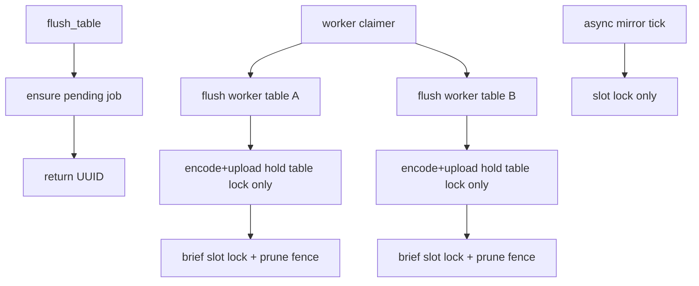
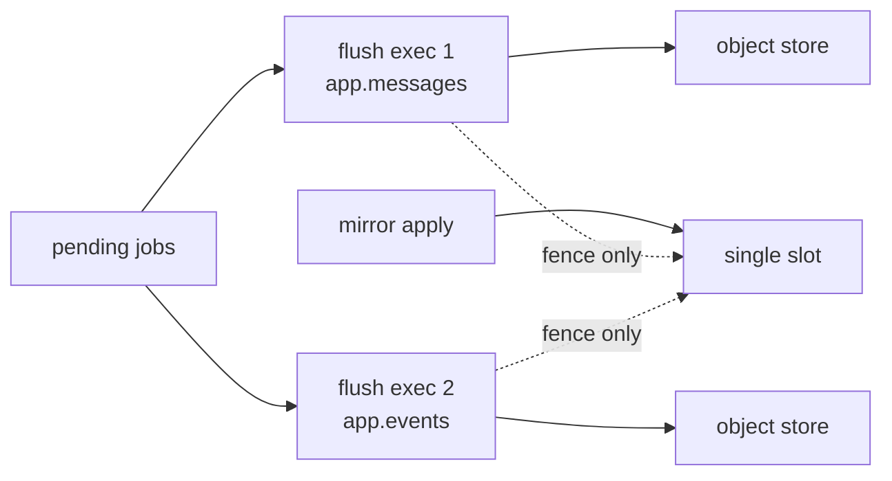

# Worker-Owned Flush Queue (No External Job Runtime)

**Date:** 2026-08-05  
**Status:** Ready to implement later  
**Related:** [ADR-006](../decisions/006-jobs-platform.md), [2026-07-23-jobs-platform-design](2026-07-23-jobs-platform-design.md), [async-flush-prune-race](../cases/async-flush-prune-race.md), [ADR-004](../decisions/004-segment-publication-protocol.md)

## Overview

Do not adopt external job runtimes. Make flush enqueue+worker-owned with short
transactions, unify public naming on **batches** (not waves), fix `duration_ms`,
slim `koldstore.jobs` via `payload` JSON, **narrow the apply/slot lock**, and
**allow parallel flushes across different tables**.

## Recommendation on crates

**Do not use [`job`](https://crates.io/crates/job) or [`duroxide`](https://github.com/microsoft/duroxide) inside `pg_koldstore`.**

| Crate | Why it does not fit |
|-------|---------------------|
| `job` (Galoy) | Needs **sqlx + Tokio poller** as a separate client of Postgres. Flush/apply must run **inside** a pgrx background worker with **SPI**. |
| `duroxide` (+ `duroxide-pg`) | Durable orchestration runtime with its own history store — fights pgrx single-backend model; we already have pending segments + manifest CAS (ADR-004). |
| `pg_durable` | Separate extension / `duroxide.*` schema — not embeddable under KoldStore flush. |

Progress and resume live in **`koldstore.jobs` + `cold_segments`**.

## What hurt listeners

Inline `flush_table` holds the **database apply lock** for the whole job. Mirror
apply cannot run → `changes_since` lags. Narrow slot locking + short flush
transactions fix that; multi-table parallel upload needs the same split.

## Observed bugs from a completed job

Log: `duration=216.715s ... segments=100 ... waves=50`  
Job row: `batches_completed=100`, payload `duration_ms: 0`

### Waves vs batches (naming)

Today there are **two** counters:

- **Wave** (log-only): outer catch-up loop, capped by `max_rows_per_flush`
- **Batch** (`jobs.batches_completed`): Parquet **segments** written

**Decision:** public language is **batches only** (= Parquet segments). Drop
`waves=` from LOG lines and docs. Internal loops may be called **passes**.

### Why `duration_ms` is 0

`now()` is transaction-stable; inline flush is one long xact → `duration_ms = 0`.
**Fix:** `clock_timestamp()` and/or **COMMIT between batches**.

## Target design

**API:** `flush_table` **enqueue-and-return** UUID. Poll `list_jobs` / job by id.

**Executor:** Worker claimer drains pending jobs. Auto-flush only enqueues.

**Transactions:** Short: commit after each batch; apply/slot lock **not** held
across Parquet upload.

**Resume:** `cold_segments` pending→active + payload checkpoint.

### Apply / slot lock split (in scope)

Today `lock_apply(database_oid)` is a **database-wide** advisory lock used for:

- every async mirror peek/advance
- whole flush (phase-0 + upload + fence)

**New contract:**

| Operation | Lock |
|-----------|------|
| Logical slot peek / advance / apply tick | **Slot lock** (keep DB-wide — one slot per DB) |
| Flush encode + object upload | **Table job lock only** |
| Flush prune fence (short SHARE ROW EXCLUSIVE + bounded apply) | Slot lock **briefly**, then release |
| Two flushes on **different** tables (upload phase) | Allowed concurrently |
| Two flushes on the **same** table | Still serialized by table job lock + unique active job |

Rename in code/docs toward `lock_slot` / `try_lock_slot` so “apply lock” is not
confused with “flush mutex.”

### Multi-table parallel flush (in scope)

**Goal:** heavy multi-table workloads flush without waiting on each other’s
Parquet uploads.

**Approach (concrete):**

1. Pending jobs for different `table_oid`s are claimable independently (existing
   unique indexes already allow one active flush per table).
2. **Flush executors:** run up to `koldstore.max_parallel_flush_jobs` (new GUC,
   default e.g. `2` or `4`) concurrent flush backends — either dynamic
   NEVER_RESTART workers spawned by the database worker, or a small pool of
   flush workers. Each claims one pending job via table try-lock.
3. Each executor: select → encode/upload batches (table lock only) → progress
   COMMITs → brief slot lock for fence/prune → complete.
4. Slot lock waiters use **try-lock + short retry** on the fence path so one
   table’s fence does not look like a hung flush; apply ticks keep using
   blocking or try+backoff as today.
5. Same-table concurrency remains forbidden (unique active flush + table lock).

**Not required for v1 of this plan:** unbounded parallel encode of many ranges
inside one table (optional follow-up with concurrency cap). Multi-table
parallelism is the priority called out here.

## Lean `koldstore.jobs` schema

Keep columns: `id`, `table_oid`, `scope_key`, `job_type`, `status`, `attempts`,
`error_trace`, `cancel_requested_at`, `created_at`, `updated_at`, `payload`.

Move into `payload`: `phase`, progress fields, `batches_completed`, row
counters, checkpoints, `started_at`, `duration_ms`, `force`, watermarks, bytes.

Edit bootstrap SQL in `crates/pg_koldstore/sql/koldstore--0.1.0.sql` (no upgrade
edges in beta). `list_jobs` still returns a flat JSON view.

## Implementation checklist

1. **Enqueue API** — `flush_table` ensures pending job, returns UUID (no inline run).
2. **Worker claimer** — drains pending; auto-flush only enqueues.
3. **Apply/slot lock split** — upload never holds slot lock; fence takes it briefly; rename helpers/docs.
4. **Multi-table parallel flush** — GUC-capped concurrent flush executors for different tables; e2e two-table overlap on upload.
5. **Short tx + progress** — COMMIT between batches; live `payload` progress.
6. **Naming** — drop LOG `wave=`; batches = segments.
7. **duration_ms** — `clock_timestamp()` (+ commits).
8. **Lean schema** — progress columns → `payload`; update `table_jobs.rs` / migrate writers.
9. **Apply budgets** — keep mirror responsive under load.
10. **Docs + e2e** — ADR-006 amendment; enqueue, duration, multi-table parallel upload, restart resume.

## Parallel encode within one table (optional follow-up)

Bounded concurrent encode/upload of non-overlapping ranges inside one job
(pending segments → one activate) remains a **follow-up**, not required to ship
multi-table parallelism.

## Out of scope

- Adopting `job` / `duroxide` / `pg_durable`
- Unbounded parallel encode (memory blow-up)
- Full lease/multi-claimer framework beyond GUC-capped flush executors + one apply worker per database
- Multiple logical slots per database (still one slot; fence serializes briefly)
