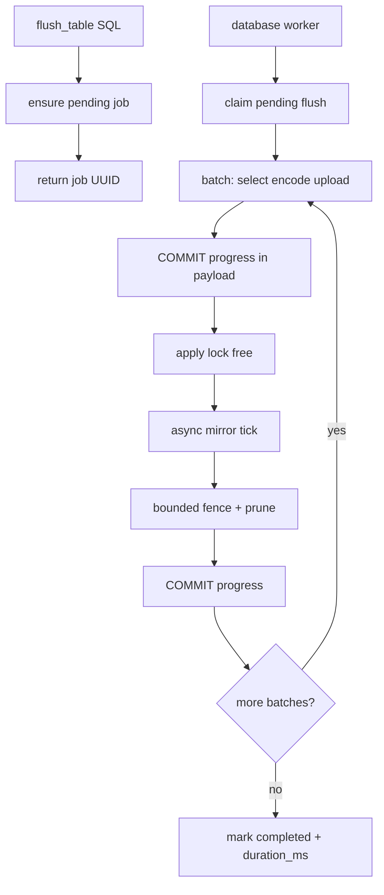

# Worker-Owned Flush Queue (No External Job Runtime)

**Date:** 2026-08-05  
**Status:** Ready to implement later  
**Related:** [ADR-006](../decisions/006-jobs-platform.md), [2026-07-23-jobs-platform-design](2026-07-23-jobs-platform-design.md), [async-flush-prune-race](../cases/async-flush-prune-race.md), [ADR-004](../decisions/004-segment-publication-protocol.md)

## Overview

Do not adopt external job runtimes. Make flush enqueue+worker-owned with short
transactions, unify public naming on **batches** (not waves), fix `duration_ms`,
and slim `koldstore.jobs` by moving progress metrics into `payload` JSON.

## Recommendation on crates

**Do not use [`job`](https://crates.io/crates/job) or [`duroxide`](https://github.com/microsoft/duroxide) inside `pg_koldstore`.**

| Crate | Why it does not fit |
|-------|---------------------|
| `job` (Galoy) | Needs **sqlx + Tokio poller** as a separate client of Postgres. Flush/apply must run **inside** a pgrx background worker with **SPI**. |
| `duroxide` (+ `duroxide-pg`) | Durable orchestration runtime with its own history store — fights pgrx single-backend model; we already have pending segments + manifest CAS (ADR-004). |
| `pg_durable` | Separate extension / `duroxide.*` schema — not embeddable under KoldStore flush. |

Progress and resume live in **`koldstore.jobs` + `cold_segments`**.

## What hurt listeners

Inline `flush_table` holds the **database apply lock** for the whole job. Mirror
apply cannot run → `changes_since` lags. Worker-owned short transactions fix that.

## Observed bugs from a completed job

Log: `duration=216.715s ... segments=100 ... waves=50`  
Job row: `batches_completed=100`, payload `duration_ms: 0`

### Waves vs batches (naming)

Today there are **two** counters:

- **Wave** (log-only): outer catch-up loop, capped by `max_rows_per_flush` (e.g. 10k rows) → 50 waves for ~500k rows
- **Batch** (`jobs.batches_completed`): Parquet **segments** written → 100 (e.g. 5k `max_rows_per_file` × 2 per wave)

**Decision:** public language is **batches only** (= Parquet segments / `batches_completed`). Drop `waves=` from LOG lines and docs. Internal catch-up loops may remain as an implementation detail named **passes** if needed, but operators and `list_jobs` only see batches/segments/rows.

### Why `duration_ms` is 0

Completion SQL uses `now() - (payload->>'started_at')::timestamptz` in
`crates/koldstore-flush/src/table_jobs.rs`. In PostgreSQL, **`now()` /
`CURRENT_TIMESTAMP` are fixed for the whole transaction**. Inline flush is one
long xact → start stamp and complete stamp are the same instant →
`duration_ms = 0`. Wall time in LOG uses Rust `Instant`, which is why logs look
correct.

**Fix:** stamp and measure with `clock_timestamp()`, and/or **COMMIT between
batches** (also required for live progress). Prefer both.

## Target design

**API:** `flush_table` **enqueue-and-return** UUID. Worker claims and runs. Poll
`list_jobs` / job row by id.

**Executor:** Database worker only. Auto-flush enqueues pending; same claimer
drains after restart.

**Transactions:** Short worker txns: commit after each batch (or after
publish+prune for that batch group) so apply lock is not held across Parquet
upload and progress is visible.

**Resume:** `cold_segments` pending→active + job checkpoint in payload; skip
already-published batches.

## Lean `koldstore.jobs` schema

Keep **first-class columns** only for identity, concurrency, and filtering:

| Keep as columns | Why |
|-----------------|-----|
| `id`, `table_oid`, `scope_key`, `job_type`, `status` | PK + unique active-job indexes |
| `attempts`, `error_trace`, `cancel_requested_at` | Ops / cancel |
| `created_at`, `updated_at` | Ordering / listing |
| `payload` jsonb | Everything else |

**Move into `payload`** (edit bootstrap SQL in
`crates/pg_koldstore/sql/koldstore--0.1.0.sql` per AGENTS.md — no upgrade edges
in beta):

- `phase`, `progress_current`, `progress_total`, `progress_unit`
- `batches_completed`, `rows_processed`, `rows_flushed`
- `checkpoint_seq`, `flush_seq_upper_bound`
- `started_at`, `duration_ms`, `force`, watermarks, bytes, etc.

`list_jobs` / `describe_table` continue to expose a flat JSON view (read from
payload + columns) so UIs do not care about the storage split.

## Implementation checklist

1. **Enqueue API** — `crates/pg_koldstore/src/sql/flush/mod.rs` / `execute.rs`: no inline run; return job id.
2. **Worker claimer** — `crates/pg_koldstore/src/database_worker/flush_task.rs`: drain pending; short txns; apply lock only around fence.
3. **Naming** — drop LOG `wave=`; align comments/docs; `batches_completed` remains segment count.
4. **duration_ms** — `clock_timestamp()` for started_at/duration; commits make `now()` usable too.
5. **Lean schema** — collapse progress columns into `payload`; update planners in `crates/koldstore-flush/src/table_jobs.rs` and migrate job writers.
6. **Apply budgets** — non-zero defaults or docs for `async_apply_max_rows_per_tick` / `max_ms`.
7. **Docs + e2e** — ADR-006 execution update; assert live payload progress, non-zero `duration_ms`, batch naming, restart resume.

## Out of scope

- Adopting `job` / `duroxide` / `pg_durable`
- Parallel multi-table flushes (apply-lock split is a later phase)
- Full lease/multi-claimer framework beyond one worker per database
