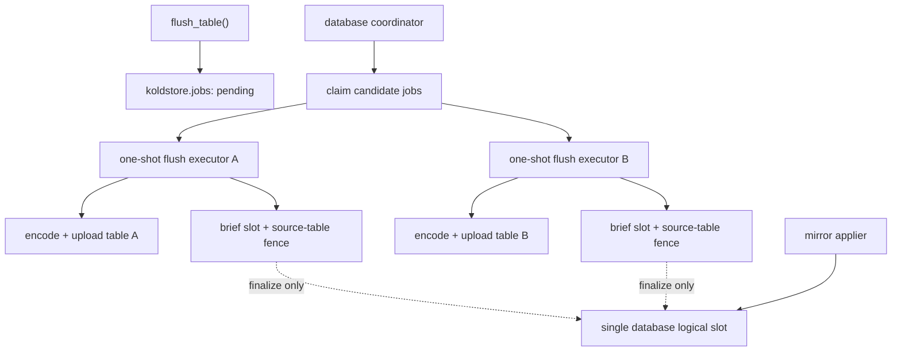

# Worker-Owned Flush Queue and Production-Grade Failure Testing

**Date:** 2026-08-05  
**Status (as of 2026-08-06):** **Core queue shipped; production hardening incomplete.**  
Supersedes ADR-006 inline-only model for the default path. Related hardening detail: [2026-08-07-improvements-to-jobs-lifecycle.md](2026-08-07-improvements-to-jobs-lifecycle.md).

### Shipped vs open (audit)

| Area | State |
| --- | --- |
| `flush_execution=queue` default; enqueue-and-return UUID | **Done** |
| One-shot `NEVER_RESTART` flush executors | **Done** |
| Session table advisory lock + `attempt_token` fencing | **Done** (fencing partial on “0-row stop” discipline) |
| Short txns; encode/upload outside open SPI where Short mode | **Done** |
| Crash / failpoint e2e coverage (substantial) | **Partial / substantial** |
| **Client still spawns executors** (not coordinator-only) | **Open** |
| Durable `flush_passes` + true pass resume | **Open** |
| Manifest object I/O **outside** slot lock | **Open** (still under `with_slot_lock_retry`) |
| Fair claim index + candidate page (not LIMIT 1) | **Open / partial** (ORDER BY exists; index / page claim missing) |
| Typed retryable vs permanent + backoff requeue | **Open** |
| Cluster-wide shmem worker reservation | **Open** |
| Ordered flush unbounded Rust `Vec` sort | **Done** (2026-08-06 MVP: PG `ORDER BY` + keyset stream) |
| Full production failure matrix / foreground gates | **Open** |

**Verdict:** Plan remains the architecture source of truth for the queue. Treat remaining rows as the active backlog (overlap with the Aug-7 lifecycle plan). Not outdated.

**Supersedes:** ADR-006 inline flush execution model  
**Related:** ADR-004 segment publication protocol, async flush prune race, jobs platform design, crate architecture

---

## 1. Executive decision

KoldStore will not adopt an external job runtime.

Flush execution will use a PostgreSQL-native durable queue backed by `koldstore.jobs`, a database coordinator, and a bounded number of one-shot flush executor background workers.

The public `koldstore.flush_table(...)` API becomes **enqueue-and-return**. It returns the UUID of a newly created or already active flush job. The caller does not encode Parquet, upload objects, publish manifests, prune rows, or wait for completion.

The design must provide:

- Short PostgreSQL transactions.
- No object-store I/O while holding the logical-slot lock.
- Parallel flush uploads for different tables.
- Strict serialization for the same table.
- Crash-safe resume.
- Idempotent segment publication.
- Bounded memory and worker concurrency.
- Live operator-visible progress.
- Deterministic fault injection for every side-effect boundary.
- End-to-end recovery verification after backend crash, PostgreSQL restart, network failure, partial object writes, stale metadata, and compound failures.

KoldStore stores production application data. The release criterion is not merely that a normal flush succeeds. The criterion is:

> For every injected failure point, the database remains logically correct, hot rows are never lost, cold rows are never exposed prematurely, duplicate visible rows are not returned, and recovery reaches a stable state without manual catalog repair.

---

## 2. Why no external job runtime

KoldStore already has the durability primitives required by its domain:

- `koldstore.jobs` for durable work state.
- `koldstore.cold_segments` with pending and active states.
- PostgreSQL catalog transactions.
- Manifest generation compare-and-swap.
- Immutable object paths and checksums.
- Logical-slot and prune fencing.
- Recovery of orphan objects and expired pending segments.

A generic workflow runtime would add a second history model, another queue abstraction, and additional operational behavior without replacing KoldStore's domain-specific publication protocol.

| Runtime | Decision |
|---|---|
| `job` | Reject. It assumes an external Tokio/SQLx poller, while KoldStore execution belongs inside PostgreSQL background workers and SPI-backed transactions. |
| `duroxide` | Reject. Durable orchestration, replay history, timers, and activity semantics are much broader than the bounded KoldStore flush state machine. |
| `pg_durable` | Reject for product simplicity, not technical incompatibility. It can run durable work inside PostgreSQL, but it would introduce a second generic orchestration schema and execution model beside KoldStore's catalog and publication protocol. |
| Redis, SQS, Kafka | Reject. They create a second source of truth and make extension-local recovery depend on external infrastructure. |

---

## 3. Terminology

### Batch

A **batch** is one Parquet segment.

Public progress uses:

```text
batches_completed = number of durable Parquet segments written
```

### Pass

A **pass** is an internal bounded publication unit containing one or more batches.

```text
Pass
├── Batch 1 → one Parquet segment
├── Batch 2 → one Parquet segment
└── One activation + prune transaction
```

Passes are internal. Do not expose "waves" in public logs, SQL, or documentation.

### Job

A **job** is the durable flush request. One job may execute multiple passes until its fixed start watermark is drained.

### Attempt

An **attempt** is one executor's ownership period for a job. A crashed executor can be replaced by a new attempt for the same job.

---

## 4. Public API

```sql
SELECT koldstore.flush_table(
  'public.messages'::regclass,
  force => false
);
```

Returns a UUID immediately.

Rules:

1. If no active flush exists, insert a pending job and return its UUID.
2. If a pending or running flush already exists for the table, return that UUID.
3. If `force = true`, upgrade the existing pending job's force intent.
4. Auto-flush only enqueues jobs.
5. Job inspection is through `koldstore.list_jobs(...)` and direct catalog access.
6. Cancellation is cooperative and checked at safe boundaries.

The separate public `enqueue_flush_job` API should either be removed or become an alias of `flush_table`. There should be one obvious flush entry point.

---

## 5. Process architecture



### Database coordinator responsibilities

The coordinator:

- Applies WAL through the logical slot.
- Evaluates auto-flush policy.
- Enqueues due jobs.
- Counts active flush executors.
- Starts at most `koldstore.max_parallel_flush_jobs`.
- Reclaims abandoned running jobs when table ownership is free.
- Never performs Parquet encoding or object upload.

### Flush executor responsibilities

A flush executor:

- Claims one job.
- Acquires table ownership.
- Executes bounded passes.
- Updates durable progress.
- Finalizes or yields on contention.
- Exits after one job in v1.

One-shot workers are preferred for v1 because process exit automatically releases session advisory locks and allocator state.

---

## 6. Lock contract

### 6.1 Table job ownership

The current transaction-level table advisory lock is not sufficient when committing between batches.

The executor must acquire a **session-level advisory lock** for the table and hold it across all job transactions:

```sql
SELECT pg_try_advisory_lock(koldstore_table_job_lock_key(table_oid));
```

The lock is released when:

- The executor explicitly unlocks.
- The executor exits normally.
- The executor crashes.
- PostgreSQL terminates the backend.

This is the primary v1 ownership signal.

### 6.2 Attempt fencing

Every claim creates a new `attempt_token uuid`.

All job progress mutations must be fenced:

```sql
UPDATE koldstore.jobs
SET ...
WHERE id = $job_id
  AND status = 'running'
  AND attempt_token = $attempt_token;
```

A stale executor must be unable to mutate a reclaimed job.

### 6.3 Logical-slot lock

Rename the database-wide apply advisory lock to `slot_lock`.

It protects only operations that acquire, peek, advance, or apply the single logical slot.

It must not be held during:

- Parquet encoding.
- Object upload.
- Checksum computation.
- Pending segment catalog insertion.
- Manifest assembly outside the final critical transaction.

Expose two internal forms:

```rust
try_lock_slot()
apply_bounded_locked(request)
```

The finalizer must use try-lock plus bounded retry rather than blocking while holding source-table locks.

### 6.4 Source-table lock

The final prune fence uses a short `SHARE ROW EXCLUSIVE` lock with a strict timeout.

Correct lock order:

```text
1. Session-level table job lock — entire job.
2. Try transaction-level slot lock.
3. Try source-table SHARE ROW EXCLUSIVE lock with timeout.
4. Capture durable WAL fence.
5. Apply bounded WAL.
6. Activate pass.
7. Prune.
8. Commit releases slot and source-table locks.
```

Never hold the source-table lock while waiting indefinitely for the slot lock.

---

## 7. Durable catalog model

### 7.1 `koldstore.jobs`

Keep core operational fields typed.

```text
id
table_oid
scope_key
job_type
status
phase
attempts
attempt_token
target_seq
checkpoint_seq
batches_completed
rows_processed
bytes_written
progress_total
cancel_requested_at
available_at
started_at
finished_at
error_trace
created_at
updated_at
payload
```

Use `payload` for versioned or job-specific details:

```text
force
current_pass_id
range_start_seq
range_end_seq
retry_class
retry_after_ms
storage diagnostics
late-cancel audit
```

Do not move all progress and checkpoints into JSONB.

### 7.2 `koldstore.cold_segments`

Add durable writer identity:

```text
writer_job_id
writer_attempt_token
pass_id
segment_ordinal
```

These fields make interrupted pass recovery deterministic.

A pending segment must be attributable to:

```text
job → attempt → pass → ordinal
```

### 7.3 Job retention

Terminal jobs must not grow forever.

Add a bounded retention process:

```text
koldstore.job_retention_days = 30
```

Cleanup must delete in small batches and must never remove jobs still referenced by pending recovery state.

---

## 8. Job state machine

```text
pending
  │ claim
  ▼
running
  ├── retryable failure ──► pending with available_at/backoff
  ├── cancel before publish ──► cancelled
  ├── permanent failure ──► error
  └── all target work finalized ──► completed
```

Suggested phases:

```text
pending
claimed
selecting
encoding
uploading
cataloging
waiting_for_fence
applying_fence
activating
pruning
checkpointing
finished
failed
cancelled
```

### Fixed watermark

At claim time:

```text
target_seq = mirror watermark visible at job start
```

The job drains only rows through `target_seq`.

Newer rows remain hot and are handled by a later job. This prevents an active workload from making one flush job unbounded.

---

## 9. Per-pass execution protocol

### Phase 1: claim

Short transaction:

1. Select one pending or resumable job using `FOR UPDATE SKIP LOCKED`.
2. Acquire the session table lock.
3. Generate `attempt_token`.
4. Set `status = running`.
5. Set `target_seq` if not already fixed.
6. Record `started_at = clock_timestamp()`.
7. Commit.

### Phase 2: reconcile recovery state

Before selecting new rows:

1. Read pending segments for this job.
2. Validate object existence, length, checksum, and ETag where available.
3. Group them by `pass_id`.
4. Determine whether a pass is:
   - Complete and ready to finalize.
   - Incomplete but resumable.
   - Invalid and safe to expire.
5. Never create new segments for a range already represented by a valid pending pass.

### Phase 3: select bounded pass

Short transaction:

```text
range_start = checkpoint_seq
range_end   = bounded sequence cutoff ≤ target_seq
```

Bounds should respect:

```text
max_rows_per_flush
max_batches_per_pass
max_bytes_per_pass
max_pass_duration
```

Commit the selected range into the job payload before producing external side effects.

### Phase 4: encode one batch

Read a bounded mirror range and produce an owned Parquet buffer.

The batch must have deterministic logical identity:

```text
job_id
pass_id
segment_ordinal
range bounds
schema version
```

The final object key remains immutable and unique per actual write attempt.

### Phase 5: upload outside a PostgreSQL transaction

Upload the object without holding the slot lock or source-table lock.

The storage layer must support:

- Timeout.
- Cancellation.
- Bounded retries.
- Byte-count verification.
- Checksum verification.
- Create-only final publication.
- Cleanup or quarantine of incomplete temporary objects.

### Phase 6: catalog pending batch

Short transaction:

1. Insert `cold_segments(status = 'pending')`.
2. Insert segment and row-group indexes.
3. Record writer job, attempt, pass, and ordinal.
4. Update batch progress.
5. Commit.

### Phase 7: finalize pass

Short critical transaction:

1. Try slot lock.
2. Try source-table lock.
3. Capture durable WAL fence.
4. Apply committed WAL through the fence.
5. Revalidate selected range and schema.
6. Build publication metadata from PostgreSQL catalogs.
7. Write or confirm derived manifest objects as required by ADR-004.
8. Activate only the pending segment IDs belonging to this pass using generation CAS.
9. Prune hot and mirror rows only when their current sequence still matches the finalized range.
10. Apply row-count deltas once.
11. Advance `checkpoint_seq`.
12. Commit.

### Phase 8: continue or complete

If:

```text
checkpoint_seq < target_seq
```

start another pass.

Otherwise set:

```text
status = completed
phase = finished
finished_at = clock_timestamp()
```

---

## 10. Idempotency rules

| Side effect | Idempotency rule |
|---|---|
| Job enqueue | Partial unique index returns existing active job |
| Job claim | Session table lock + attempt token |
| Range selection | Persisted pass ID and range before upload |
| Object upload | Immutable create-only final key; unique segment UUID |
| Pending catalog insert | Unique segment ID and unique pass ordinal |
| Manifest publication | Generation CAS |
| Segment activation | Pending IDs scoped to job/pass; repeated activation is no-op or fenced failure |
| Prune | Delete only rows whose version still matches the finalized cutoff |
| Counters | Applied in same transaction as activation/prune or guarded by pass-finalized marker |
| Completion | Conditional terminal update by job ID and attempt token |
| Recovery cleanup | Missing objects and already-deleted rows count as success |

Hard invariants:

1. No segment is query-visible before catalog activation.
2. A pass is never activated twice.
3. A row newer than the pass range is never pruned.
4. Hot remains authoritative until activation and prune commit.
5. Recovery never guesses ownership from object names alone when catalog identity is available.

---

## 11. Retry and backoff

Classify failures.

### Retryable

```text
network timeout
connection reset
temporary DNS failure
HTTP 429
HTTP 5xx
object-store throttling
slot lock contention
source-table lock timeout
worker slot unavailable
generation CAS conflict after concurrent catalog change
```

Use exponential backoff with jitter and a maximum delay.

### Permanent until operator action

```text
invalid credentials
permission denied
bucket missing with create disabled
schema incompatible
unsupported PostgreSQL type
checksum mismatch after confirmed complete upload
corrupt Parquet generated locally
catalog invariant violation
```

Permanent errors set `status = error`.

### Retry budget

Track:

```text
attempts
consecutive_failures
last_error_class
available_at
```

Do not hot-loop failed storage operations.

---

## 12. Cancellation semantics

### Before any pass activation

- Stop producing new batches.
- Leave or expire pending objects safely.
- Mark `cancelled`.

### After a pass activation

- Do not pretend already published cold data was rolled back.
- Complete required prune/checkpoint work for the activated pass.
- Record `cancel_requested_after_publish = true`.
- If no further pass starts, mark the job `completed`, not `cancelled`.

### During upload

The storage client should support cancellation where possible. If cancellation cannot abort the remote request safely, let the request finish, catalog or quarantine the result, and stop before activation.

---

## 13. Testing philosophy

KoldStore should adopt the strongest practical ideas from SQLite's test approach:

1. Test the deployed interfaces, not only internal functions.
2. Sweep failure points systematically rather than testing one hand-picked crash.
3. Run I/O tests in two modes:
   - Fail one operation, then recover.
   - Fail that operation and every later I/O operation.
4. After disabling failure injection, reopen and validate the entire logical state.
5. Simulate crashes in a separate process.
6. Manipulate the filesystem/object-store model to reproduce:
   - Partial writes.
   - Reordered visibility.
   - Missing files.
   - Truncated files.
   - Corrupted bytes.
   - Stale listings.
7. Test compound failures, including failure during recovery.
8. Use mutation and coverage tools to prove failure branches are exercised.
9. Repeat scenarios across PostgreSQL versions and storage backends.

The KoldStore equivalent of SQLite's integrity check is not one SQL query. It is a full invariant verifier covering PostgreSQL catalogs, Parquet objects, manifests, checksums, and logical query results.

---

## 14. Required test infrastructure

### 14.1 Structured failpoint framework

Replace ad hoc string-only failpoints with a typed registry.

```rust
enum FlushFailpoint {
    AfterClaimCommit,
    AfterRangePersist,
    BeforeEncode,
    DuringEncodeRow(u64),
    AfterEncode,
    BeforeTempPut,
    DuringTempPutBytes(u64),
    AfterTempPut,
    BeforeFinalCreate,
    AfterFinalCreate,
    BeforePendingInsert,
    AfterPendingInsert,
    BeforeManifestWrite,
    AfterManifestWrite,
    BeforeSlotLock,
    AfterSlotLock,
    BeforeSourceLock,
    AfterSourceLock,
    AfterFenceCapture,
    DuringFenceApplyBatch(u64),
    BeforeActivate,
    AfterActivate,
    BeforePrune,
    DuringPruneBatch(u64),
    AfterPrune,
    BeforeCheckpoint,
    AfterCheckpoint,
    BeforeComplete,
    AfterComplete,
}
```

Failpoint actions:

```text
return error
panic
PostgreSQL ERROR
SIGKILL current executor
sleep
block until released by test
drop connection
corrupt buffer
truncate write
```

Production builds may compile out destructive actions, while test builds expose them through controlled GUCs or test-only SQL.

### 14.2 Fault-injecting object store

Add a `FaultInjectingObjectStore` wrapper around the existing object-store trait.

Capabilities:

```text
fail Nth operation
fail all operations after N
delay operation
limit bandwidth
truncate upload after N bytes
acknowledge write but drop object
return success with wrong ETag
return stale object length
corrupt one byte after upload
hide newly written object from LIST
hide object from HEAD but expose through GET
expose through HEAD but fail GET
duplicate response
timeout after remote side committed
fail rename/copy
copy only prefix
delete source before copy finishes
fail cleanup
return out-of-order LIST results
```

Every operation should emit a deterministic trace:

```text
operation number
operation type
key
byte range
injected behavior
result
```

### 14.3 Model filesystem backend

Create a test-only in-memory or directory-backed storage model that can snapshot complete storage state after each operation.

It should support restoring a selected snapshot and applying crash damage:

```text
drop unsynced temp object
truncate last write
replace final bytes with old version
reorder temp/final visibility
lose directory/listing update
preserve final object but lose pending catalog transaction
```

Object storage differs from SQLite's local VFS, so do not blindly simulate sectors. Model the failure semantics that KoldStore actually depends on: request completion ambiguity, eventual listing consistency, multipart/copy interruption, immutable create races, and stale metadata.

### 14.4 Network fault proxy

For S3-compatible E2E tests, run MinIO behind Toxiproxy or an equivalent controllable proxy.

Scenarios:

```text
latency
jitter
bandwidth limit
connection reset
timeout
half-open connection
cut connection after request body
cut connection after server commit but before response
intermittent packet loss
DNS/service unavailability
```

### 14.5 Process crash harness

The parent test process:

1. Starts PostgreSQL and a real flush executor.
2. Arms a failpoint.
3. Starts a flush.
4. Waits until the executor reaches the point.
5. Kills only the executor backend or the whole PostgreSQL server.
6. Restarts as required.
7. Runs recovery.
8. Verifies invariants and logical query results.

Support:

```text
SIGKILL executor
SIGTERM executor
postmaster immediate stop
container kill
host filesystem remount simulation where practical
```

### 14.6 Invariant checker

Add:

```sql
SELECT * FROM koldstore.verify_table_integrity('public.messages');
```

and a deeper internal/test API.

Checks:

```text
one active managed schema
one active job per table
no active segment without object
no pending segment older than allowed policy unless owned by a live attempt
checksum and byte size match
Parquet footer is readable
Parquet row count matches catalog
row-group arrays match footer
segment index bounds match footer
active segments match current manifest generation
no active pass activated twice
manifest counters equal catalog-derived counts
no hot row was pruned when no active cold representation exists
current logical result equals reference table
no duplicate current primary key
tombstoned keys are absent
latest sequence wins
```

### 14.7 Reference-model oracle

For E2E tests, maintain an unmodified PostgreSQL reference table containing the expected current state.

Apply identical DML to:

```text
reference table
managed KoldStore table
```

After every crash and recovery:

```sql
SELECT ... FROM reference_table
EXCEPT ALL
SELECT ... FROM managed_table;

SELECT ... FROM managed_table
EXCEPT ALL
SELECT ... FROM reference_table;
```

Both must be empty for supported query shapes.

Also compare:

```text
count
primary-key set
row hashes
ordered results
point lookups
updates and deletes of previously cold keys
changes_since cursor behavior
```

---

## 15. Systematic failure-point sweep

For each scenario, run the workflow repeatedly with failure operation `N` advancing from 1 until the workflow completes without triggering the fault.

Two modes:

### Single-fault mode

Only operation `N` fails. Later operations work.

### Persistent-fault mode

Operation `N` and all later operations fail until the test disables injection.

After each failure:

1. Stop or kill the executor where appropriate.
2. Disable the injected fault.
3. Restart PostgreSQL/worker if needed.
4. Run recovery.
5. Run integrity verification.
6. Compare against the reference model.
7. Ensure the job reaches a valid terminal or retryable state.
8. Ensure a second recovery run is a no-op.

---

## 16. End-to-end test matrix

### 16.1 Enqueue and claim

- Concurrent 100 callers receive one active job UUID.
- Existing pending force=false upgraded by force=true.
- Worker fails to start because `max_worker_processes` is exhausted.
- Coordinator crashes after worker registration but before job claim.
- Worker crashes after session lock but before running update.
- Worker marks running then crashes before claim commit.
- Stale attempt tries to update after reclaim.
- Two databases use independent worker pools and slot locks.
- Table is dropped between enqueue and claim.
- Table is unmanaged between enqueue and claim.

### 16.2 Batch selection

- Empty backlog.
- Exactly one row.
- Exactly batch boundary.
- One row over boundary.
- Very large backlog.
- Concurrent inserts after fixed `target_seq`.
- Concurrent updates move a selected key above pass range.
- Concurrent delete before selection.
- Concurrent delete after selection but before fence.
- Schema change before selection.
- Schema change after range persistence.
- Order column renamed.
- Primary key metadata changes are rejected safely.

### 16.3 Encoding

- Unsupported value conversion.
- Null in expected non-null PK.
- Wide JSON/text row.
- Maximum supported row width.
- Compression error.
- Arrow allocation failure.
- Out-of-memory simulation.
- Panic during row-group generation.
- Generated Parquet footer validation fails.
- Encoded row count differs from selected count.
- Segment min/max metadata differs from footer.
- Process killed after buffer creation.

### 16.4 Temporary upload

- Temp PUT fails before sending bytes.
- Fails after 1 byte.
- Fails at every chunk boundary.
- Server stores partial bytes then closes.
- Client times out but server committed full temp object.
- Client retries and sees existing temp object.
- Slow upload exceeds job timeout.
- Cancellation during slow upload.
- Credentials expire mid-upload.
- Storage quota exceeded.
- Disk full on filesystem backend.
- Permission denied.
- Parent directory disappears.
- Filesystem returns short write.
- `fsync`/sync-equivalent failure where applicable.

### 16.5 Final immutable publication/copy

- Copy/create fails before destination creation.
- Destination receives only prefix.
- Destination complete but response lost.
- Source temp disappears before copy.
- Final key already exists with identical bytes.
- Final key already exists with different bytes.
- ETag absent.
- ETag changes unexpectedly.
- Checksum mismatch.
- Delete-temp cleanup fails.
- LIST does not show final object immediately.
- HEAD shows final, GET temporarily fails.
- Object becomes visible after job retry.

### 16.6 Pending catalog insertion

- Crash after final object but before pending row.
- Catalog insert fails.
- Index-bound insert fails.
- Transaction aborts after segment row but before index rows.
- Duplicate pass ordinal.
- Duplicate segment UUID.
- Wrong byte size rejected.
- Wrong row-group cardinality rejected.
- Stale attempt tries to insert after reclaim.
- Object is deleted externally before catalog commit.

### 16.7 Manifest construction and write

- Manifest assembled with zero expected segments.
- Catalog changes during assembly.
- Manifest shard write fails.
- Root write fails after shard write.
- Root points to missing shard.
- Shard checksum mismatch.
- Old root remains visible after new shards.
- New root visible before one shard due injected fault.
- Response lost after root commit.
- Retry writes identical manifest.
- Concurrent compaction or future publisher causes generation conflict.
- Corrupt existing manifest must not override PostgreSQL catalog authority.

### 16.8 Slot and source-table fence

- Slot lock unavailable.
- Slot active PID remains during abort window.
- Source-table lock timeout.
- Long-running writer blocks source lock.
- Cancellation while waiting for slot.
- Cancellation after slot acquired.
- WAL flush delayed.
- Logical decode returns empty initially.
- `synchronous_commit = off`.
- Very large source transaction.
- Apply row budget exhausted.
- Apply time budget exhausted.
- Apply fails after one mirror batch.
- Applier crashes during fence.
- Replication slot is missing.
- Slot is incompatible.
- WAL required by slot has been removed.
- PostgreSQL restart between upload and fence.

### 16.9 Activation

- Generation CAS conflict.
- Crash before activation statement.
- Crash after activation statement before commit.
- Commit succeeds but client receives error.
- Attempt repeats activation.
- One pending segment ID missing.
- Pending segment owned by another job included accidentally.
- Object disappears immediately before activation.
- Object checksum changes immediately before activation.
- Manifest generation increments but segment status update is forced to fail.
- Counter update fails.
- Cache invalidation fails or is delayed.

### 16.10 Prune

- Newer hot version exists.
- Newer mirror version exists.
- Cold delete tombstone.
- Reinsert after delete.
- Multi-column primary key.
- Batch delete partially executes then transaction aborts.
- Crash after activation before prune.
- Crash during prune.
- Crash after prune before checkpoint.
- Prune retry runs twice.
- Trigger or RLS interaction.
- Source-table lock released only after commit.
- Flush-origin WAL is not re-applied.
- PostgreSQL 15 replication-origin path.
- PostgreSQL 16+ origin filtering path.

### 16.11 Checkpoint and completion

- Checkpoint update fails.
- Crash after prune commit but before job checkpoint.
- Crash after checkpoint but before completion.
- Completion response lost.
- Cancel arrives after activation.
- Cancel arrives after final checkpoint.
- Duration uses wall clock correctly.
- Clock moves backward.
- Executor exits before session unlock call.
- Terminal job cleanup races with inspection.
- Retention cleanup never removes referenced recovery state.

### 16.12 Restart and recovery

- Executor process crash.
- Whole PostgreSQL crash.
- Container kill.
- Restart with pending valid segment.
- Restart with orphan final object.
- Restart with temp-only object.
- Restart with active catalog row and missing manifest root.
- Restart with manifest root and missing active catalog row.
- Restart with corrupt Parquet.
- Restart with corrupt catalog index bounds.
- Recovery itself crashes after each recovery step.
- Recovery runs twice.
- Two recovery workers run concurrently.
- Recovery while a live executor owns the table.
- Recovery while network is slow.
- Recovery while object store is unavailable.
- Recovery after credentials rotation.
- Recovery after table was dropped.
- Recovery after storage configuration changed.

### 16.13 Compound failures

- Crash, then I/O error during recovery.
- Timeout, then PostgreSQL restart during retry.
- Partial upload, then object-store outage during cleanup.
- Generation conflict, then cancellation.
- Slot failure, then table drop.
- Corrupt object, then recovery catalog update failure.
- Disk full while writing error/recovery metadata.
- Worker slot exhaustion while abandoned job needs reclaim.
- Network partition during activation verification.
- Cancellation while recovery is validating an object.
- Schema change while an abandoned pass is recovered.

### 16.14 Parallelism

- Two different tables upload concurrently.
- Four tables with limit two never exceed two executors.
- Same table never overlaps across batch commits.
- One slow table does not block another table's upload.
- Fences serialize briefly on one slot.
- Mirror apply continues during uploads.
- Apply latency under two concurrent uploads.
- Memory cap under maximum concurrency.
- Object-store connection pool saturation.
- Fairness: one large table cannot starve small jobs forever.
- Coordinator restart preserves pending jobs.
- Two coordinators cannot exceed configured executor count.

### 16.15 Query correctness during failures

At every meaningful blocked phase, issue concurrent queries:

```text
before pending insert
after pending insert
after manifest write
after activation before prune
during prune transaction
after prune
during recovery
```

Verify:

- No unactivated cold segment is read.
- Hot+active duplicate versions resolve correctly.
- No primary key disappears.
- Deletes remain deleted.
- Updates return newest state.
- Exact PK lookup is correct.
- Ordered top-N is correct.
- `changes_since` is monotonic and resumable.
- Reader cache generation changes safely.
- Long-running snapshots see a coherent generation.

### 16.16 Storage corruption

Manipulate test objects directly:

- Flip one byte in data page.
- Flip one byte in footer.
- Truncate footer.
- Append garbage.
- Replace object with another valid Parquet file.
- Swap two segment objects.
- Modify object without changing mocked ETag.
- Wrong checksum in catalog.
- Wrong ETag in catalog.
- Wrong row count.
- Wrong min/max.
- Wrong row-group offsets.
- Delete one object.
- Delete manifest root.
- Delete one manifest shard.
- Create unknown orphan final object.
- Create stale temp object.

The reader must fail closed. It must never silently return partial or incorrect data.

---

## 17. Current repository coverage and gaps

The repository already has valuable foundations:

- Failpoints around claim, row selection, Parquet writing, temporary object publication, checksum metadata, pending segment insertion, manifest publication, activation, cleanup, and completion.
- Pending-to-active segment publication with generation CAS.
- Immutable unique object paths.
- Checksum and ETag catalog fields.
- Expired pending and orphan recovery.
- Worker soft-failure handling and apply retry backoff.
- Bounded mirror apply requests.
- Source-table lock timeout.
- E2E and stress test directories.
- Concurrency design documents and async mirror worker tests.

Important gaps before this design is production-grade:

1. Existing failpoints are not yet a systematic operation-number sweep.
2. Most failpoints return errors; they do not fully simulate backend SIGKILL or postmaster crash.
3. No general fault-injecting object-store wrapper is evident.
4. No model storage snapshot/restore harness is evident.
5. Slow network, response-loss-after-commit, partial copy, stale LIST, and ambiguous timeout cases need dedicated infrastructure.
6. Pending segments currently lack job/attempt/pass ownership.
7. Current table lock is transaction-scoped and will not survive short transaction boundaries.
8. Current scheduler executes at most one inline flush and shares the mirror worker.
9. Current duration uses transaction-stable timestamps.
10. Current orphan running jobs are marked error rather than resumed as the same durable job.
11. Terminal job retention is unbounded.
12. A full cross-catalog/object/query invariant checker is still needed.
13. Recovery must be tested against failures occurring inside recovery itself.
14. Reference-model differential checks should run after every crash case, not only normal-path E2E tests.

---

## 18. Coverage and quality gates

### Per pull request

- Unit tests.
- Domain state-machine tests.
- PostgreSQL E2E normal path.
- Selected failpoint tests for modified phases.
- Formatting, clippy, and sanitizer-compatible builds where supported.

### Nightly

- Full failure-point sweep on filesystem backend.
- Single-fault and persistent-fault modes.
- PostgreSQL 15, 16, 17, and 18 matrix.
- Differential query checks against reference tables.
- Random DML with periodic crash/restart.
- Memory and file-descriptor leak checks.
- Queue scale test.

### Weekly or release candidate

- MinIO + network proxy matrix.
- Slow network and ambiguous completion cases.
- Full PostgreSQL process crash matrix.
- Compound failure suite.
- Long soak with random fault injection.
- Mutation testing for publication and recovery decisions.
- Coverage report focused on branches in:
  - job claim/reclaim,
  - segment publication,
  - object-store error mapping,
  - fence/apply,
  - activation/prune,
  - recovery.

### Release blocker conditions

Release is blocked by any test producing:

```text
lost logical row
duplicate visible current primary key
stale row resurrection
active segment with missing or invalid object
hot prune without durable active cold representation
job stuck permanently without an owner
unbounded retry loop
silent checksum/footer corruption
reader returning partial results after corruption
same-table concurrent finalization
```

---

## 19. Observability required for testing and production

Expose counters and timings:

```text
pending queue depth
oldest pending age
running executors
executor spawn failures
flush rows/sec
flush bytes/sec
encode duration
upload duration
catalog duration
slot wait duration
source-lock wait duration
fence apply duration
activation duration
prune duration
retry count by error class
orphan objects
expired pending segments
checksum failures
recovery actions
mirror lag bytes
mirror lag time
retained WAL
peak executor RSS
```

Every job log line should include:

```text
job_id
attempt_token
table_oid
pass_id
batch ordinal
phase
```

Never log `wave=` publicly.

---

## 20. Implementation order

1. Add session-level table ownership and attempt fencing.
2. Make `flush_table` enqueue-and-return UUID.
3. Add job/pass ownership to `cold_segments`.
4. Split coordinator from one-shot flush executors.
5. Split slot lock from upload work.
6. Implement short transactions and pass checkpointing.
7. Add typed progress timestamps and fix duration.
8. Add fault-injecting object-store wrapper.
9. Add typed failpoint actions and process-kill harness.
10. Add integrity verifier and reference-model oracle.
11. Implement full filesystem failure sweep.
12. Add MinIO network proxy E2E.
13. Add compound recovery failures.
14. Add job retention and operational scale tests.
15. Only then raise default parallelism above two.

---

## 21. Final acceptance statement

This design is ready to implement only after the following contracts are accepted:

- Session-level table ownership across commits.
- Attempt-token fencing.
- Fixed job watermark.
- Pending segment ownership by job, attempt, and pass.
- Activation and prune as one bounded pass-finalization transaction.
- No slot lock during object I/O.
- Deterministic crash and I/O fault injection.
- Full integrity and reference-model verification after every injected failure.

The target quality bar is:

> A flush may fail, retry, crash, or be interrupted at any external side-effect boundary, but it must never make the logical table incorrect.
