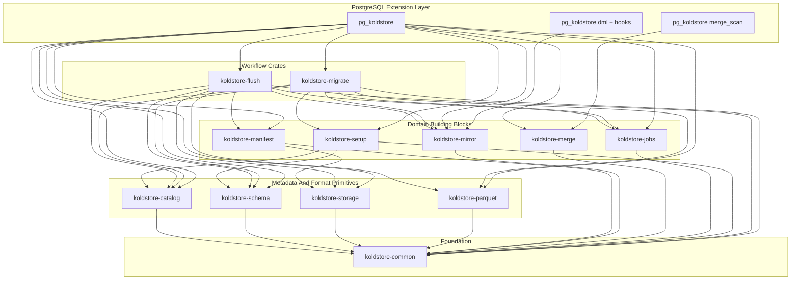

# Crate Architecture Reorganization Plan

## Goal

Turn pg-kalam from a fat extension crate (~10k LOC in [`crates/pg_koldstore`](crates/pg_koldstore) vs ~4k across seven libraries) into a layered, discoverable, well-documented Rust architecture. A new contributor should be able to answer "where does this behavior live?" from the crate name alone. Two outcomes matter equally: clean structure and a lighter, better-documented codebase.

Confirmed decisions:

- Use `koldstore-common` as the shared foundation crate.
- Keep merge scan inside [`crates/pg_koldstore`](crates/pg_koldstore) (tied to the PostgreSQL planner/executor and native custom scan FFI).
- Keep `koldstore-catalog` as an explicit first-class crate.
- Split the confirmed `schema` concern into two crates grounded in the actual bootstrap: `koldstore-setup` (creates internal tables) and `koldstore-schema` (tracks migrated-table schema/versions). See "Setup vs Schema vs Catalog".

## Extension Domains (from the recap)

The extension is organized around these functional domains. Each maps to a crate (PG-free logic) plus a thin adapter in [`crates/pg_koldstore`](crates/pg_koldstore) where PostgreSQL runtime access is required.

- setup: create the internal DDL tables/indexes the extension needs.
- migrate: migrate/demigrate a table to and from koldstore.
- merge_scan: query hot and cold together.
- dml: insert/update/delete against a migrated table (capture into the mirror).
- flushing/jobs: flush hot rows to cold and run background jobs.
- storage: object-store access.
- schema: store schema (columns/types/versions) for migrated tables.

## Two Cross-Cutting Requirements (apply to every phase)

### 1. Trim while you move (keep it light)

Moving code is also the moment to delete it. During every extraction:

- Re-read each moved file end to end and remove dead code: unused functions, structs, enums, fields, constants, feature branches, and imports with no remaining callers.
- Remove duplicated types by consolidating to one owner (see "Duplicate Types To Resolve").
- Delete commented-out code and stale TODOs; git history is the archive.
- Do not carry helper code into a library crate "just in case". If nothing calls it after extraction, drop it.
- Prefer narrowing public surface: make items `pub(crate)` unless another crate truly needs them.

Safety rule: only remove code that is provably unused (no references across the workspace, including tests and `#[pg_extern]` SQL surface). Anything ambiguous is flagged in the PR description rather than silently deleted, and behavior-bearing code is never removed without a passing test proving it is unreachable.

### 2. Document for maintainers

Every crate, module, and logic-bearing method carries intent-level documentation:

- Each crate root (`lib.rs`) has a `//!` header: what the crate owns, what it must never depend on, and the one-line rule for where new code goes.
- Each module file starts with a `//!` header describing the logic it implements and why it exists.
- Every function that performs real logic (validation, planning, resolution, state transitions, SQL building) has a `///` doc comment stating purpose, key invariants, and `# Errors` where it returns `Result`.
- Comments explain intent and trade-offs, never restate the code. No "increment counter" style noise.
- Public SQL entrypoints in [`crates/pg_koldstore/src/sql`](crates/pg_koldstore/src/sql) document the user-facing contract and which library crate performs the work.

This standard is added to [`AGENTS.md`](AGENTS.md) so it is enforced going forward, not just during the migration.

## Setup vs Schema vs Catalog

Grounded in [`crates/pg_koldstore/sql/koldstore--0.1.0.sql`](crates/pg_koldstore/sql/koldstore--0.1.0.sql):

- setup owns the DDL that creates every internal object: `koldstore.storage`, `koldstore.schemas`, `koldstore.manifest`, `koldstore.jobs`, `koldstore.segments`, `koldstore.cold_pk_hints`, the `global_seq`/`global_commit_seq` sequences, composite types, indexes, and grants. It is the install/bootstrap planner.
- schema owns the `koldstore.schemas` registry: `SchemaColumn`, `SchemaRegistryEntry`, `type_matrix`, schema versions, and `initialization_state` for migrated tables. This is "storing the schema changes for migrated tables".
- catalog owns cold-data bookkeeping: `segments`, `cold_pk_hints`, managed table meta, flush policy config, manifest catalog rows, plus PG-free query/decode/cache access.

Concretely, [`crates/koldstore-catalog/src/schema_registry.rs`](crates/koldstore-catalog/src/schema_registry.rs) and [`crates/koldstore-catalog/src/type_matrix.rs`](crates/koldstore-catalog/src/type_matrix.rs) move into `koldstore-schema`; [`crates/koldstore-catalog/src/segments.rs`](crates/koldstore-catalog/src/segments.rs), [`crates/koldstore-catalog/src/cold_pk_hints.rs`](crates/koldstore-catalog/src/cold_pk_hints.rs), and [`crates/koldstore-catalog/src/table_meta.rs`](crates/koldstore-catalog/src/table_meta.rs) stay in `koldstore-catalog`.

## Target Architecture

Dependency rule: arrows point only into lower layers. No crate depends on [`crates/pg_koldstore`](crates/pg_koldstore). `pgrx` lives only in [`crates/pg_koldstore`](crates/pg_koldstore).

## Crate Ownership

### `koldstore-common` (foundation)

Rename [`crates/koldstore-core`](crates/koldstore-core) to `koldstore-common`. Owns shared PG-free domain types and helpers.

- Keep: `error`, `filter`, `ident`, `pk`, `row`, `seq`, `table_kind`, `table_name`.
- Absorb pure scope-key logic from [`crates/pg_koldstore/src/security/scope.rs`](crates/pg_koldstore/src/security/scope.rs).
- Absorb ID generation from [`crates/pg_koldstore/src/sql/snowflake.rs`](crates/pg_koldstore/src/sql/snowflake.rs) if used beyond SQL wrappers.
- No dependency on any other `koldstore-*` crate.

### `koldstore-catalog` (cold-data bookkeeping)

Keep as explicit crate. Owns cold metadata models plus PG-free access helpers.

- Keep: `segments`, `cold_pk_hints`, `table_meta` (managed table meta, `FlushPolicy` config, FK policy).
- Absorb PG-free SQL builders from [`crates/pg_koldstore/src/catalog/queries.rs`](crates/pg_koldstore/src/catalog/queries.rs).
- Absorb PG-free decoding from [`crates/pg_koldstore/src/catalog/decode.rs`](crates/pg_koldstore/src/catalog/decode.rs).
- Absorb PG-free cache shapes from [`crates/pg_koldstore/src/catalog/cache.rs`](crates/pg_koldstore/src/catalog/cache.rs).
- Leave [`crates/pg_koldstore/src/catalog/resolve.rs`](crates/pg_koldstore/src/catalog/resolve.rs) in the extension (uses OIDs/SPI).

### `koldstore-schema` (migrated-table schema)

New crate. Owns the schema registry for migrated tables.

- Move `schema_registry` and `type_matrix` out of [`crates/koldstore-catalog`](crates/koldstore-catalog).
- Own schema versioning and column-set diff logic (schema changes over time).
- Own type-support validation used by migration, replacing use of `parquet::PgType` for validation.
- Backs the `koldstore.schemas` table model; SPI execution stays in the extension.

### `koldstore-setup` (extension install / internal DDL)

New crate. Owns typed DDL plans for the extension's internal objects.

- Represent the objects in [`crates/pg_koldstore/sql/koldstore--0.1.0.sql`](crates/pg_koldstore/sql/koldstore--0.1.0.sql) as ordered, typed DDL plans (tables, indexes, sequences, types, grants).
- Absorb internal DDL builders currently mixed into [`crates/pg_koldstore/src/sql/ddl.rs`](crates/pg_koldstore/src/sql/ddl.rs).
- Not the public SQL API: `migrate_table` / `register_storage` stay as thin `#[pg_extern]` wrappers.
- Bootstrap wiring (`pgrx::extension_sql_file!`) and execution stay in [`crates/pg_koldstore/src/lib.rs`](crates/pg_koldstore/src/lib.rs).

### `koldstore-storage` (object storage boundary)

Grow [`crates/koldstore-storage`](crates/koldstore-storage) from config/paths into the storage access boundary.

- Keep: `backend`, `path_template`, `publish`.
- Add over time: `object` (object + metadata models), `client` (trait: list/put/get/delete), backend impls (`local`, `s3`, `gcs`, `azure`), `errors`.
- Flush and migrate never see backend-specific details.

### `koldstore-manifest` (manifest lifecycle)

Split [`crates/koldstore-manifest/src/model.rs`](crates/koldstore-manifest/src/model.rs) by operation.

- Modules: `model`, `create`, `update`, `drop`, `publish`, `sync_state`.
- Keep serialized manifest format stable.

### `koldstore-parquet` (serdes only)

Keep [`crates/koldstore-parquet`](crates/koldstore-parquet) focused on Arrow/Parquet conversion, writing, reading, footer stats, pruning. It must not own migration or type-validation policy (that moves to `koldstore-schema`).

### `koldstore-mirror` (mirror repository API + DML statements)

Keep [`crates/koldstore-mirror`](crates/koldstore-mirror) as the PG-free repository/statement API for the change-log mirror, and make it the home for pure DML statement building.

- Keep: `relation`, `columns`, `schema`, `read`, `write`, `statement`.
- Add `lifecycle` for PG-free create/drop/collision planning from [`crates/pg_koldstore/src/migrate/mirror.rs`](crates/pg_koldstore/src/migrate/mirror.rs).
- Absorb pure DML/capture statement building from [`crates/pg_koldstore/src/sql/dml.rs`](crates/pg_koldstore/src/sql/dml.rs) (for example `MirrorCapturePlan` construction), leaving trigger creation and SPI execution in the extension.

### `koldstore-merge` (pure hot/cold logic)

Grow [`crates/koldstore-merge`](crates/koldstore-merge) into the deterministic merge/filter crate; the PostgreSQL custom scan stays in the extension.

- Keep: `resolver`, `changelog`, `quals`, `tombstone`.
- Absorb pure RLS/filter classification from [`crates/pg_koldstore/src/security/rls.rs`](crates/pg_koldstore/src/security/rls.rs).
- Absorb pure row-resolution logic from [`crates/pg_koldstore/src/merge_scan/exec.rs`](crates/pg_koldstore/src/merge_scan/exec.rs); scan state, memory contexts, and tuple slots stay in the extension.

### `koldstore-jobs` (shared job framework)

New crate for job mechanics shared by flush, migrate, and future compact.

- Own: job IDs, lease records, phase/status enums, retry metadata, batch/cursor progression, generic stale-lease recovery.
- Extract shared patterns from [`crates/pg_koldstore/src/flush/job.rs`](crates/pg_koldstore/src/flush/job.rs) and [`crates/pg_koldstore/src/migrate/jobs.rs`](crates/pg_koldstore/src/migrate/jobs.rs).
- No flush- or migrate-specific names in its core; domains keep their own phases.

### `koldstore-flush` (flush workflow)

New crate for hot-to-cold flush (PG-free).

- Move: `job`, `policy`, `cleanup`, `recovery`, and `worker` (mode enum) from [`crates/pg_koldstore/src/flush`](crates/pg_koldstore/src/flush).
- Depends on `common`, `catalog`, `schema`, `manifest`, `parquet`, `mirror`, `storage`, `jobs`.
- Resolve the duplicate `FlushPolicy`: config in `catalog`, runtime evaluation in `flush`.

### `koldstore-migrate` (migration workflow)

New crate for migrate/demigrate planning (PG-free).

- Move PG-free planning from [`crates/pg_koldstore/src/migrate`](crates/pg_koldstore/src/migrate): `constraints`, `order`, `jobs`, `backfill`, `register`, `rehydrate`, `rollback`, `scope`, `lock`.
- Move `MigrateTableRequest` / `DemigrateTableRequest` from [`crates/pg_koldstore/src/sql/ddl.rs`](crates/pg_koldstore/src/sql/ddl.rs) if PG-free.
- Validation uses `koldstore-schema` type support, not `parquet::PgType`.
- SPI execution, trigger creation, and OID lookups stay in the extension.

### `pg_koldstore` (thin PostgreSQL adapter)

Permanent responsibilities only:

- Bootstrap: [`crates/pg_koldstore/src/lib.rs`](crates/pg_koldstore/src/lib.rs), `build.rs`, `sql/*.sql`.
- SPI boundary: [`crates/pg_koldstore/src/spi.rs`](crates/pg_koldstore/src/spi.rs).
- Runtime: [`crates/pg_koldstore/src/guc.rs`](crates/pg_koldstore/src/guc.rs), [`crates/pg_koldstore/src/memory.rs`](crates/pg_koldstore/src/memory.rs), tracing init in [`crates/pg_koldstore/src/observability.rs`](crates/pg_koldstore/src/observability.rs).
- Hooks: [`crates/pg_koldstore/src/hooks`](crates/pg_koldstore/src/hooks) (executor, xact, ddl, planner) — dml capture wiring lives here, delegating statement building to `koldstore-mirror`.
- merge_scan adapter + native FFI: [`crates/pg_koldstore/src/merge_scan`](crates/pg_koldstore/src/merge_scan), [`crates/pg_koldstore/native`](crates/pg_koldstore/native).
- OID resolution: [`crates/pg_koldstore/src/catalog/resolve.rs`](crates/pg_koldstore/src/catalog/resolve.rs).
- SQL entrypoints: [`crates/pg_koldstore/src/sql`](crates/pg_koldstore/src/sql) as thin, documented wrappers that validate input, call library crates, and execute returned plans.

## Duplicate Types To Resolve (during the relevant phase)

- `catalog::FlushPolicy` vs `flush::policy::FlushPolicy`: config in `catalog`, evaluator in `flush`.
- `mirror::SqlParamType` vs `spi::SqlParamType`: one type (in `mirror` or `common`); SPI imports it.
- `parquet::PgType` used for migration validation vs `schema::type_matrix`: validation uses `schema`; parquet keeps Arrow mapping only.
- Job lease logic duplicated in flush and migrate: unify in `koldstore-jobs`.

## Migration Phases

Every phase includes the two cross-cutting requirements: trim dead/unneeded code in the files it touches, and add crate/module/method documentation to everything it creates or moves.

### Phase 0: Guardrails And Documentation

- Add `docs/architecture/crate-architecture.md` (dependency graph, domain-to-crate map, "where does new code go?").
- Add an ADR under `docs/decisions/` recording the layered split and the setup/schema/catalog decision.
- Add crate-ownership rules and the doc-comment standard and cleanup policy to [`AGENTS.md`](AGENTS.md).
- Add empty crate stubs: `koldstore-setup`, `koldstore-schema`, `koldstore-jobs`, `koldstore-flush`, `koldstore-migrate`.
- Verify: `cargo metadata` succeeds; workspace still builds.

### Phase 1: Rename `core` To `common`

- Rename package/folder [`crates/koldstore-core`](crates/koldstore-core) to `koldstore-common`; update workspace deps and all `koldstore_core` imports.
- No behavior change; trim any now-unused re-exports.
- Verify: workspace tests pass; no `koldstore_core` references remain.

### Phase 2: Extract `koldstore-jobs`

- Extract shared lease/phase/batch/recovery primitives from flush and migrate job code.
- Trim duplicated job structs after unifying.
- Verify: `cargo test -p koldstore-jobs`; existing flush/migrate tests unchanged.

### Phase 3: Extract `koldstore-flush`

- Move PG-free flush modules; wire deps; trim dead branches and unused helpers.
- Reduce flush code in [`crates/pg_koldstore/src/sql/ops.rs`](crates/pg_koldstore/src/sql/ops.rs) to SPI wrappers.
- Resolve `FlushPolicy` duplication.
- Verify: `cargo test -p koldstore-flush`; pgrx flush integration tests pass.

### Phase 4: Split `koldstore-schema` And Grow `koldstore-catalog`

- Move `schema_registry` + `type_matrix` into `koldstore-schema`; add schema version/diff logic.
- Move PG-free `queries`/`decode`/`cache` into `koldstore-catalog`.
- Repoint migration/flush validation to `koldstore-schema`; trim now-dead type-validation paths.
- Verify: `cargo test -p koldstore-schema` and `-p koldstore-catalog`; registry/storage tests pass.

### Phase 5: Extract `koldstore-setup`

- Represent internal objects from [`koldstore--0.1.0.sql`](crates/pg_koldstore/sql/koldstore--0.1.0.sql) as typed DDL plans; move internal DDL builders out of [`crates/pg_koldstore/src/sql/ddl.rs`](crates/pg_koldstore/src/sql/ddl.rs).
- Keep bootstrap wiring/execution in the extension; trim leftover inline DDL strings.
- Verify: `cargo test -p koldstore-setup`; extension install/setup tests pass.

### Phase 6: Extract `koldstore-migrate`

- Move PG-free migration planning modules; repoint validation to `koldstore-schema`.
- Keep SPI/trigger/OID code in the extension; trim dead planning code.
- Reduce [`crates/pg_koldstore/src/sql/ddl.rs`](crates/pg_koldstore/src/sql/ddl.rs) to input parsing + delegation + execution.
- Verify: `cargo test -p koldstore-migrate`; migrate/demigrate/rollback/backfill integration tests pass.

### Phase 7: Consolidate Merge And DML Logic

- Move pure RLS/filter/resolution logic into `koldstore-merge`; keep `merge_scan` adapter and FFI in the extension.
- Move pure DML/mirror statement building into `koldstore-mirror`; keep capture trigger wiring in [`crates/pg_koldstore/src/hooks`](crates/pg_koldstore/src/hooks) and [`crates/pg_koldstore/src/sql/dml.rs`](crates/pg_koldstore/src/sql/dml.rs) as thin wrappers.
- Trim duplicated statement/param types.
- Verify: `cargo test -p koldstore-merge`; merge_scan and DML integration tests pass.

### Phase 8: Grow `koldstore-storage`

- Add `object` models and a `client` trait (list/put/get/delete); route manifest publish and flush object ops through it.
- Verify: storage unit tests over a local/fake backend; flush uses typed storage APIs.

### Phase 9: Split Manifest Lifecycle

- Split `model.rs` into `create`/`update`/`drop`/`publish`/`model`; keep format stable.
- Verify: manifest schema + publish protocol tests pass.

### Phase 10: Thin The Extension SQL Surface

- Reduce [`crates/pg_koldstore/src/sql/ops.rs`](crates/pg_koldstore/src/sql/ops.rs), [`ddl.rs`](crates/pg_koldstore/src/sql/ddl.rs), [`dml.rs`](crates/pg_koldstore/src/sql/dml.rs) to documented thin wrappers.
- Remove any remaining duplicated helpers; document each `#[pg_extern]` contract.
- Verify: public SQL API tests pass; `pg_koldstore` LOC substantially reduced.

## Contributor Experience (documented in Phase 0)

- New shared identifier type -> `koldstore-common`.
- New internal table -> model split across `koldstore-catalog`/`koldstore-schema`, DDL in `koldstore-setup`, execution in `pg_koldstore`.
- Object-store behavior -> `koldstore-storage`.
- New flush rule -> `koldstore-flush`.
- Migration validation -> `koldstore-migrate` + `koldstore-schema` type support.
- Migrated-table schema/version change -> `koldstore-schema`.
- DML capture statement -> `koldstore-mirror` (wiring in `pg_koldstore` hooks).
- Merge scan -> pure logic in `koldstore-merge`, adapter in `pg_koldstore::merge_scan`.

## Checkpoints

- After Phase 1: rename complete, workspace green, no behavior change.
- After Phase 3: flush mostly out of the extension; layering proven on one large workflow.
- After Phase 6: migrate mostly out; the two largest domains no longer live in the extension.
- After Phase 10: `pg_koldstore` is a thin adapter; every crate/module/logic method is documented; dead code removed.

## Risks And Mitigations

- Rename churn (`core` -> `common`): isolate in its own phase; no behavior changes mixed in.
- Hidden `pgrx` coupling in "pure-looking" code: discover during extraction; keep adapters in the extension.
- Over-deleting during cleanup: only remove provably unreferenced code; flag ambiguous cases in the PR instead of deleting.
- Over-abstracting `koldstore-jobs`: extract only mechanics proven by both flush and migrate.
- Public SQL regressions while moving `ddl`/`ops`/`dml`: keep SQL entrypoint tests green after each phase.
- Manifest serialization drift: keep schema compatibility tests around every manifest change.

## Definition Of Done

- Crate responsibilities are documented and enforced by dependency direction.
- [`crates/pg_koldstore`](crates/pg_koldstore) contains only PostgreSQL integration code and thin, documented wrappers.
- The seven recap domains map cleanly to crates: setup, migrate, merge_scan, dml, flushing/jobs, storage, schema.
- Every crate root, module, and logic-bearing method has intent-level documentation.
- Dead and duplicated code identified during moves is removed; the extension is materially lighter.
- PG-free crates have unit tests beside them; pgrx integration tests still cover PostgreSQL behavior.
- The architecture doc and ADR explain why the split exists and how to extend it.
